## 序列转导模型

- 是处理**序列数据**的模型。

- **序列数据**：具有顺序关系的数据（如：自然语言文本，正着说和反着说是不一样的，元素的顺序是有意义的），每个元素的顺序对于数据的整体含义非常重要

- 典型的序列转导任务

  - **文本翻译**：翻译前的文本("How are you") -> 翻译后的文本（“你好吗？”）；

  - **文本生成**：用户的输入文本("How are you?") -> AI生成的回复文本("I'm fine, thank you.")；

  - **语音转文字**：一个音频片段 -> 音频的文字转写；

## 前馈神经网络(FNN)

**Feedforward** **Neural Network**

### 图表说明

1. X、Y分别代码输入和输出
2. W和V分别对应权重矩阵

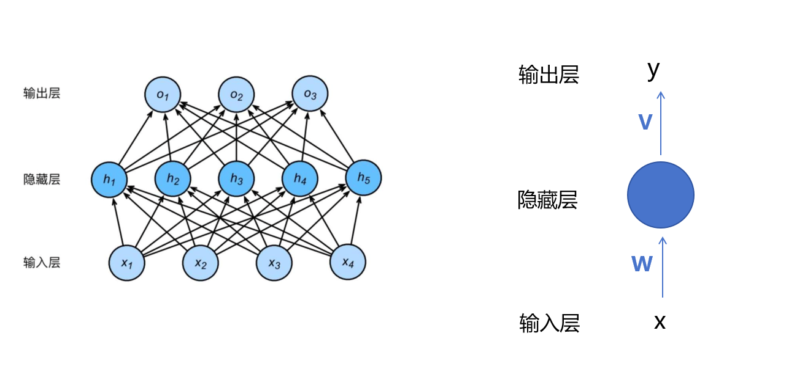

### FNN为什么不适合序列转导任务

1. 前馈神经网络接受的**输入**，就是一个**固定长度的向量**

2. 解决方式

   1. 方式一：将输入**对应位置的向量做平均**，但是`会完全丢掉词语的顺序`
      如：将第一列的（0.0，0.0，0.9，0.1）进行平均，作为第一个位置的向量，后面的以此类推
      最后不管句子中的字有多少，都会被平均下来

   2. 方式二：拼接

      如:

      - a=[a1,a2,…,am]**a**=[*a*1,*a*2,…,*a**m*] 位于 RmR*m* 空间（有 m*m* 个分量）。
      - b=[b1,b2,…,bn]**b**=[*b*1,*b*2,…,*b**n*]
      - 最后拼接成**c**=[*a*1,*a*2,…,*a**m*,*b*1,*b*2,…,*b**n*] 

      将该示例，拼接成16维向量，那么就需要非常长的输入层，效率非常低下
      而且简单的拼接，仍然是将句子，作为一个整体输入，无法判断词之间的先后顺序

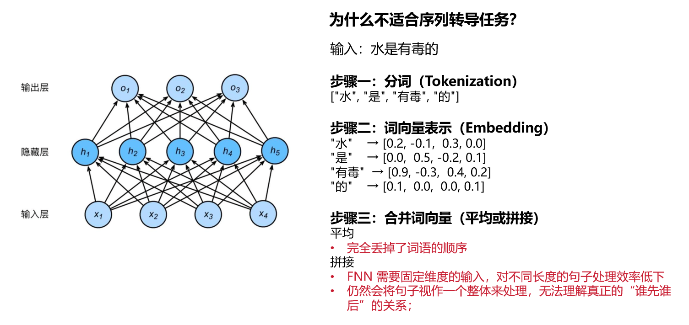

## 循环神经网络(RNN)

**Recurrent** **Neural Network** 

### **RNN** **解决的问题：**

1. **能够建模词序**：RNN 是按时间顺序（token 顺序）逐个处理输入的；
2. **能够建模上下文依赖**：RNN 是逐个喂入词语，并且会有“记忆”机制；也就是有记忆机制，能将上下文记住，不会输入后面，忘记前面
3. **支持不定长输入**：不再需要 FNN 那种固定长度的输入格式，句子多长都行；

### RNN与FNN对比

RNN是在FNN的基础上，在中间加了个循环的机构

RNN更想模拟人类说话的过程，
第一个时刻，我只输入第一个词语："水"
第二个时刻，只输入第二个token: "是"
第三个时刻，只输入第三个token: "有"
第四个时刻，只输入第四个token: "毒"

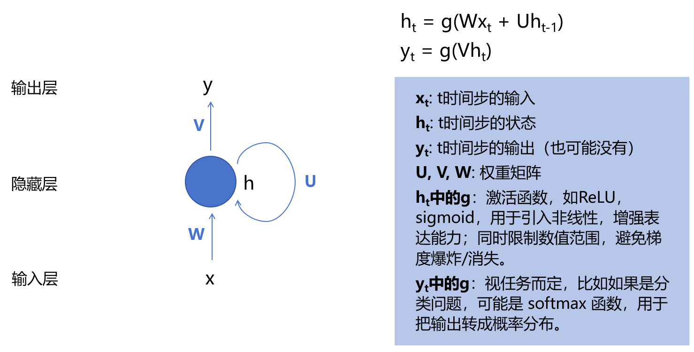

### RNN流程解说

1.  时刻1，输入，计算。
    ( **X1**    1时刻的输入)   *   **W**(权重矩阵)) + (**H0**(初始化的隐藏状态) * **U**(权重矩阵)) ,
   上面的公式，再经过**g**(激活函数)计算，得到了**H**(当前**1时刻**的)   

   上面的**H1**，再乘以**权重矩阵V**，得到了**当前1时刻的输入Y1**

2. **1时刻的计算结果**，被**当作时刻2的输入的一部分**，和**另一部分的其他输入，一同作为时刻2的输入**，进行运算

3. 后面的以此类推

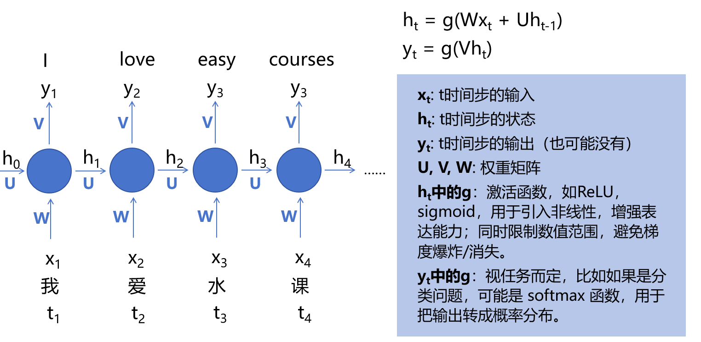

### 缺点

1. 如果输入输出不等长怎么办？
2. 由此引出了编码器，解码器的结构

## 编码器-解码器结构

**Encoder and Decoder** 

### 说明

1. **支持输入输出不等长**
2. 该结构，是基于RNN
3. 将输入和输出拆开来做
4. 编码器只管输入，解码器只管输出

### **编码器 - 解码器结构**解决的问题：

1. 支持输入输出不等长

#### 解码方式一

##### 流程

1. 这里的**C**是，时刻4的时间点下，H4经过计算得到的输出：
   该输出包含了**整个输入文本的上下文的语义信息**，
   同时也隐式的包含了这个**上下文每个token的位置信息**(因为是一个一个处理的，**位置不同，编码结构也不同**,所以有位置信息)

2. 解码：

   1. C作为解码器第一个时刻的隐藏状态的初始输入，S0，得到第一个时间步的输出结果，此示例为" I"
   2. **第一步的输出结果，作为第二步的输入**，
      同时**第一步的隐藏输出S1，同时作为第二步的输入**，
      二者共同作为输入，得出第二步的输出结果，此示例为 "LOVE"

   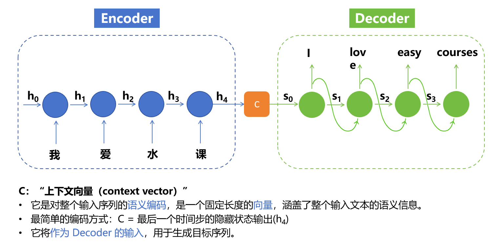

##### 缺点

1. 可能会随着解码，当解码到后面，上下文的信息被稀释的差不多了

#### 解码方式二

##### 解决方式

1. 每次重新输入上下文向量

##### 流程说明

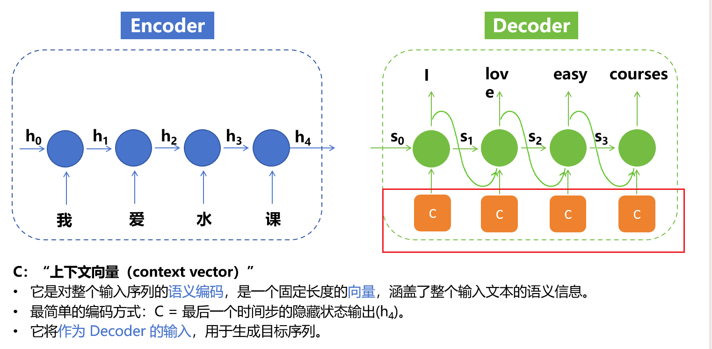

## 注意力机制

### **注意力机制**解决的问题:

1. 解决处理长序列时的“遗忘”问题
   1. 解决**模型处理长序列时的“遗忘”问题**：随着序列长度的增长，远距离依赖信息在传递过程中易被稀释，导致模型对长距离依赖关系的建模能力减弱。
2. 解决不同时间步输入对当前时刻输出的“重要性”问题
   1. 解决不同时间步输入对当前时刻输出的**“重要性”**问题：所有时间步的输入在计算当前时刻输出时被同等对待，忽略了不同时间步对当前时刻输出的重要性可能存在的差异。

### 流程解析

#### 流程说明

1. 注意力机制，由上面的编码器和解码器衍生而来，**会在每个时间步上，输入原始上下文**
2. 注意力机制考虑到：每个时间步，会要**求输入上下文中，有不同的重点，所以C不能再是相同的**，而是C1、C2、C3......
3. 如下三个图，C0、C1、C2 在**不同的时间步下，有不同的加权平均值**。如C1需要0.6的和，0.1的h2，0.2的h3，0.1的h4
4. 如图三，**为了在翻译时，让"水"   能够关注到旁边的   "课"   这个字，我们可以在编码时，给""课"更大的权重**

#### 总结

1. 解决长序列遗忘问题，可以在
   1. **每个时间步生成上下文时，给予不同的权重，**
   2. **靠近当前位置的基于高权重，**
   3. **远离当前位置或者信息不重要的，给予低权重**
   4. 如果**需要关注更上游的信息，可以给予高权重(如h100 要关注h0时，只需要给h0较高权重即可)**，这样比较灵活，解决了位置影响推理的问题
2. 解决原生上下文对当前的影响程度
   1. 可以给前后的重要信息，较高的权重
   2. 如”水“ “课”两个字要联合起来翻译，可以在翻译水(h3时刻)，给予”课“较高权重、翻译课(h4时刻)，给予”水“较高权重， 

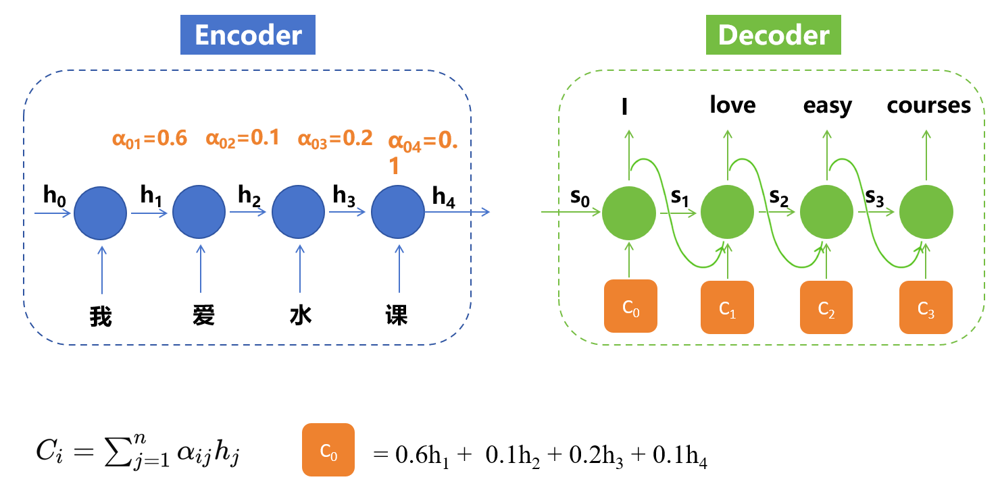

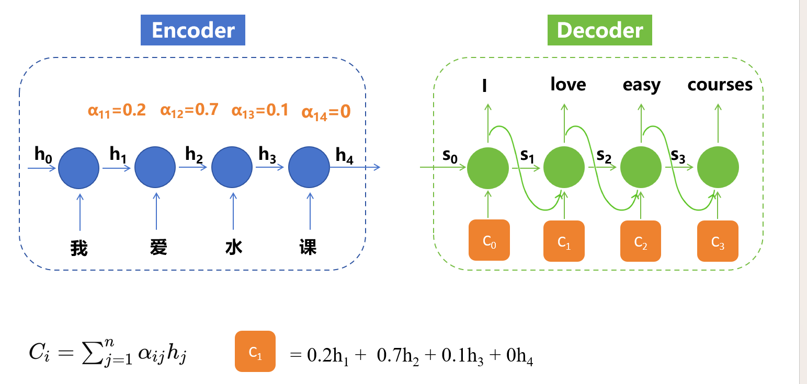

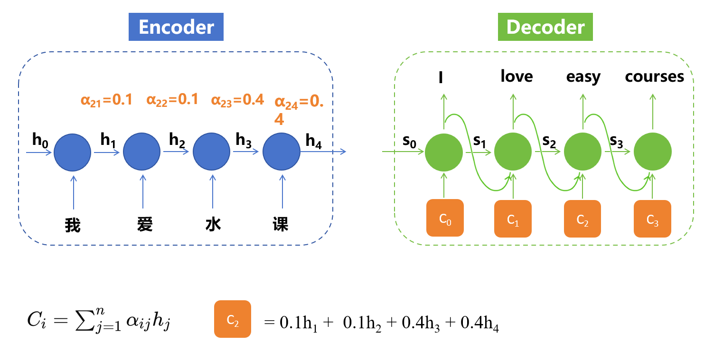

## 串行化计算

### 说明

上述过程中，如果要得到H4的结果，要等H3，H3的结果要等H2，以此类推， 因此无法并行

## TransForm&Self-Attention

### 解决问题

1. 解决串行化计算问题

   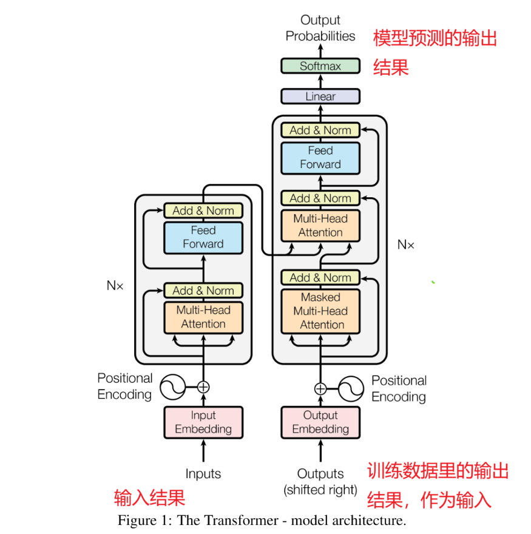

### 说明

#### 编码器

1. 首先需要将句子，转换成一个向量，在transform中，是一个512维的向量

   1. 在编码单个token时，让它以一个全局的视角，看到整个上下文中，其他所有词的信息，
   2. 然后将这些信息都编码到该token的语义向量上面去
   3. 对其他的词，都做相同的操作
   4. 并且这件事，是在同一时刻发生的，是一个并行处理的过程

2. 由于不像循环神经网络有时序和位置，所以Transform需要通过另外一种额外的编码方式，去把该token的位置和时序信息，也编码进它的向量里

3. 这样就得到了一个矩阵

   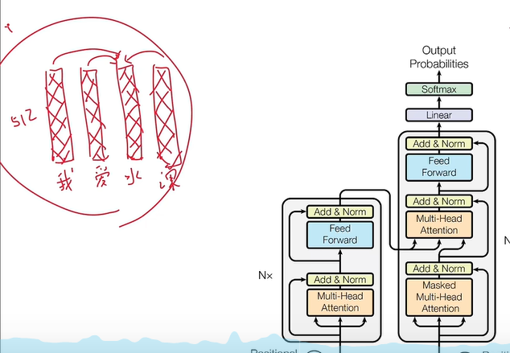

#### 解码器

1.  在训练时，已经知道整个句子，可以挖空某个词，然后提供前面的词，让大模型预测

   1. 归因于已经知道句子，可以任意抠掉句子中的某个词，
   2. 将后面的东西都遮住
   3. 然后通过前面的词 + 已知的句子编码后的结果，让模型推测，这种方式可以并行实现

   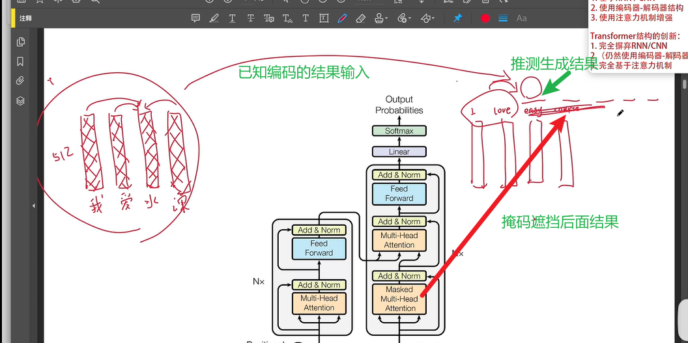

2. 在实际使用中，由于不知道句子究竟是什么样子，所以只能从左到右，依次生成

### 模块翻译说明

1. Multi-Header Attention(多头注意力机制)
2. Add&Norm(残差连接 和 归一化)
3. Feed Forward(前馈神经网络)
4. Nx
   1. 表示编码器的模块有N个(论文中说有6个)
   2. 他们顺序的前后连接起来(因为输入和输出的维度不会变化，所以想叠几个都可以)

#### 残差连接

1. 假设深度学习中，有一个模块学习效果很差，输入经过QKV，可能已经被扭曲的面目全非了，如果再走接下来的流程，让后续的模块去训练，结果肯定不是特别好
2. 通过残差连接：当运行到`第N个模块`，可以将`输入`以及 `第N-1个模块输出结果`，`传递给N模块`，进行计算
3. 这样不管前面的模块训练的怎么样，都可以将原始信息继续往下带

#### 归一化

1. 让数值更加的稳定，方便深度学习的训练

### 流程说明

#### 输入一个句子

##### Embedding

1. 经过Embedding 模型，将**自然语言**，**转成**机器可理解的**高维向量形式**

   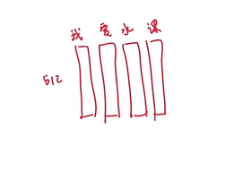

##### Position Encoding

1. 经过**Position Encoding**，将每一个词，生成一个512维的**位置编码**，显式的**叠加到向量上**

##### 叠加权重

###### 叠加权重流程

1. 输入有三个权重矩阵Wq、Wk、Wv，生成关于该token的三个加权矩阵
   q是query, 他们三个分别对应：查询、键、值，这三个矩阵都是512*512维的矩阵

   拿一个token来说，分别乘以Wq、Wk、Wv，就是1*512，1 * 512，1 *  512，总共是3个1*512的向量
   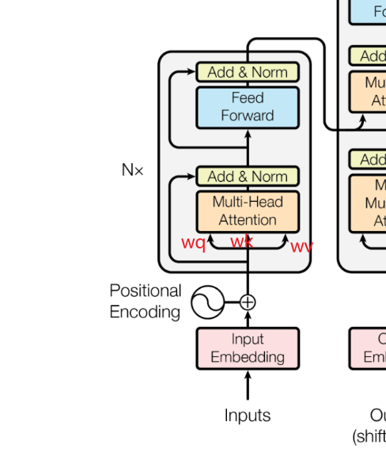

   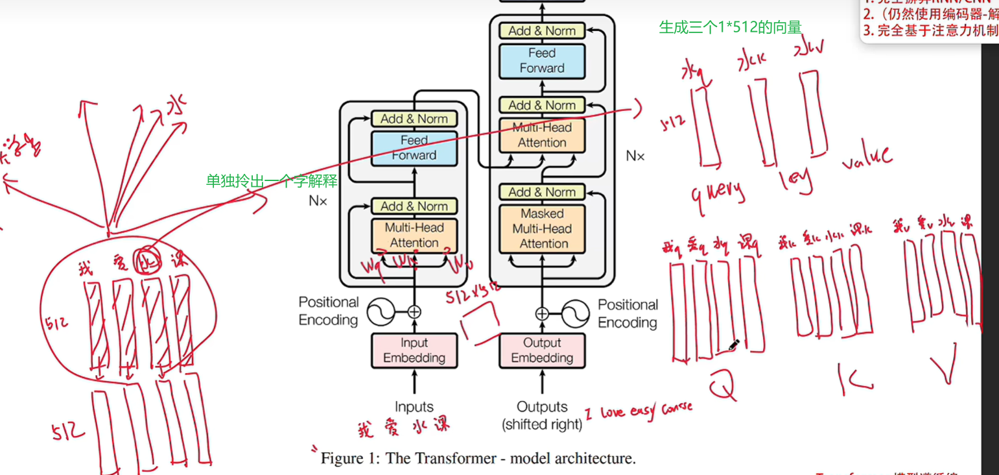

2. 并行计算，得出句子中每个字的关于Q、K、V的向量

3. 将计算后的向量，按照Q、K、V分别分组

4. 然后传入到Mult-Head Attention 多头注意力机制中

5. 单头注意力的计算

   1. 例如"我爱水课"这 4 个字, 乘以512*512的权重矩阵，得到 三个 4 *512 的矩阵Q、K、V结果

   2. 然后这三个矩阵，再通过下面的Attention公式，进行一个注意力的计算

      (具体公式解释，可以参照"**为什么要有QKV**")

      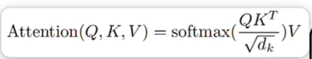

      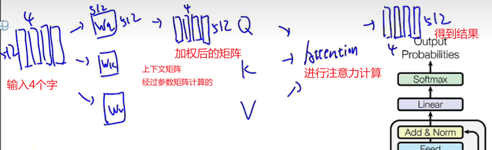

   3. 最后得到一个 4 * 512的矩阵，该矩阵包含上下文信息的编码矩阵

6. 多头注意力的计算

   1. 相对于单头，多头的权重矩阵由 512 * 512 变成 64 * 512

      1. 所谓多头，是这里的64*512的权重矩阵，变成了8组， 所以最后经过Attention计算之后，其结果也会有8个

   2. 矩阵乘法的结果，也不再是4 * 512， 而是4 * 512 * 512 * 64 得到的是 4 * 64 的矩阵

   3. 经过Attention的计算，得到的不是4 * 512， 而是 4 * 64的矩阵，最后得到8个矩阵

   4. 然后将上述的8个矩阵结果，直接拼接起来，最后得到一个4*512的结果

   5. 最后经过线性层，将拼接好之后的4 * 512的结果进行线性计算，得到一个新的4 * 512的结果

      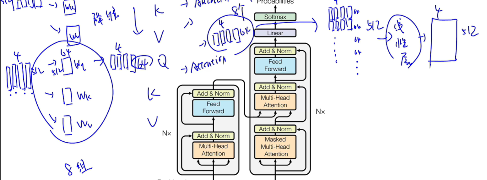

   

7. 由于矩阵是并行操作，所以上述的原向量，会同步叠加上上下文的语义信息

###### 为什么要有QKV

1. 由于同一个字，可 能有不同含义，所以需要将该字的向量，映射到不同的位置

   1. 如：水果的水，应该映射到 猕猴桃、橘子、水果的上下文那个区间
   2. 水课的水，应该映射到论文、大学生、课程、简单上去
   3. 矿泉水的水，应该映射到农夫山泉、怡宝、矿泉水上去
   4. 通过上述这些步骤，该向量就带上了上下文的向量信息了

2. 这里的Q相当于一个发问？问题不固定，以实际模型的参数为准

   1. 这里举例：Q相当于发问：这里有名词吗
   2. K是检索关键词：有名词/没有名词
   3. V就是该token代表的实际的值，以   "水"   token举例，V就是'水'

3. QKV如何计算生成向量？

   1. 使用`缩放点积注意力`公式，Q和K做一个点积

      

   2. 这里拿水的Q去乘以所有的K，拿着自己当前的问题参数，向所有的向量发问

      相当于这个水，拿着自己当前的问题参数(你是名词吗？)，向所有的向量发问

      假设是名词，Q * K的值就越大，否则值就越小

      这里的值，就相当于权重

      然后经过Dk进行缩放

      最后经过Softmax函数，得到一个和为1的概率分布，这个就是最终的权重

      这个权重的实际含义就是：所有token，对于当前水这个词，它的语义影响的重要程度，当然也包含‘水’这个词本身

      得到这个权重之后，再去和V做矩阵乘法

      

      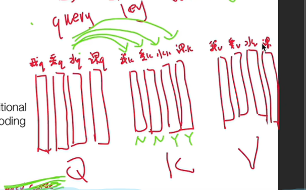

   

##### 多头降维的意义

###### 说明

1. 在单头512的过程中，512个参数，表示了512个方向

2. 多头降维之后，将512分成8个大的领域方向，每个领域方向有64个子方向，合起来对应单头的512的方向

   1. 如描述一个东西: 甜、辣、咸   脂肪食品、碳水食品、  包含维生素A、包含维生素B

   2. 可以将其分为： 口味(甜、辣、咸)、热量(脂肪食品、碳水食品)、营养(包含维生素A、包含维生素B)等

      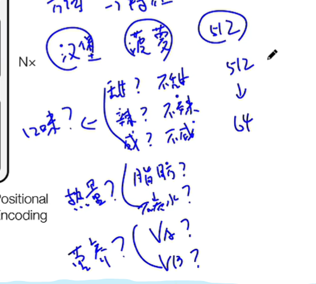

###### 为什么使用多头

1. 单头是512维参与计算
2. 多头一上来，就把他们映射成了8组 * 64 维的，再计算，再融合
3. 每个头关注的重点信息不同，这样可以让模型，能更加关注重点，更丰富，更详细的表示出意图

###### 为什么要经过线性层进行融合

1. 举例：一个图片，512维度的可能是高清、高像素图片
2. 但是不能说8个64维的照片，不能说合在一起，就是高清图片，虽然他们的像素总和是一样的
3. 8个64拼起来，也就相当于 将8个表情包合起来的操作
4. 线性层，就是再做了一层映射，当然这些参数也需要通过训练得到

###### 为什么要拆成8*64的

1. 多头也可以用8个512*512去做，但是计算量就上来了，翻了8倍 
2. 拆成8*64，首先相对于单头，计算量没变，又保留了多头的优势

#### 获取上面输出的结果进行解码

##### Masked Mult-Head Attention(带掩码的多头注意力机制)

1. 我们想并行的进行训练，想让大模型预测easy这个词的时候， 只能让它看到前面的词I Love ,而需要将easy course这两 个词给掩盖掉

##### 解码器里的多头注意力机制

1. 原理和编码器的一样

2. 不同的是Q、K、V的来源不同，这里的K、V 来自于编码器，
   而Q，来自于训练输出结果的，掩码多头计算之后的，结果，作为输入

3. 比如I Love easy course, 

   为了预测easy

   我们会将easy course 进行掩盖，

   Q就是I Love 的上下文向量的信息，可以理解成：我现在已经有了I Love，我下一个词该生成什么好呢？告诉我该关注谁？上下文中，谁对我最重要？

   K 和V 就是前面编码之后的结果，从那里去拿K 和V

   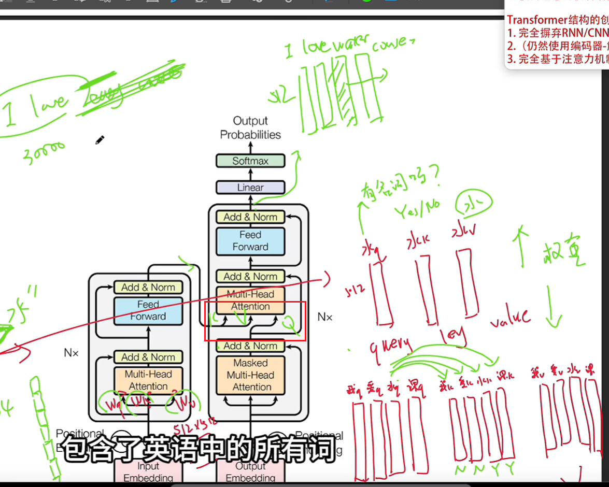

#### 线性计算并转换成自然语言

1. 经过上述的残差连接和归一化，我们已经得到了想要的向量
2. 这里经过线性层Linear，做一个维度的变换
   1. 这里假设有一个包含所有英文词的30000大小的词表
   2. 线性层，将512维度的Easy 向量，映射到一个30000维的向量
   3. 向量中的每个位置，代表在词典中，这个词的概率得分
3. SoftMax将上面的这个得分的向量，又映射成一个概率
   1. 因为光凭得分，可能并不能推测概率，要知道总分是多少，比如得90，如果总分100可以选用，如果总分1000呢？
   2. 最后通过概率的此表，然后将词取出来，组合成句子

## 三种不同网络结构

有三种结果：Self-Attention、RNN、CNN，为什么选择Self-Attention

1. 每层的计算总复杂度要低于之前

   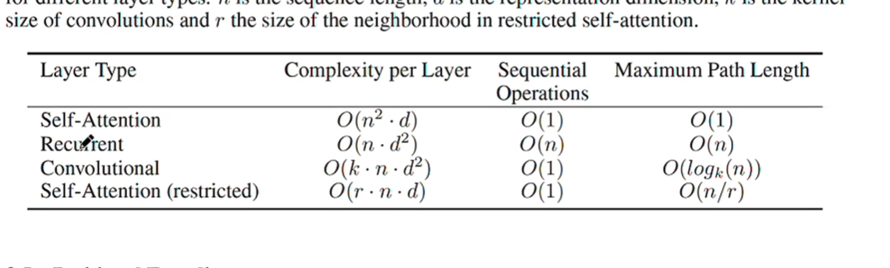

2. 拥有了并行的计算能力

3. 解决了模型内部学习长距离依赖的问题

## Introduction & Background 思路

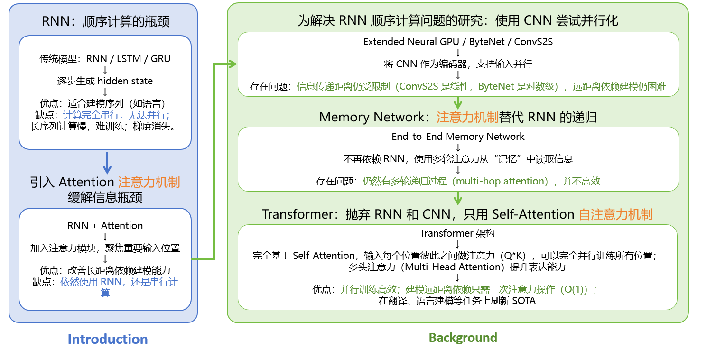

## 三种不同注意力机制

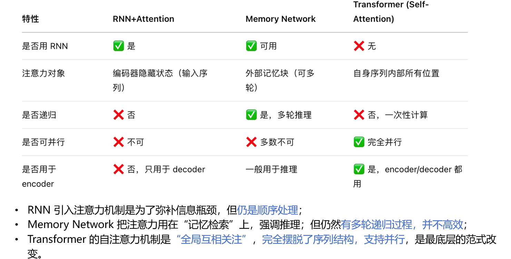

