## B站源视频

[B站源视频，特别感谢UP主：堂吉诃德拉曼查的英豪](https://www.bilibili.com/video/BV1WiP2ezE5a/?spm_id_from=333.1387.homepage.video_card.click&vd_source=6640f6a610f21caea69f14ca9e672257)

## 基础说明

### 为什么不使用网页版DeepSeek

1. 我们的需求：绝对的隐私保护和个性化知识库构建
2. 场景：比如如果你希望大模型能根据你们企业的规章制度来回答问题，那么首先你肯定需要将这些规章制度或者模型作为附件上传，但你仍然可能面临一些别的问题：
   - 一个是`数据隐私问题`；联网使用大模型，所有数据均会上传到DeepSeek服务器，数据隐私性无法得到保证；
   - 第二个是`上传文件的限制问题`；一般来说网页版AI对于文件上传数量是有限制的，因为解析附件需要额外的算力；即使你是付费用户，有时你想要上传的文件不是一个两个，而是几百个文件，也就是一个专业领域的知识库，模型同样可能无力支持；
   - 第三个问题是`上传文件附件方式使用起来繁琐`：仅仅只是将文件作为附件加入对话上下文，`每一次想要让模型根据这些附件回答问题的时候，都需要重新上传附件`；想要`新增、删除、修改已有的附件，同样也是很难实现的`；

### 实现网页版deepseek不能实现的需求

1. 隐私保护
   - 通过对话`大模型（如DeepSeek）的本地部署`解决隐私问题；
2. 个性化知识库构建
   - 使用`RAG技术`(Retrieval-Augmented Generation，检索增强生成)构建个人知识库。为此我们需要：
     - 本地部署RAG技术所需要的`开源框架RAGFlow`；
     - 本地部署`Embedding大模型`（`或者直接部署自带Embedding模型的RAGFlow版本`）；

### 为什么使用RAG？RAG和微调的区别

1. RAG和微调都是为了解决大模型的幻觉问题
   - 幻觉：大模型不知道你的这些私有知识，当它回答自己不知道的问题时会出现一本正经的胡说八道；
2. 微调技术和RAG技术的区别：
   - `微调`：在已有的预训练模型基础上，再结合特定任务的数据集进一步对其进行训练，使得模型在这一领域中表现更好（微调是考前复习，模型通过训练，消化吸收了这些知识然后给你回复）；
   - `RAG`：在生成回答之前，通过信息检索从外部知识库中查找与问题相关的知识，增强生成过程中的信息来源，从而提升生成的质量和准确性。（RAG是开卷考试，模型看到你的问题，开始翻你的知识库，以实时生成更准确的答案）；
3. RAG（Retrieval-Augmented Generation）技术原理：
   - `检索（Retrieval）`：当用户提出问题时，系统会从外部的知识库中检索出与用户输入相关的内容。
   - `增强（Augmentation）`：系统将检索到的信息与用户的输入结合，扩展模型的上下文。这让生成模型（也就是Deepseek）可以利用外部知识，使生成的答案更准确和丰富。
   - `生成（Generation）`：生成模型基于增强后的输入生成最终的回答。它结合用户输入和检索到的信息，生成符合逻辑、准确且可读的文本内容。

### 什么是Embedding？为什么除了DeepSeek、RAGFlow外我还需要“Embedding模型”？

1. 检索（Retrieval）：

   当用户提出问题时，系统会从外部的知识库中检索出与用户输入相关的内容。

   1. `准备外部知识库`：外部知识库可能来自本地的文件、搜索引擎结果、API 等等。这样，RAG 不仅依赖于模型本身的内在的、通过训练得到的知识，还能实时调用外部的信息进行补充。我们要构建的就是一个基于本地文件的外部知识库；
   2. `通过 embedding 模型，对知识库文件进行解析`：**文本是由自然语言组成的，这种格式不利于机器直接计算相似度。embedding 模型要做的，就是将自然语言转化为高维向量，然后通过向量来捕捉到单词或句子背后的语义信息**。比如，“蟹堡王”“比奇堡”“深度学习”三个词，embedding 会将蟹堡王和比奇堡映射到相近的向量空间中；而深度学习会被映射到离他们较远的向量空间中，这样通过embeding，机器就可以学习到自然语言之间的深度语义关系，并且依此计算出不同文本之间的相似关系了；
   3. `通过 embedding 模型，对用户的提问进行处理`：用户的输入同样会经过嵌入（Embedding）处理，生成一个高维向量。
   4. `拿用户的提问去匹配本地知识库`：**使用这个用户输入生成的这个高纬向量，去查询知识库中有无相关的文档片段。系统会利用某些相似度度量（如余弦相似度）去判断这个相似度**。这一整个过程可以理解为，上传并解析了知识库之后，相当于给知识库中每一个小的文段都生成了一个指纹；然后用户输入问题之后，这个问题同样也会生成一个独一无二的指纹，接着RAGFLOW系统就会拿着用户输入的这个指纹，在指纹库也就是知识库中匹配，找到相似的指纹，然后把将检索到的这些相关文段与用户的输入结合，扩展模型的上下文，再喂给对话模型DeepSeek。

2. 模型的分类：Chat模型、Embedding模型；

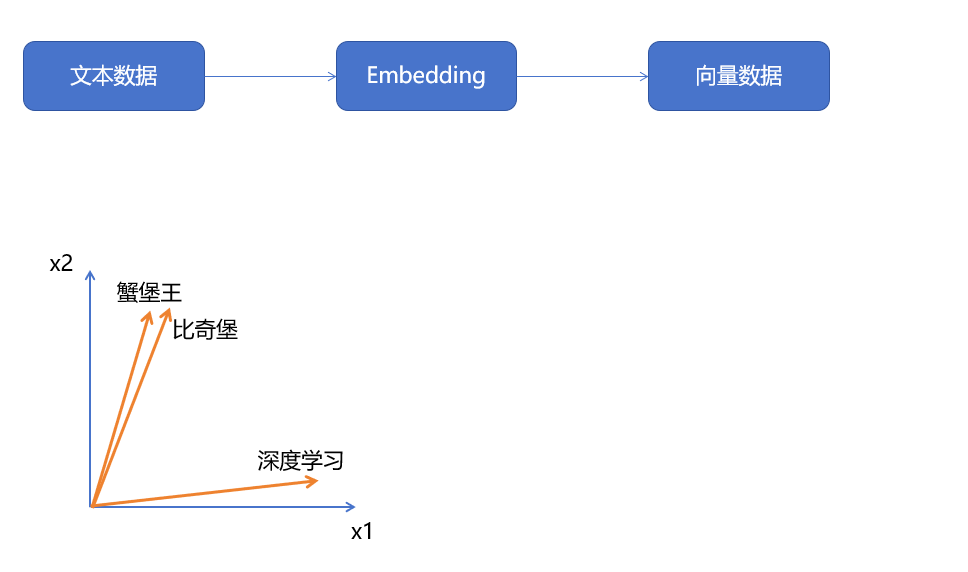

## 本地部署流程

1. 下载ollama，通过ollama将DeepSeek模型下载到本地运行；
2. 下载RAGflow源代码和Docker，通过Docker来本地部署RAGflow；
3. 在RAGflow中构建个人知识库并实现基于个人知识库的对话问答；

### 下载ollama，通过ollama将DeepSeek和Embedding模型都下载到本地；

1. [下载ollama平台](https://ollama.com/)

   - ollama是一个用于本地运行和管理大语言模型（LLM）的工具。

2. 配置环境变量

   1. `OLLAMA_HOST=0.0.0.0:11434`：让虚拟机里的程序能访问本机上运行的 Ollama 模型

      - RAGFlow是部署在虚拟机里的，默认情况下，Ollama 只能允许本机访问（监听 localhost:11434），其他设备（比如虚拟机）是无法连接的。
      - 可能存在的问题：如果配置后虚拟机无法访问，可能是你的本机防火墙拦截了端口 11434，需要放行它。
      - 如果你的 Ollama 只想给自己的虚拟机使用，而不想直接暴露 11434 端口让任何设备都能访问，你可以通过SSH 端口转发来实现；

   2. `OLLAMA_MODELS` ：默认模型下载到C盘，如果希望下载到其他盘可以配置；

   3. 注意配置之后保险起见一定要重启电脑；

      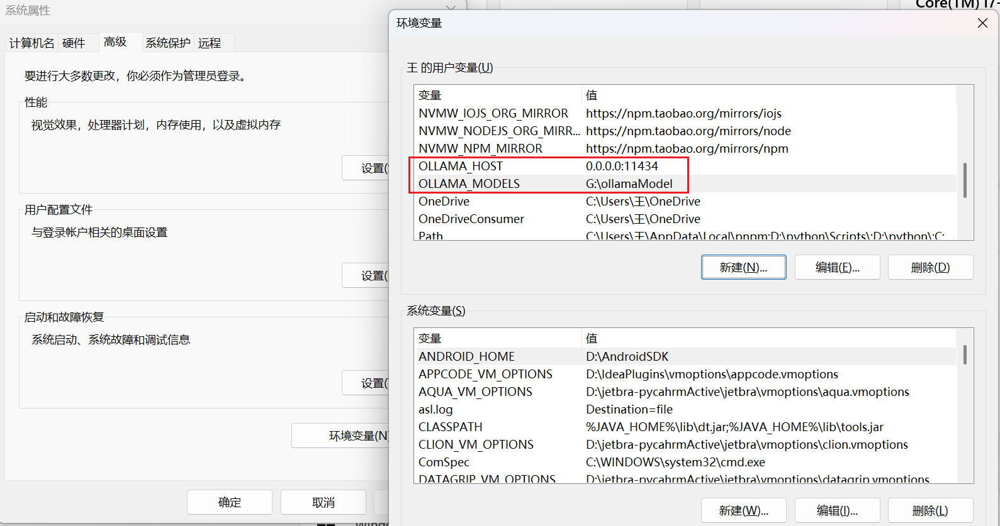

3. 通过ollama下载模型deepseek-r1:32b

   ```sh
   ollama run deepseek-r1:32b
   ```

### 下载RAGflow源代码和docker，通过docker本地部署RAGflow

#### [下载Docker](https://www.docker.com/get-started/)

##### 下载

1. Docker 镜像是一个封装好的环境，它包含了所有运行 RAGFlow 所需的依赖、库和配置。

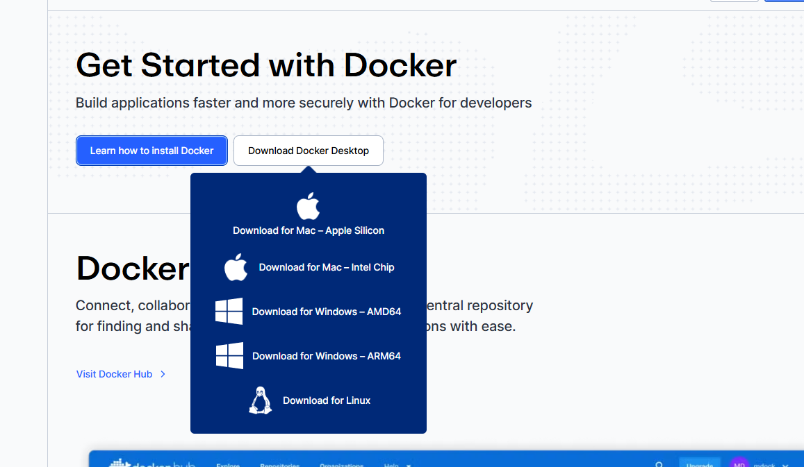

##### 开启WSL2与虚拟化

- **启用虚拟化**：需要在BIOS/UEFI设置中开启CPU的虚拟化技术（如Intel VT-x或AMD-V） 。

- **开启WSL 2**：为了获得更好的性能和兼容性，Docker官方推荐使用WSL 2后端。可以通过以下步骤开启并设置：

  1. 以**管理员身份**打开PowerShell或命令提示符。

  2. 运行以下命令来安装WSL并设置默认版本为WSL 2：

     ```powershell
     wsl --install
     wsl --set-default-version 2
     ```

     `wsl --install` 命令会默认安装一个Ubuntu发行版并开启所需的所有Windows功能

##### 启动与验证

1. 双击安装包之后，重启电脑

2. 重启之后，在powershell上输入，如果能看到类似 `Docker version 27.3.1, build xxxxxx` 的版本信息，说明Docker CLI已经安装成功 。

   ```powershell
   docker --version
   ```

3. 运行Docker的“hello-world”镜像，来验证整个Docker引擎是否能正常工作

   ```powershell
   docker run hello-world
   ```

   如果终端打印出欢迎信息并成功运行了一个测试容器，那么恭喜你，Docker已经在你的Windows上成功安装并可以正常使用了

#### 下载RAGflow[源代码](https://github.com/infiniflow/ragflow/blob/main/README_zh.md)

1. 查看源码文档，发现只有v0.21.1版本，包含embedding模型，可以在docker中使用这个镜像

   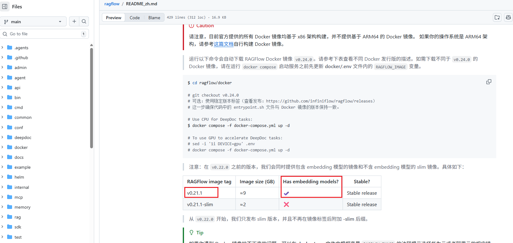

2. 使用git命令行`下载源码`，打开项目中`docker文件夹`

3. 打开文件夹中的.env文件，搜索RAGFLOW_IMAGE，确保值是包含embedding功能的模型

   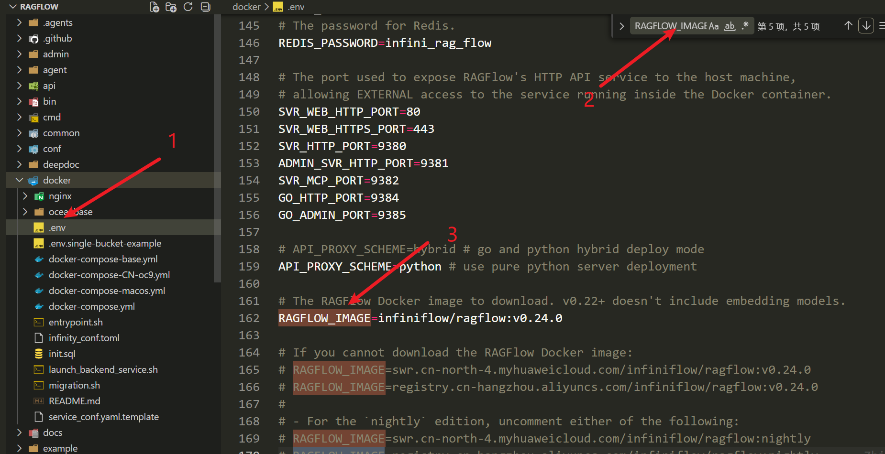

4. 打开项目文件，将命令行切换到docker文件夹中，按照源码的readme文档，启动项目

   ```sh
   $ cd ragflow/docker
   
   # git checkout v0.24.0
   # 可选：使用稳定版本标签（查看发布：https://github.com/infiniflow/ragflow/releases）
   # 这一步确保代码中的 entrypoint.sh 文件与 Docker 镜像的版本保持一致。
   
   # Use CPU for DeepDoc tasks:
   $ docker compose -f docker-compose.yml up -d
   
   # To use GPU to accelerate DeepDoc tasks:
   # sed -i '1i DEVICE=gpu' .env
   # docker compose -f docker-compose.yml up -d
   ```
   
   - 运行`docker compose -f docker-compose.yml up -d`命令后，可以看到镜像的状态时running或者healthy状态即可
   - 打开默认网址localhost:80，即可打开RagFlow，然后进行注册(第一次进入)

## 在RAGflow中构建个人知识库并实现基于个人知识库的对话问答；

### 选择模型

1. 在RAGflow中进行相关配置、上传文件构建个人知识库、调用本地部署的Embedding解析处理上传的文件、调用本地部署的DeepSeek根据文件内容生成回答
   1. 在“模型提供商”中添加我们本地部署的deepseek模型；
   
      - 点击个人头像，找到最左侧的模型提供商，然后将本地部署的模型添加进来，让其能够找到
      - 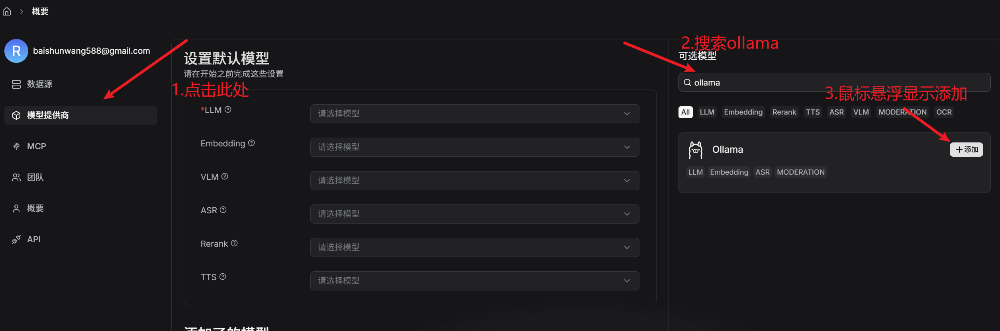
      - 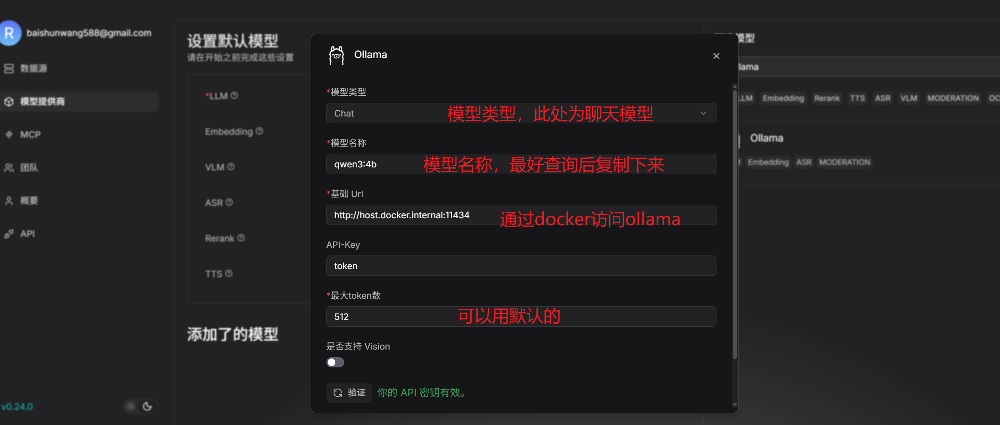
   
   2. 在“系统模型设置”中配置Chat模型（deepseek）和Embedding模型（RAGFlow自带的）；
   
      - 由于RAGFlow从 `v0.22.0` 开始，我们只发布 slim 版本，并且不再在镜像标签后附加 **-slim** 后缀。我们可以在ollama中本地使用embedding大模型
   
      - 按照上述步骤，设置一个embedding模型即可
   
      - 然后在RAGFlow中，使用这个Chat和Embedding模型
   
        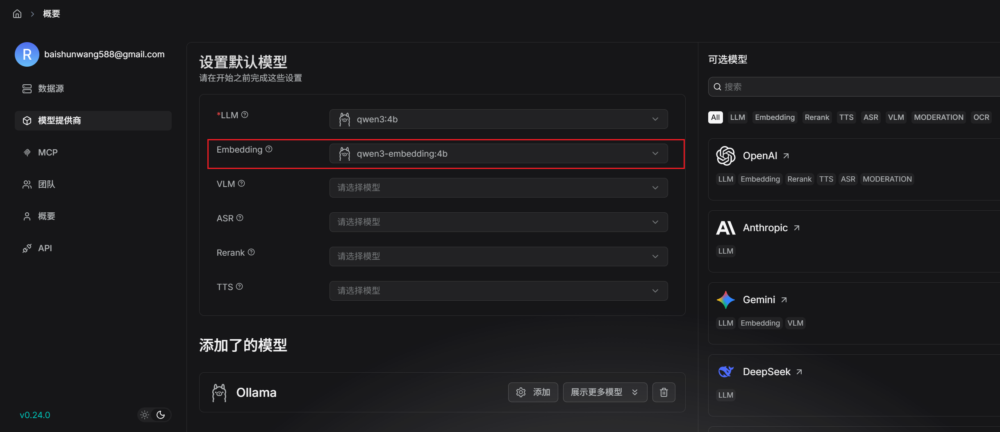
   
   3. 创建知识库，上传文件，解析文件；
   
      - 创建知识库
        - 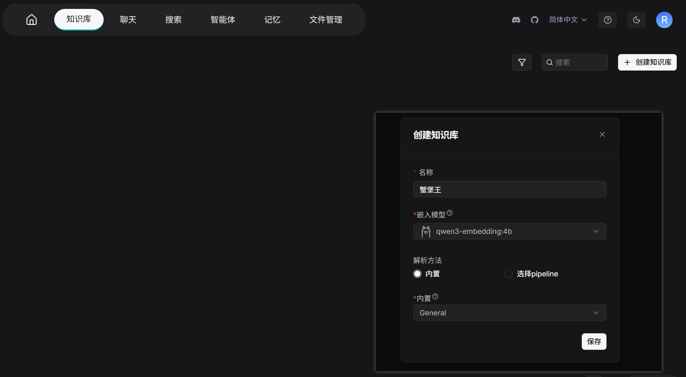
   
      - 解析文档，如果没有解析，可以手动点击开始按钮
        - 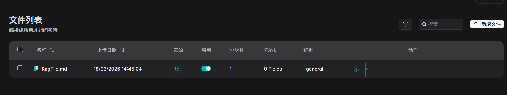
   
   4. 创建聊天助手（注意prompt和tokens的配置）；
   
      1. 将RAG知识库引入进来
   
         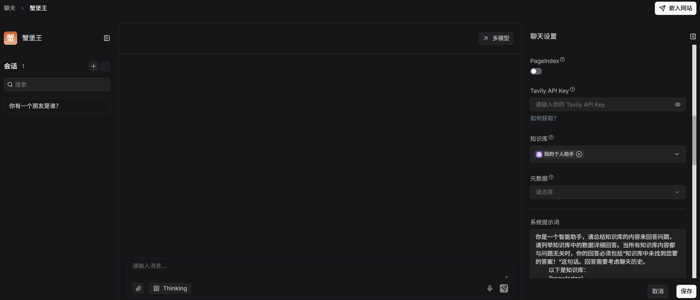
   
   5. 开始对话；
   
   6. 添加其他在线的模型
   
      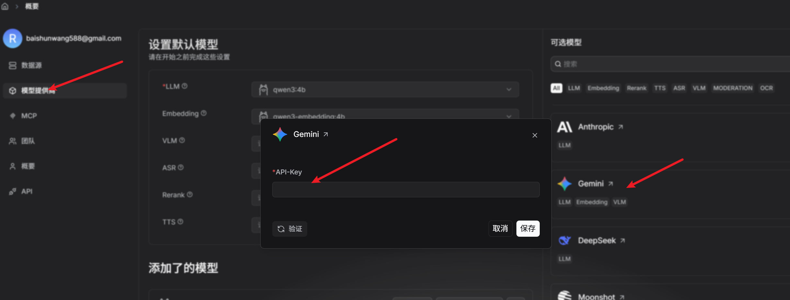

## 只想迅速搭建个人知识库，可以不本地部署吗

1. ——当然可以！这样实现起来更简单，而且效果一般来说会更好；
2. 具体步骤：
   1. 下载RAGFlow源代码和docker，通过docker本地部署RAGFlow（RAGFlow目前没有官方的网页版）；
   2. 在RAGFlow中配置任意的Chat模型和Embedding模型（你需要到这些模型对应的官网去付费申请apiKey）；
3. 一般来说，直接使用在线模型肯定更简单，因为你不需要本地部署大模型了；然后直接使用企业的在线模型，性能肯定更优越，因为你在本地部署的模型参数量肯定没发跟人家比；
4. **但是，使用在线模型，你无法保证数据的绝对隐私性，同时很多企业api虽然有免费额度，但是用着用着就会开始收费了**；


