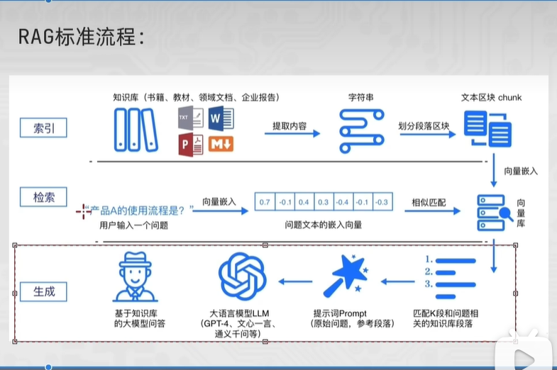
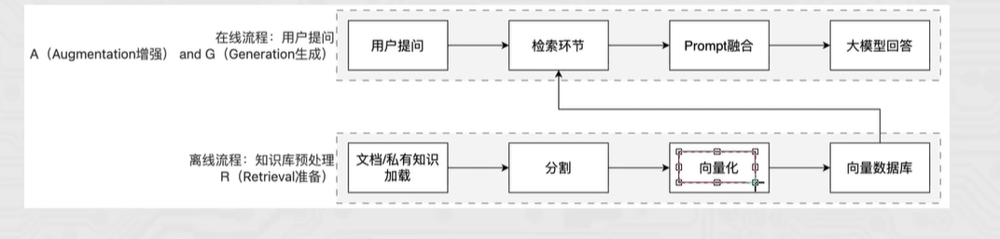
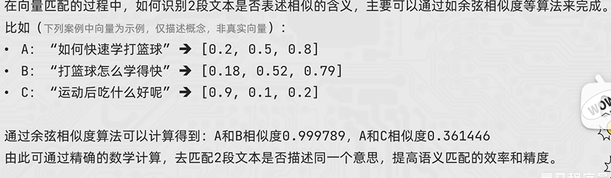
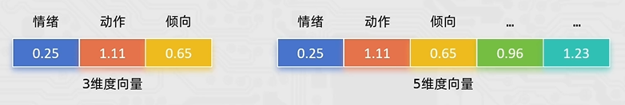

## 定义

RAG(Retrieval-Augmented Generation)即检索增强生成，为大模型提供了`从特定数据源检索到的信息，以此来修正和补充生成的答案`。可以总结为一个公式:RAG=检索技术 +LLM 提示

## 流程

### 索引

1. 有一个程序，会源源不断获取知识(如爬虫)、或者提供文本
2. 这些信息`提取成字符串`，然后`划分段落区块`，然后``形成向量`，`存储到向量数据库中`

### 检索

1. 当用户提问，并不会直接传给模型，而是将问题，转成向量
2. 通过相似匹配，将用户提出的问题，和向量数据库中的数据做匹配
3. 然后将问题和搜索到的关联数据，打包放到一起，一起传给大模型

### 生成

1. 此时传给大模型的，不仅仅是用户的提问，还有自己私有向量库里面所检索到的相关文本
2. 将他们一起打包给模型，模型就会更加的专业和精准

## 向量

### 定义

向量(Vector)  就是文本的  “数学身份证”   :它把一段文字的`语义信息`，`转换成`一串固定长度的`数字列表`让`计算机能 “看懂” 文字的含义并做相似度计算`。

简单来说，就是让计算机更方便的理解不同的文本内容，是否表述的是一个意思。

### 向量匹配

在向量匹配过程中，如何识别2段文本是否表述相似的含义，主要可以通过如`余弦相似度`等算法来完成

一般来说，相似度越靠近数字1，含义越相近

### 向量维度

如何更为精准的完成语义匹配，生成向量的维度是一个很重要的指标。

如text-embedding-v1模型，可以生成1536维的向量(一段文本`固定`得到1536个数字序列)，比较实用。

1. 1536个数字表示，这段文本在1536个主题(`抽象的语义特征`)方向上的得分(强度)

   如：上面是1536个抽象语义特征，那么就可以针对这个文本，在1536个维度进行打分

2. 生成向量的维度越多，就更好的记录文本的语义特征，做语义匹配会更加精准

3. 更多的向量会在计算、存储和匹配过程中，带来更大的压力。

选择合适的向量维度需要在精确和性能之间做平衡。

一般1536维算是比较好的选择。

