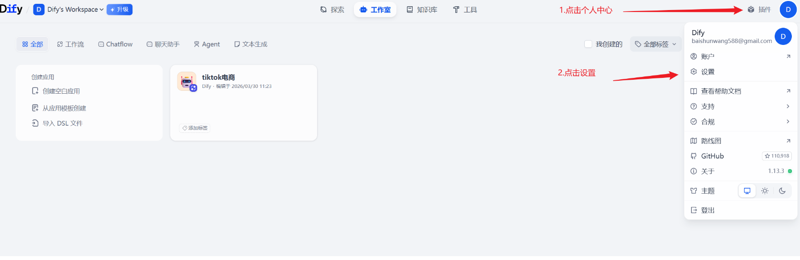
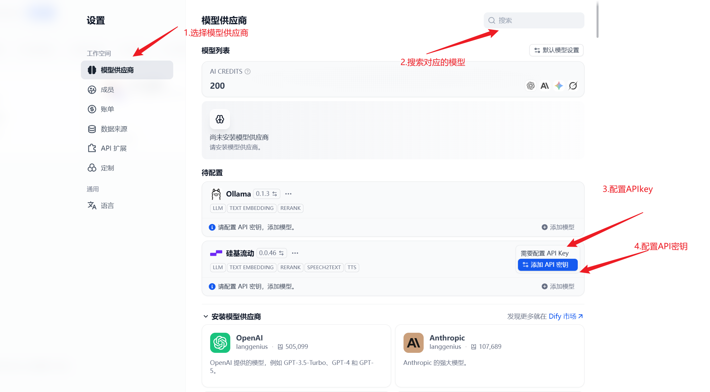
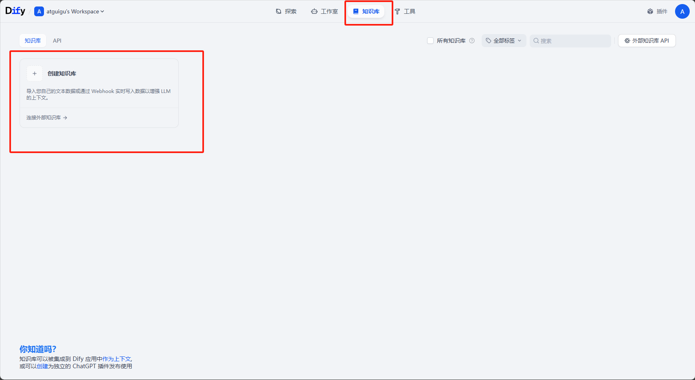
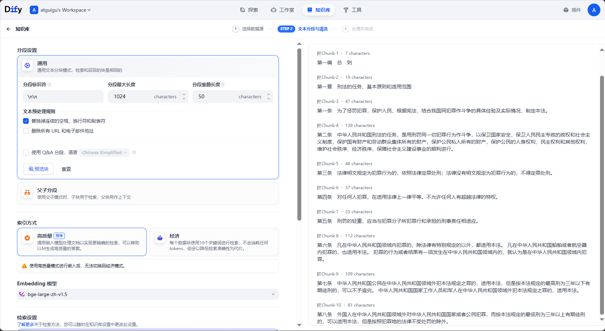

## 使用Dify搭建知识库

### Dify介绍

Dify（DefineModify）是一个开源的大语言模型(LLM)应用开发平台，由`苏州语灵人工智能`推出。

Dify 为 AI Agent 提供了50多种内置工具，如谷歌搜索、DALL·E、Stable Diffusion 和 WolframAlpha 等。

官网：https://dify.ai/zh

说明：https://github.com/langgenius/dify/blob/main/README_CN.md

### 源数据格式

通过使用Dify，可以方便快捷地构建私有知识库。可以将知识库放在工作流中，协同多种工具一起使用。而且Dify提供的知识库功能有着简洁的可视化界面，可以很方便地进行管理，适用于个人和团队。

目前Dify 支持多种源数据格式，包括： 

- 长文本内容：TXT、Markdown、DOCX、HTML、JSON、 PDF  


- 结构化数据：CSV、Excel


**注：私有知识库要达到良好的效果，必须与embedding模型和reranker模型相结合，请在xinterface中启用相关模型并引入Dify。**

###  构建私有知识库

#### 前置步骤：设置embedding模型





#### **步骤1：首先创建一个新的知识库**



#### **步骤2：上传知识库文件**

这里准备的是一部刑法的txt格式文本，用自然段的形式划分了每一条法则


#### **步骤3：分段设置**

大语言模型存在有限的上下文窗口，通常需要将整段文本进行分段处理后，将与用户问题关联度最高的几个段落召回，即分段 top-K 召回模式。此外，在用户问题与文本分段进行语义匹配时，合适的分段大小将有助于匹配关联性最高的文本内容，减少信息噪音。

分段标识符如果是`\n`，则是以换行为一个分段；如果是`\n\n`，则是以一个段落为一个分段。点击`预览块`查看目前块划分的情况。

分段重叠长度一般是分段最大长度的`10%-20%`。

知识库文档里如果有url、邮箱，还可以把这些过滤掉。



#### **步骤4：选择索引方式**

这里自动选择高质量。高质量的准确性更高，但是token消耗也会增加。如果使用的是部署到本地的模型，花费就没有影响。


还有Q&A方式。 如果文档是问答方式，那选择这种方式是最契合的。

#### **步骤5：检索设置**

在这里可以选择Embedding模型和Rerank模型，也可以设置Top K，也就是选出最相似的前n条。选择Score阈值，即筛选文本的相似度阈值。


混合检索：既包括向量检索（涉及rerank检索的大模型），也包含全文检索。

设置完成后，保存并处理即可。


### 测试

1. 接下来我们进行测试使用。创建一个聊天助手，将提示词写为

   ```txt
   你是一个法律小助手，请只根据知识库中的信息，简要回答用户提问的案件触犯了哪些法律
   ```

2. 知识库选择刚才添加的刑法.txt，然后可以开始提问。

3. 可以观察到，聊天助手会自动引用知识库中的内容进行回答。

   