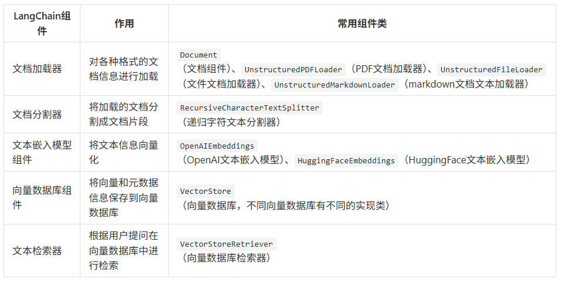
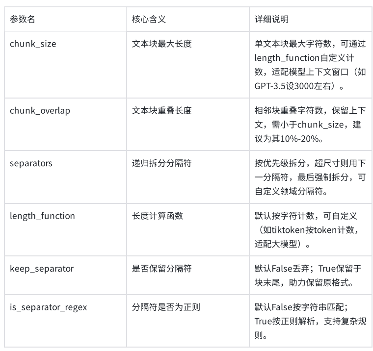

## Rag标准流程

1. 切分阶段

   1. 各种格式文档 -> 
   2. 转换成 LangChain中的文档(Document)对象 ->
   3. 根据分割规则，对文档对象进行分割 ->
   4. 将文档对象，通过嵌入模型，转换成向量，存入向量数据库

2. 使用阶段

   1. 用户提出问题
   2. 将问题通过嵌入模型，转换成向量
   3. 通过向量检索器，通过相似性检索，返回关联的文本片段(召回)
   4. 将文本进行重排序(重拍)
   5. 将重排后的文本片段渲染到提示词模板中，作为提问问题的上下文传给大模型
   6. 大模型将问题整合，返回答案

3. 核心组件介绍

   1. 文档加载器加载 -> 
   2. 然后文档分割器分割 ->
   3. 然后文本嵌入模型组件进行向量化
   4. 然后存入向量数据库
   5. 最后使用文本检索器进行调用

   

## 文档加载器

### CSVLoader

```python
# pip install langchain_community
from langchain_community.document_loaders.csv_loader import CSVLoader

# 加载所有列
docs = CSVLoader(
    file_path="assets/sample.csv",  # 文件路径
).load()  # 返回List[Document]

print(docs)

# 加载部分列
docs = CSVLoader(
    file_path="assets/sample.csv",  # 文件路径
    metadata_columns=["title", "author"],  # 将指定列作为元数据
    content_columns=["content"],  # 将指定列作为内容
).load()  # 返回List[Document]

print(docs)

```

### UnstructuredWordDocumentLoader

```python
# pip install langchain_community unstructured[docx]
# pip install -U unstructured
# pip install python-docx
# pip install regex==2026.1.14
from langchain_community.document_loaders import UnstructuredWordDocumentLoader

docs = UnstructuredWordDocumentLoader(
    # 文件路径
    file_path="assets/alibaba-more.docx",
    # 加载模式:
    #   single 返回单个Document对象
    #   elements 按标题等元素切分文档
    mode="single",
).load()

#print(type(docs))
print(docs)


```

### JSONLoader

```python
# pip install jq
from langchain_community.document_loaders import JSONLoader

# 提取所有字段
docs = JSONLoader(
    file_path="assets/sample.json",  # 文件路径
    jq_schema=".",  # 提取所有字段
    text_content=False,  # 提取内容是否为字符串格式
).load()

print(docs)

```

### UnstructuredMarkdownLoader

```python
# pip install langchain_community unstructured[md]
from langchain_community.document_loaders import UnstructuredMarkdownLoader

docs = UnstructuredMarkdownLoader(
    # 文件路径
    file_path="assets/sample.md",
    # 加载模式:
    #   single 返回单个Document对象
    #   elements 按标题等元素切分文档
    mode="elements",
).load()

print(docs)

```

### PyPDFLoader

```python
# pip install langchain_community
from langchain_community.document_loaders import PyPDFLoader

docs = PyPDFLoader(
    # 文件路径，支持本地文件和在线文件链接，如"https://arxiv.org/pdf/alg-geom/9202012"
    file_path="assets/sample.pdf",
    # 提取模式:
    #   plain 提取文本
    #   layout 按布局提取
    extraction_mode="plain",
).load()

print(docs)

```

### TextLoader

```python

# pip install langchain_community
from langchain_community.document_loaders import TextLoader

# 返回List[Document]
file_path = "assets/sample.txt"  # 文件路径
encoding = "utf-8"  # 文件编码方式

docs = TextLoader(file_path, encoding).load()

print(docs)
# [Document(metadata={'source': 'asset/sample.txt'}, page_content='...')]

```

## 文档分割

### 分类

| 分割器                         | 作用               |
| ------------------------------ | ------------------ |
| RecursiveCharacterTextSplitter | 递归按字符分割文本 |
| CharacterTextSplitter          | 按指定字符分割文本 |
| MarkdownHeaderTextSpliter      | 按Markdown标题分割 |
| PythonCodeTextSplitter         | 专门分割Python代码 |
| TokenTextSplitter              | 按Token数量分割    |
| HTMLHeaderTextSplitter         | 按HTML标题分割     |

以上大部分文本分割器，都继承自TextSplitter基类，该基类定义了分割文本的核心方法

1. split_text()：将文本字符串，分割成字符串列表
2. split_documents(): 将`Document对象列表`分割成`更小文本片段的Document对象列表`
3. create_documents(): 通过字符串列表创建Document对象

### RecursiveCharacterTextSplitter

#### 参数

1. **重要点**：
   1. **chunk_overlap**：文本块重叠长度
2. 参数说明
   1. length_function ,表示的是文本的长度



#### 切割文本

```python
"""
使用split_text()方法进行文本分割
RecursiveCharacterTextSplitter中指定的
chunk_size=100,块大小为100，
chunk_overlap=30, 片段重叠字符数为30，
length_function=len，计算长度的函数使用len，# 可选：默认为字符串长度，可自定义函数来实现按 token 数切分
"""
from langchain_text_splitters import RecursiveCharacterTextSplitter

# 1.分割文本内容
content = (
    "大模型RAG（检索增强生成）是一种结合生成模型与外部知识检索的技术，通过从大规模文档或数据库中检索相关信息，"
    "辅助生成模型以提升回答的准确性和相关性。其核心流程包括用户输入查询、系统检索相关知识、"
    "生成模型基于检索结果生成内容，并输出最终答案。RAG的优势在于能够弥补生成模型的知识盲区，"
    "提供更准确、实时和可解释的输出，广泛应用于问答系统、内容生成、客服、教育和企业领域。"
    "然而，其也面临依赖高质量知识库、可能的响应延迟、较高的维护成本以及数据隐私等挑战。")


# 2.定义递归文本分割器
# 使用RecursiveCharacterTextSplitter创建文本分割器，设置块大小为100，重叠长度为30,
# length_function=len就是指定使用 Python 内置的len()函数来计算文本长度，也是这个分割器的默认值
# 比如，print(len("大模型RAG技术"))  # 输出8，因为统计的是字符个数（中文字符、字母、符号各算1个）
# 遵循 “重叠后向前取有效内容、且不生成过小碎片” 的核心分割逻辑，不会让最后一个片段的有效内容只剩扣除重叠后的少量字符
# 原始文本 → split_text → 第一次分割成字符串块 → create_documents → 对字符串块二次分割 → 内容丢失有可能
text_splitter = RecursiveCharacterTextSplitter(chunk_size=100, chunk_overlap=30, length_function=len)

# 3.分割文本
# 将原始文本内容分割成多个文本块
splitter_texts = text_splitter.split_text(content)

# 4.转换为文档对象
# 将分割后的文本块转换为文档对象列表
splitter_documents = text_splitter.create_documents(splitter_texts)
print(f"原始文本大小：{len(content)}")
print(f"分割文档数量：{len(splitter_documents)}")
for splitter_document in splitter_documents:
    print(f"文档片段大小：{len(splitter_document.page_content)},文档内容：{splitter_document.page_content}")


'''
原始文本大小：225

分割文档数量：3

文档片段大小：100,文档内容：大模型RAG（检索增强生成）是一种结合生成模型与外部知识检索的技术，通过从大规模文档或数据库中检索相关信息，辅助生成模型以提升回答的准确性和相关性。其核心流程包括用户输入查询、系统检索相关知识、生成模

文档片段大小：100,文档内容：相关性。其核心流程包括用户输入查询、系统检索相关知识、生成模型基于检索结果生成内容，并输出最终答案。RAG的优势在于能够弥补生成模型的知识盲区，提供更准确、实时和可解释的输出，广泛应用于问答系统、内容

文档片段大小：85,文档内容：区，提供更准确、实时和可解释的输出，广泛应用于问答系统、内容生成、客服、教育和企业领域。然而，其也面临依赖高质量知识库、可能的响应延迟、较高的维护成本以及数据隐私等挑战。
'''

'''
验证总字符的逻辑（并非简单相加）
同学们可能会疑惑：100+100+85=285，比原始 225 多了 60，why?
这是因为重叠部分被重复计算了，实际原始文本的有效内容被完整覆盖，且无丢失：
第 1 块和第 2 块的重叠：30 字符（重复计算 1 次）
第 2 块和第 3 块的重叠：30 字符（重复计算 1 次）
总重复计算：60 字符 → 285 - 60 = 225（和原始文本长度一致）

这正是分割器设计chunk_overlap的目的：
以 “重复计算重叠部分” 为代价，保证每个文本块的语义完整性，避免分割切断上下文。
'''

```

#### 切割文档对象

```python
"""
分割文档对象
RecursiveCharacterTextSplitter不仅可以分割纯文本，还可以直接分割Document对象
"""
# pip install python-magic-bin
from langchain_text_splitters import RecursiveCharacterTextSplitter
from langchain_unstructured import UnstructuredLoader

# 1.创建文档加载器，进行文档加载
loader = UnstructuredLoader("rag.txt")
documents = loader.load()

# 2.定义递归文本分割器
# 创建RecursiveCharacterTextSplitter实例，用于将文档分割成指定大小的文本块
# chunk_size: 每个文本块的最大字符数为100
# chunk_overlap: 相邻文本块之间的重叠字符数为30
# length_function: 使用len函数计算文本长度
text_splitter = RecursiveCharacterTextSplitter(chunk_size=100, chunk_overlap=30, length_function=len)

# 3.分割文本
# 使用文本分割器将加载的文档分割成多个较小的文档片段
splitter_documents = text_splitter.split_documents(documents)

# 输出分割后的文档信息
print(f"分割文档数量：{len(splitter_documents)}")

for splitter_document in splitter_documents:
    print(f"文档片段：{splitter_document.page_content}")
    print(f"文档片段大小：{len(splitter_document.page_content)}, 文档元数据：{splitter_document.metadata}")
```

## 文本嵌入模型组件

1. 根据不同模型API定义实例化，此处千问使用`DashScopeEmbeddings`关键字
2. 使用embed_documents将文本转换为向量
3. 存入redis

```python

from langchain_redis import RedisConfig, RedisVectorStore
from langchain_community.embeddings import DashScopeEmbeddings
import os

# 初始化 Embedding 模型
# 1. 初始化阿里千问 Embedding 模型
embeddingsModel = DashScopeEmbeddings(
    model="text-embedding-v3",  # 支持 v1 或 v2
    dashscope_api_key=os.getenv("aliQwen-api")  # 从环境变量读取
)

# ========== 存储数据 ==========
# 定义待处理的文本数据列表
texts = [
    "我喜欢吃苹果",
    "苹果是我最喜欢吃的水果",
    "我喜欢用苹果手机",
]
# query_result = embeddings.embed_query(texts)
# print(query_result)


# 获取文本向量
# 使用embedding模型将文本转换为向量表示
embeddings = embeddingsModel.embed_documents(texts)

# 打印结果
# 遍历并打印每个文本及其对应的向量信息
for i, vec in enumerate(embeddings, 1):
    print(f"文本 {i}: {texts[i-1]}")
    print(f"向量长度: {len(vec)}")
    print(f"前5个向量值: {vec[:10]}\n")

# 定义每条文本对应的元数据信息
metadata = [{"segment_id": "1"}, {"segment_id": "2"}, {"segment_id": "3"}]

# 配置Redis连接参数和索引名称
config = RedisConfig(
    index_name="newsgroups",
    redis_url="redis://localhost:26379",
)

# 创建Redis向量存储实例
vector_store = RedisVectorStore(embeddingsModel, config=config)

# 将文本和元数据添加到向量存储中
ids = vector_store.add_texts(texts, metadata)

# 打印前5个存储记录的ID
print(ids[0:5])
```

## 向量数据库存储

## 文本检索(相似度查找)

1. 使用关键字：`similarity_search_with_score`进行查找

```python

from langchain_redis import RedisConfig, RedisVectorStore
from langchain_community.embeddings import DashScopeEmbeddings
import os

# 初始化 Embedding 模型
# 1. 初始化阿里千问 Embedding 模型
embeddingsModel = DashScopeEmbeddings(
    model="text-embedding-v3",  # 支持 v1 或 v2
    dashscope_api_key=os.getenv("aliQwen-api")  # 从环境变量读取
)

#2. 创建Redis向量存储实例
vector_store = RedisVectorStore(embeddingsModel,
                                config=RedisConfig(index_name="newsgroups",redis_url="redis://localhost:26379"))

# ========== 查询数据 ==========
# 定义查询文本
query = "我喜欢用什么手机"

#3. 将查询语句向量化，并在Redis中做相似度检索
results = vector_store.similarity_search_with_score(query, k=3)

print("=== 查询结果 ===")
for i, (doc, score) in enumerate(results, 1):
    similarity = 1 - score  #  score 是距离，可以转成相似度
    print(f"结果 {i}:")
    print(f"内容: {doc.page_content}")
    print(f"元数据: {doc.metadata}")
    print(f"相似度: {similarity:.4f}")
```

## AI智能运维助手示例

需求(功能作用)：通过提供错误的编码，给出异常解释，辅助运维人员更好的定位问题和维护系统

```python
# pip install unstructured
# pip install docx2txt
# pip install python-docx
from langchain.chat_models  import  init_chat_model
import os

from langchain_community.document_loaders import Docx2txtLoader
from langchain_core.prompts import PromptTemplate
from langchain_classic.text_splitter import CharacterTextSplitter
from langchain_core.runnables import RunnablePassthrough
from langchain_community.embeddings import DashScopeEmbeddings
from langchain_community.vectorstores import Redis

# 没有使用RAG，直接查询大模型，出现歧义，上课时先给学生演示before情况，没有用RAG
'''llm = init_chat_model(
    model="qwen-plus",
    model_provider="openai",
    api_key=os.getenv("aliQwen-api"),
    base_url="https://dashscope.aliyuncs.com/compatible-mode/v1"
)
response=llm.invoke("00000是什么意思")
print(response.content)'''

llm = init_chat_model(
    model="qwen-plus",
    model_provider="openai",
    api_key=os.getenv("aliQwen-api"),
    base_url="https://dashscope.aliyuncs.com/compatible-mode/v1"
)

prompt_template = """
    请使用以下提供的文本内容来回答问题。仅使用提供的文本信息，
    如果文本中没有相关信息，请回答"抱歉，提供的文本中没有这个信息"。

    文本内容：
    {context}

    问题：{question}

    回答：
    "
"""

prompt = PromptTemplate(
    template=prompt_template,
    input_variables=["context", "question"]
)

# 1. 初始化阿里千问 Embedding 模型
embeddings = DashScopeEmbeddings(
    model="text-embedding-v3",  # 支持 v1 或 v2
    dashscope_api_key=os.getenv("aliQwen-api")  # 从环境变量读取
)

# 4. 加载文档
# 4.1 TextLoader 无法处理 .docx 格式文件，专门用于加载纯文本文件的（如 .txt）
# loader = TextLoader("alibaba-more.docx", encoding="utf-8")

# 4.2 LangChain提供了Docx2txtLoader专门用于加载.docx文件，先通过pip install docx2txt
loader = Docx2txtLoader("alibaba-java.docx")  # 直接传入文件路径即可
documents = loader.load()

# 5. 分割文档
text_splitter = CharacterTextSplitter(chunk_size=1000, chunk_overlap=0, length_function=len)
texts = text_splitter.split_documents(documents)

print(f"文档个数:{len(texts)}")

# 6. 创建向量存储
# 连接到 Redis 并存入向量（自动调用 embeddings 嵌入）
vector_store = Redis.from_documents(
    documents=documents,
    embedding=embeddings,
    redis_url="redis://localhost:26379",  # 替换为你的 Redis 地址
    index_name="my_index3",  # 向量索引名称
)

retriever = vector_store.as_retriever(search_kwargs={"k": 2})

# 8. 创建Runnable链
rag_chain = (
        {
            "context": retriever,
            "question": RunnablePassthrough()
        }
        | prompt
        | llm
)

# 9. 提问
question = "00000和A0001分别是什么意思"
result = rag_chain.invoke(question)
print("\n问题:", question)
print("\n回答:", result.content)
```


