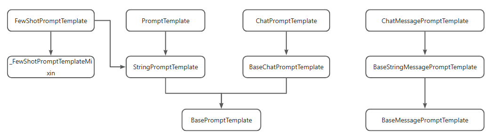

## LangChain的核心功能

- **模型（Models）**：提供统一接口调用各种LLM，如OpenAI的GPT系列、Anthropic的Claude系列、Google的Gemini系列，以及Hugging Face的开源模型。
- **提示（Prompts）**：优化模型输入，提升生成结果的质量，包括PromptTemplate、ChatPromptTemplate和FewShotPromptTemplate等。
- **链（Chains）**：封装多个组件的调用序列，创建复杂的工作流程，如SimpleSequentialChain等。
- **代理（Agents）**：允许模型自主调用外部工具和组件，实现多步骤任务处理，如AutoGPT和BabyAGI。
- **记忆（Memory）**：存储和检索对话数据，支持上下文感知的应用，如多轮对话系统。
- **索引（Indexes）**：组织和检索文档数据，支持RAG（检索增强生成）等应用场景。

## 实例化大模型

### 实例化大模型

#### 基本使用

```python
from langchain_openai import ChatOpenAI
llm = ChatOpenAI(
    model="qwen-max-latest",
    base_url="https://dashscope.aliyuncs.com/compatible-mode/v1",
    api_key="",
    streaming=True,
)
resp = llm.invoke("100 + 100 = ?")
print(resp.content)
```

注意 api_key 会提示：Expected type 'SecretStr | None', got 'str' instead 错误

#### 流式输出

只需要将invoke换成stream

```python
resp = llm.stream("100 + 100 = ?")
for item in resp:
    print(item.content, end="")
```

### 使用SecretStr类型对api_key进行加密

安装 pydantic：

```sh
uv add pydantic
```

**Pydantic** 是一个基于 Python 类型注解（type hints）的**数据验证与解析库**，广泛用于数据模型定义、数据验证、序列化和反序列化。它通过定义类（继承自 `BaseModel`）和类型注解，自动验证输入数据的结构和类型，确保数据符合预期格式，并提供清晰的错误信息。官网：https://docs.pydantic.dev/

可以使用 SecretStr 进行优化：

```python
from pydantic import SecretStr

api_key=SecretStr(""),
```

## 初始化提示词模板

### PromptTemplate(字符串提示模板)

#### 步骤

1. 先使用`PromptTemplate.from_template`创建提示词模板
2. 再使用`模板.format`进行代码补充完整，参数要和模板对齐
3. 再将整理好的模板传给大模型

#### **适用场景**：

- 用于**文本补全模型**，输入是纯文本（单字符串）。
- 适用于简单的任务，例如生成一段文本、回答问题或执行指令。

#### **特点**：

- **输入变量插值**：通过 `{}` 占位符动态替换变量。
- **模板格式**：支持 `f-string`。
- **输出形式**：生成一个完整的字符串作为模型输入。

#### 示例

```python
template_prompt = PromptTemplate.from_template("今天{something}真不错")
print(template_prompt) # input_variables=['something'] input_types={} partial_variables={} template='今天{something}真不错'

formatted_prompt = template_prompt.format(something="天气")
print(formatted_prompt) # 今天天气真不错
```

### ChatPromptTemplate(聊天提示模板)

#### 使用

1. 使用`ChatPromptTemplate.from_messages`创建模板，`参数是一个数组`，数组内是`元组`
2. 使用`模板.format_messages` 补充好模板，参数要和上面模板的形参保持一致

#### **适用场景**：

- 用于**聊天模型**（如 ChatGPT / 通义千问等），输入是多轮对话的消息列表（`SystemMessage`、`HumanMessage`、`AIMessage` 等）。
- 适用于需要模拟多轮对话或角色扮演的场景。

#### **特点**：

- **多消息类型支持**：可以组合系统指令、用户输入和助手回复。
- **消息格式化**：生成结构化的消息列表，供聊天模型处理。
- **灵活性**：支持动态替换变量（如 `SystemMessage` 中的占位符）。

#### 示例

```python
from langchain_openai import ChatOpenAI
from langchain_core.prompts import ChatPromptTemplate
llm = ChatOpenAI(
    model="qwen-max-latest",
    base_url="https://dashscope.aliyuncs.com/compatible-mode/v1",
    api_key="",
    streaming=True,
)
system_message = "你是一位{role}专家，擅长回答{domain}领域的问题。"
human_message = "{question}"

chat_prompt = ChatPromptTemplate.from_messages([
    ("system", system_message),
    ("human", human_message)
])

# 格式化消息
formatted_messages = chat_prompt.format_messages(
    role="技术",
    domain="Web开发",
    question="如何构建一个基于Vue的前端应用？"
)
resp = llm.stream(formatted_messages)
for item in resp:
    print(item.content, end="")
"""
[
  SystemMessage(content='你是一位技术专家，擅长回答Web开发领域的问题。', additional_kwargs={}, response_metadata={}),
  HumanMessage(content='如何构建一个基于Vue的前端应用？', additional_kwargs={}, response_metadata={})
]
"""
```

> python基础知识扩充：
>
> 这里的 `("system", system_message)`是 python 的 tuple 类型
>
> **Tuple（元组）**：
>
> - **有序**：元素按顺序排列，支持索引和切片操作。
> - **不可变**：**创建后无法修改（不能增删改元素）**。
> - **定义方式**：使用圆括号 `()` 或直接逗号分隔元素。
>
> **Array（数组）**：相当于 JS 中的 Array
>
> - **可变**：可以动态添加、删除或修改元素。
> - **有序**：元素按顺序排列，支持索引和切片。
>
> **Dict（字典）**：相当于 JS 中的 Object
>
> - **无序**：元素（键值对）没有固定顺序。
> - **可变**：可以动态添加、删除或修改键值对。
> - **定义方式**：使用花括号 `{}`，键值对用冒号 `:` 分隔。

### ChatMessagePromptTemplate与ChatPromptTemplate结合

#### 步骤

1. 使用`ChatMessagePromptTemplate.from_template`构建模板
2. 使用`ChatPromptTemplate.from_messages`组合成消息提示词模板
3. 使用`消息提示词模板.format_messages`填充实现提示词模板
4. 将填充好的提示词模板，传递给大模型

知识扩充：`ChatMessagePromptTemplate`可以结合 `ChatPromptTemplate`使用，同时对提示词模板和消息体进行抽象和复用：

```python
system_template = ChatMessagePromptTemplate.from_template(
    template="你是一位{role}专家，擅长回答{domain}领域的问题。",
    role="system",
)

human_template = ChatMessagePromptTemplate.from_template(
    template="用户问题：{question}",
    role="user",
)

chat_prompt = ChatPromptTemplate.from_messages([
    system_template,
    human_template,
])

messages = chat_prompt.format_messages(
    role="技术",
    domain="Web开发",
    question="如何构建一个基于Vue的前端应用？"
)

print(messages)

"""
[
  ChatMessage(content='你是一位技术专家，擅长回答Web开发领域的问题。', additional_kwargs={}, response_metadata={}, role='system'),
  ChatMessage(content='用户问题：如何构建一个基于Vue的前端应用？', additional_kwargs={}, response_metadata={}, role='human')
]
"""
```

### FewShotPromptTemplate

#### **适用场景**：

- 用于**少样本学习**（Few-Shot Learning），在提示中包含示例（Examples），帮助模型理解任务。
- 适用于复杂任务（如翻译、分类、推理），需要通过示例引导模型行为。

#### **特点**：

- **示例嵌入**：通过 `examples` 参数提供示例输入和输出。
- **动态示例选择**：支持 `ExampleSelector` 动态选择最相关的示例。
- **模板格式**：通常包含前缀（Prefix）、示例（Examples）和后缀（Suffix）。

#### 步骤

1. 定义`示例模板`，比如输入xx，输出xx
2. 根据上面的示例模板，`定义数组类型的示例，形参要和模板对应上`
3. 设置前置文本
4. 设置后置文本，也就是整段提示词最后的后缀
   由于前面的都通过example_template和examples，整理好了格式
   对于为了避免用户需要每次按照这个格式输出，可以设置后缀，让用户只需要输入关键信息，由suffix整理成和上面一样的格式
5. 指定输入的变量名称：`input_variables=["变量名"]`，指定用户传入的数据，被赋值到哪个参数上了
6. 将`少量模板，进行填充，然后传给大模型`

#### **示例**：

```python
# 定义示例模板
example_template = "输入: {input}\n输出: {output}"

# 创建示例
examples = [
    {"input": "将'Hello'翻译成中文", "output": "你好"},
    {"input": "将'Goodbye'翻译成中文", "output": "再见"},
]

# 创建少样本模板
few_shot_prompt = FewShotPromptTemplate(
    examples=examples,
    example_prompt=PromptTemplate.from_template(example_template),
    prefix="请将以下英文翻译成中文：",
    suffix="输入: {text}\n输出:",
    input_variables=["text"]
)

# 格式化提示
formatted_prompt = few_shot_prompt.format(text="Thank you")
print(formatted_prompt)

"""
请将以下英文翻译成中文：

输入: 将'Hello'翻译成中文
输出: 你好

输入: 将'Goodbye'翻译成中文
输出: 再见

输入: Thank you
输出:
"""
```

### 总结

#### 常用模板类特性和使用场景对比

| **子类**                | **适用模型类型** | **输入类型**   | **主要用途**                 |
| ----------------------- | ---------------- | -------------- | ---------------------------- |
| `PromptTemplate`        | 文本补全模型     | 单字符串       | 生成单轮文本任务的提示       |
| `ChatPromptTemplate`    | 聊天模型         | 多消息列表     | 模拟多轮对话或角色扮演       |
| `FewShotPromptTemplate` | 所有模型         | 包含示例的模板 | 通过示例引导模型完成复杂任务 |

#### 常用提示词模板类的继承关系



## 链式调用大模型

1. 先不进行few_shot_prompt.format填充完整模板，而是先把`提示词模板prompt`和`大模型llm` 组装在一起

```python
 定义示例模板
example_template = "输入: {input}\n输出: {output}"

# 创建示例
examples = [
    {"input": "将'Hello'翻译成中文", "output": "你好"},
    {"input": "将'Goodbye'翻译成中文", "output": "再见"},
]

# 创建少样本模板
few_shot_prompt = FewShotPromptTemplate(
    examples=examples,
    example_prompt=PromptTemplate.from_template(example_template),
    prefix="请将以下英文翻译成中文：",
    suffix="输入: {text}\n输出:",
    input_variables=["text"]
)

# 格式化提示
## formatted_prompt = few_shot_prompt.format(text="Thank you")


chain = few_shot_prompt | llm

response = chain.stream({"text": "Thank you"})
# response = chain.stream(input={"user_input": "计算100+100"})

for chunk in response:
    print(chunk.content, end="")
```

