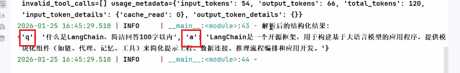
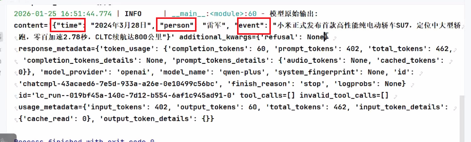

## 背景

语言模型`返回的内容通常都是字符串的格式(文本格式)`，但在实际AI应用开发过程中，往往希望大模型可以返回更直观、更格式化的内容，以确保应用能够顺利进行后续的逻辑处理
此时，LangChain提供的输出解析器就派上用场了

输出解析器(Output Parser) 负责获取model的输出，并将其转换为更合适的格式，这在应用开发中及其重要

作用：`将大模型的输出转换为JSON、XML、YAML等结构化数据`

## 解析器分类

1. 最常用的就是前三个

| 解析器类型           | 适用场景       | 输出格式         |
| -------------------- | -------------- | ---------------- |
| StrOutputParser      | 简单文本输出   | 字符串           |
| JSONOutputParser     | JSON格式数据   | 字典/列表        |
| PydanticOutputParser | 复杂结构化数据 | Pydantic模型对象 |
| ListOutputParser     | 列表数据       | Python列表       |
| DatetimeOutputParser | 时间日期数据   | datetime对象     |
| BooleanOutputParser  | 布尔输出       | True/False       |

## 输出解析器两大方法

### JsonOutputParser

将大模输出的内容，格式化成指定的格式返回

```python
"""
JsonOutputParser，即JSON输出解析器，
是一种用于将大模型的自由文本输出转换为结构化JSON数据的工具。

本案例是：指定提示词指明返回 json 格式
"""

from langchain_core.output_parsers import StrOutputParser, JsonOutputParser
from langchain_core.prompts import ChatPromptTemplate
import os
from langchain.chat_models import init_chat_model
from loguru import logger

# 创建聊天提示模板，包含系统角色设定和用户问题输入
chat_prompt = ChatPromptTemplate.from_messages([
    ("system", "你是一个{role}，请简短回答我提出的问题，结果返回json格式，q字段表示问题，a字段表示答案。"),
    ("human", "请回答:{question}")
])

# 使用指定的角色和问题生成具体的提示内容
prompt = chat_prompt.invoke({"role": "AI助手", "question": "什么是LangChain，简洁回答100字以内"})
logger.info(prompt)

# 初始化模型
model = init_chat_model(
    model="qwen-plus",
    model_provider="openai",
    api_key=os.getenv("aliQwen-api"),
    base_url="https://dashscope.aliyuncs.com/compatible-mode/v1"
)

# 调用模型获取回答结果
result = model.invoke(prompt)
logger.info(f"模型原始输出:\n{result}")

print("*" *  60)


# 创建JSON输出解析器实例
parser = JsonOutputParser()
# 调用解析器处理结果数据，将输入转换为JSON格式的响应
response = parser.invoke(result)
logger.info(f"解析后的结构化结果:\n{response}")
logger.info("\n")
# 打印类型
logger.info(f"结果类型: {type(response)}") # <class 'dict'>
```



### get_format_instructions

会返回一段清晰的格式说明字符串，**告诉model希望输出成什么格式**(比如JSON，或者特定格式)，不一定是JSON，也**可以是其他格式**

1. 定义一个Person类
2. JsonOutputParser增加参数，要求pydantic_object为定义的Person`parser = JsonOutputParser(pydantic_object=Person)`
3. 对转换器调用get_format_instructions方法`format_instructions = parser.get_format_instructions()`
4. 将转换后得到的结果，传到prompt中

   `prompt = chat_prompt.format_messages(topic="小米su7跑车", format_instructions=format_instructions)`

```python
"""
JsonOutputParser，即JSON输出解析器，
是一种用于将大模型的自由文本输出转换为结构化JSON数据的工具。

本案例是：借助JsonOutputParser的get_format_instructions() ，
生成格式说明，指导模型输出JSON 结构
"""

from langchain_core.output_parsers import StrOutputParser, JsonOutputParser
from langchain_core.prompts import ChatPromptTemplate
import os
from langchain.chat_models import init_chat_model
from loguru import logger
from pydantic import BaseModel, Field

class Person(BaseModel):
    """
    定义一个新闻结构化的数据模型类
    属性:
        time (str): 新闻发生的时间
        person (str): 新闻涉及的人物
        event (str): 发生的具体事件
    """
    time: str = Field(description="时间") #
    person: str = Field(description="人物")
    event: str = Field(description="事件")

# 创建JSON输出解析器，用于将model输出解析为Person对象
parser = JsonOutputParser(pydantic_object=Person)

# 获取格式化指令，告诉model如何输出符合要求的JSON格式
format_instructions = parser.get_format_instructions()

# 创建聊天提示模板，定义系统角色和用户输入格式
chat_prompt = ChatPromptTemplate.from_messages([
    ("system", "你是一个AI助手，你只能输出结构化JSON数据。"),
    ("human", "请生成一个关于{topic}的新闻。{format_instructions}")
])

# 格式化提示词，填入具体主题和格式化指令
prompt = chat_prompt.format_messages(topic="小米su7跑车", format_instructions=format_instructions)

# 记录格式化后的提示词信息
logger.info(prompt)


# 初始化大语言模型实例
model = init_chat_model(
    model="qwen-plus",
    model_provider="openai",
    api_key=os.getenv("aliQwen-api"),
    base_url="https://dashscope.aliyuncs.com/compatible-mode/v1"
)


# 调用大语言模型获取响应结果
result = model.invoke(prompt)

# 记录模型返回的结果
logger.info(f"模型原始输出:\n{result}")


# 使用解析器将模型输出解析为结构化数据
response = parser.invoke(result)
logger.info(f"解析后的结构化结果:\n{response}")

# 打印类型
logger.info(f"结果类型: {type(response)}")


```



## StrOutputParser

```python
"""
字符串解析器StrOutputParser
它是LangChain中最简单的输出解析器，它可以简单地将任何输入转换为字符串。
从结果中提取content字段转换为字符串输出。
"""
from langchain_core.output_parsers import StrOutputParser
from langchain_core.prompts import ChatPromptTemplate
import os
from langchain.chat_models import init_chat_model
from loguru import logger

# 创建聊天提示模板，包含系统角色设定和用户问题输入
chat_prompt = ChatPromptTemplate.from_messages(
    [
        ("system", "你是一个{role}，请简短回答我提出的问题"),
        ("human", "请回答:{question}")
    ]
)

# 使用指定的角色和问题生成具体的提示内容
prompt = chat_prompt.invoke({"role": "AI助手", "question": "什么是LangChain，简洁回答100字以内"})
logger.info(prompt)

# 初始化聊天模型
model = init_chat_model(
    model="qwen-plus",
    model_provider="openai",
    api_key=os.getenv("aliQwen-api"),
    base_url="https://dashscope.aliyuncs.com/compatible-mode/v1"
)

# 调用模型获取回答结果
result = model.invoke(prompt)
logger.info(f"模型原始输出:\n{result}")
# 创建字符串输出解析器，用于解析模型返回的结果
parser = StrOutputParser()

# 打印解析后的结构化结果
response = parser.invoke(result)
logger.info(f"解析后的结构化结果:\n{response}")
logger.info("\n")
# 打印类型
logger.info(f"结果类型: {type(response)}")
```

## with_structured_output

将模型和定义的类绑定，以要求模型按照格式输出

按照代码中的步骤来进行：

1. 定义你希望LLM输出的数据结构
2. 将这个定义好的 `AnimalList` 类传给模型的 `with_structured_output` 方法
3. 调用并获取对象 (Invoke)

```python

import os
from typing import TypedDict, Annotated
from langchain.chat_models import init_chat_model

llm = init_chat_model(
    model="qwen-plus",
    model_provider="openai",
    api_key=os.getenv("aliQwen-api"),
    base_url="https://dashscope.aliyuncs.com/compatible-mode/v1"
)
# 1.定义你希望LLM输出的数据结构
class Animal(TypedDict):
    animal: Annotated[str, "动物"]
    emoji: Annotated[str, "表情"]

class AnimalList(TypedDict):
    animals: Annotated[list[Animal], "动物与表情列表"] # List<Animal>

messages = [{"role": "user", "content": "任意生成三种动物，以及他们的 emoji 表情"}]
# 将这个定义好的 `AnimalList` 类传给模型的 `with_structured_output` 方法
llm_with_structured_output = llm.with_structured_output(AnimalList)
# 调用并获取对象 (Invoke)
resp = llm_with_structured_output.invoke(messages)
print(resp)


```

## PydanticOutputParser

对于结构更复杂、具有强类型约束的需求，PydanticOutputParser 则是最佳选择。
它结合了Pydantic模型的强大功能，提供了类型验证、数据转换等高级功能

也需要使用与JsonOutputParser相同，也使用`get_format_instructions`

唯一不同就是在定义类的方式上，使用Pydantic

```python
"""
PydanticOutputParser 是 LangChain 输出解析器体系中最常用、最强大的结构化解析器之一。
它与 JsonOutputParser 类似，但功能更强 —— 能直接基于 Pydantic 模型 定义输出结构，
并利用其类型校验与自动文档能力。
对于结构更复杂、具有强类型约束的需求，PydanticOutputParser 则是最佳选择。
它结合了Pydantic模型的强大功能，提供了类型验证、数据转换等高级功能
"""

import os
from langchain.chat_models import init_chat_model
from langchain_core.output_parsers import PydanticOutputParser
from langchain_core.prompts import ChatPromptTemplate
from loguru import logger
from pydantic import BaseModel, Field, field_validator


class Product(BaseModel):
    """
    产品信息模型类，用于定义产品的结构化数据格式

    属性:
        name (str): 产品名称
        category (str): 产品类别
        description (str): 产品简介，长度必须大于等于10个字符
    """
    name: str = Field(description="产品名称")
    category: str = Field(description="产品类别")
    description: str = Field(description="产品简介")

    @field_validator("description")
    def validate_description(cls, value):
        """
        验证产品简介字段的长度
        参数:
            value (str): 待验证的产品简介文本
        返回:
            str: 验证通过的产品简介文本
        异常:
            ValueError: 当产品简介长度小于10个字符时抛出
        """
        if len(value) < 10:
            raise ValueError('产品简介长度必须大于等于10')
        return value

# 创建Pydantic输出解析器实例，用于解析模型输出为Product对象
parser = PydanticOutputParser(pydantic_object=Product)

# 获取格式化指令，用于指导模型输出符合Product模型的JSON格式
format_instructions = parser.get_format_instructions()

# 创建聊天提示模板，包含系统消息和人类消息
prompt_template = ChatPromptTemplate.from_messages([
    ("system", "你是一个AI助手，你只能输出结构化的json数据\n{format_instructions}"),
    ("human", "请你输出标题为：{topic}的新闻内容")
])

# 格式化提示消息，填充主题和格式化指令
prompt = prompt_template.format_messages(topic="华为Mate X7", format_instructions=format_instructions)

# 记录格式化后的提示消息
logger.info(prompt)

# 创建模型
model = init_chat_model(
    model="qwen-plus",
    model_provider="openai",
    api_key=os.getenv("aliQwen-api"),
    base_url="https://dashscope.aliyuncs.com/compatible-mode/v1"
)

# 调用模型获取结果
result = model.invoke(prompt)

# 记录模型返回的结果
logger.info(f"模型原始输出:\n{result.content}")

# 使用解析器将模型结果解析为Product对象
response = parser.invoke(result)

# 打印解析后的结构化结果
logger.info(f"解析后的结构化结果:\n{response}")

# 打印类型
logger.info(f"结果类型: {type(response)}")
```


