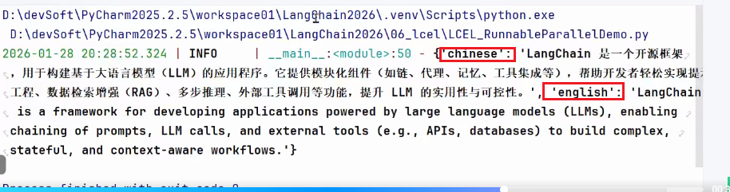

## 定义

### 基础说明

Runnable是langchain中的抽象基类(ABC)

目标：为所有可执行组件，提供统一的操作接口

核心理念：`一切可执行的对象，都应该有统一的调用方式`

**Runnable** 是LangChain 核心抽象接口(定义在langchain_core.runnables)`统一组件调用方式`，支持LCEL组合，适配同步/异步、流式、批量等场景，是构建工作流的基础

### 作用：

1. 统一接口
2. 将多个组件按照特定顺序组合起来，一边完成复杂任务的一个工作流或管道(Pipeline)

### 核心方法

1. invoke(input): 同步执行，处理单个输入，最常用方法
2. batch(input): 批量执行，处理多个输入，提升处理效率
3. stream(input): 流式执行，逐步返回结果，经典场景：让大模型流式输出
4. ainvoke：异步执行，用于高并发场景

## LCEL

### 定义

LCEL：LangChain expression language

核心操作符：使用管道操作符 | 将多个Runnable对象，像拼积木一样组合起来

作用：可以快速拼接多个Runnable，为复杂工作流，支持条件分支、并行执行等

### 经典写法

```python
Chain = prompt | model | output_parser

# Chain 本身也是Runnable，可以通过标准的invoke方法继续调用它

result = chain.invoke({topic: "编程"})
```


## 常用链

### RunnableSequence顺序链

1. 使用 | 将prompt ，model, parser 链接起来
2. 最后使用invoke填充调用

```python
"""
顺序链
LangChain 的一个典型链条由Prompt、Model、OutputParser （可没有）组成，
然后可以通过 链（Chain） 把它们顺序组合起来，让一个任务的输出成为下一个任务的输入
意思等价于Linux里面的管道符
"""
from langchain.chat_models import init_chat_model
from langchain_core.output_parsers import StrOutputParser
from langchain_core.prompts import ChatPromptTemplate
from loguru import logger
import os

# 创建聊天提示模板，包含系统角色设定和用户问题输入
chat_prompt = ChatPromptTemplate.from_messages([
    ("system", "你是一个{role}，请简短回答我提出的问题"),
    ("human", "请回答:{question}")
])

# 初始化模型
model = init_chat_model(
    model="qwen-plus",
    model_provider="openai",
    api_key=os.getenv("aliQwen-api"),
    base_url="https://dashscope.aliyuncs.com/compatible-mode/v1"
)

# 创建字符串输出解析器，用于处理模型输出
parser = StrOutputParser ()

# 构建处理链：提示模板 -> 模型 -> 输出解析器
chain = chat_prompt | model | parser

# 执行处理链并记录最终结果及数据类型
result_chain = chain.invoke({"role": "AI助手", "question": "什么是LangChain，简洁回答100字以内"})
logger.info(f"Chain执行结果:\n {result_chain}")
logger.info(f"Chain执行结果类型: {type(result_chain)}")

print()

print(type(chain))

```

### RunnableBranch分支链

1. 使用`RunnableBranch`,参数为：
   1. 元组(表达式：执行链条)，如果表达式为真，则使用该执行链条
2. 使用invoke将参数传递到该链中

```python
"""
分支链
在LangChain中提供了类RunnableBranch来完成LCEL中的条件分支判断，它可以根据输入的不同采用不同的处理逻辑，
具体示例如下
会根据用户输入中是否包含英语、韩语等关键词，来选择对应的提示词进行处理。根据判断结果，
再执行不同的逻辑分支
"""
from langchain.chat_models import init_chat_model
from langchain_core.output_parsers import StrOutputParser
from langchain_core.prompts import ChatPromptTemplate
from loguru import logger
from langchain_core.runnables import RunnableBranch
import os

# 构建提示词
english_prompt = ChatPromptTemplate.from_messages([
    ("system", "你是一个英语翻译专家，你叫小英"),
    ("human", "{query}")
])

japanese_prompt = ChatPromptTemplate.from_messages([
    ("system", "你是一个日语翻译专家，你叫小日"),
    ("human", "{query}")
])

korean_prompt = ChatPromptTemplate.from_messages([
    ("system", "你是一个韩语翻译专家，你叫小韩"),
    ("human", "{query}")
])


def determine_language(inputs):
    """判断语言种类"""
    query = inputs["query"]
    if "日语" in query:
        return "japanese"
    elif "韩语" in query:
        return "korean"
    else:
        return "english"


# 初始化模型
model = init_chat_model(
    model="qwen-plus",
    model_provider="openai",
    api_key=os.getenv("aliQwen-api"),
    base_url="https://dashscope.aliyuncs.com/compatible-mode/v1"
)

# 创建字符串输出解析器，用于处理模型输出
parser = StrOutputParser()
# 创建一个可运行的分支链，根据输入文本的语言类型选择相应的处理流程
# 返回值：RunnableBranch对象，可根据输入动态选择执行路径的可运行链
chain = RunnableBranch(
    (lambda x: determine_language(x) == "japanese", japanese_prompt | model | parser),
    (lambda x: determine_language(x) == "korean", korean_prompt | model | parser),
    (english_prompt | model | parser)
)

# 测试查询
test_queries = [
    {'query': '请你用韩语翻译这句话:"见到你很高兴"'},
    {'query': '请你用日语翻译这句话:"见到你很高兴"'},
    {'query': '请你用英语翻译这句话:"见到你很高兴"'}
]

for query_input in test_queries:

    # 判断使用哪个提示词
    lang = determine_language(query_input)
    logger.info(f"检测到语言类型: {lang}")

    # 根据语言类型选择对应的提示词并格式化
    if lang == "japanese":
        chatPromptTemplate = japanese_prompt
    elif lang == "korean":
        chatPromptTemplate = korean_prompt
    else:
        chatPromptTemplate = english_prompt

    #print(query_input) # {'query': '请你用英语翻译这句话:"见到你很高兴"'}

    # 格式化提示词并打印
    formatted_messages = chatPromptTemplate.format_messages(**query_input)
    logger.info("格式化后的提示词:")
    for msg in formatted_messages:
        logger.info(f"[{msg.type}]: {msg.content}")

    # 执行链
    # 将参数，传递到RunnableBranch中，里面的x,此时就是{'query': '请你用韩语翻译这句话:"见到你很高兴"'}
    result = chain.invoke(query_input)
    logger.info(f"输出结果: {result}\n")
```

### RunnableSerializable串行链

1. 需要多次调用大模型，将多个步骤串联起来实现功能
2. 关键代码：`full_chain = chain1 | (lambda content: {"input": content}) | chain2`
   1. 中间的lambda匿名函数，将chain1的数据，处理之后，传递给chain2继续使用

```python
"""
RunnableSerializable-串行链
子链叠加串行，假如我们需要多次调用大模型，将多个步骤串联起来实现功能
"""
from langchain.chat_models import init_chat_model
from langchain_core.output_parsers import StrOutputParser
from langchain_core.prompts import ChatPromptTemplate
from loguru import logger
import os

model = init_chat_model(
    model="qwen-plus",
    model_provider="openai",
    api_key=os.getenv("aliQwen-api"),
    base_url="https://dashscope.aliyuncs.com/compatible-mode/v1"
)


# 子链1提示词
prompt1 = ChatPromptTemplate.from_messages([
    ("system", "你是一个知识渊博的计算机专家，请用中文简短回答"),
    ("human", "请简短介绍什么是{topic}")
])
# 子链1解析器
parser1 = StrOutputParser()
# 子链1：生成内容
chain1 = prompt1 | model | parser1

result1 = chain1.invoke({"topic": "langchain"})
logger.info(result1)

# 子链2提示词
prompt2 = ChatPromptTemplate.from_messages([
    ("system", "你是一个翻译助手，将用户输入内容翻译成英文"),
    ("human", "{input}")
])
# 子链2解析器
parser2 = StrOutputParser()
# 子链2：翻译内容
chain2 = prompt2 | model | parser2


# 组合成一个复合 Chain，使用 lambda 函数将chain1执行结果content内容添加input键作为参数传递给chain2
full_chain = chain1 | (lambda content: {"input": content}) | chain2

# 调用复合链
result = full_chain.invoke({"topic": "langchain"})
logger.info(result)
```

### RunnableParallel并行链

1. 使用`RunnableParallel`关键字

   1. 参数为字典，key会作为后面的结果输出，value就是对应的链

      

```python
"""
RunnableParallel-并行链

在 Langchain 中，创建并行链（Parallel Chains），是指同时运行多个子链（Chain），并在它们都完成后汇总结果。
**作用**：同时执行多个 Runnable，合并结果
"""
from langchain.chat_models import init_chat_model
from langchain_core.output_parsers import StrOutputParser
from langchain_core.prompts import ChatPromptTemplate
from langchain_core.runnables import RunnableParallel
from loguru import logger
import os

model = init_chat_model(
    model="qwen-plus",
    model_provider="openai",
    api_key=os.getenv("aliQwen-api"),
    base_url="https://dashscope.aliyuncs.com/compatible-mode/v1"
)

# 并行链1提示词
prompt1 = ChatPromptTemplate.from_messages([
    ("system", "你是一个知识渊博的计算机专家，请用中文简短回答"),
    ("human", "请简短介绍什么是{topic}")
])
# 并行链1解析器
parser1 = StrOutputParser()
# 并行链1：生成中文结果
chain1 = prompt1 | model | parser1

# 并行链2提示词
prompt2 = ChatPromptTemplate.from_messages([
    ("system", "你是一个知识渊博的计算机专家，请用英文简短回答"),
    ("human", "请简短介绍什么是{topic}")
])
# 并行链2解析器
parser2 = StrOutputParser()

# 并行链2：生成英文结果
chain2 = prompt2 | model | parser2

# 创建并行链,用于同时执行多个语言处理链
parallel_chain = RunnableParallel({
    "chinese": chain1,
    "english": chain2
})

# 调用复合链
result = parallel_chain.invoke({"topic": "langchain"})
logger.info(result)


# 打印并行链的ASCII图形表示，LangGraph提前预告，不是本节知识点
parallel_chain.get_graph().print_ascii()

```

### RunnableLambda函数链

1. 定义函数

2. 使用`RunnableLambda`二次封装一下函数，变成`debug_node` 函数

   1. 如果函数是单参数，可以不用`RunnableLambda`,因为langChain会自动包装成Runnable函数

   2. 如果函数是多参数，需要使用`RunnableLambda`显式的包装

      ```python
      # ❌ 错误：多参数函数（需要显式包装）
      def multi_param(x, y):
          return x + y
      
      
      # ✅ 正确：使用 RunnableLambda 显式包装
      from langchain_core.runnables import RunnableLambda
      chain = chain1 | RunnableLambda(lambda x: multi_param(x, "extra"))
      ```

      

3. 将函数加入Chain，核心代码：`full_chain = chain1 | debug_print | chain2`，`full_chain2 = chain1 | debug_node | chain2`

```python
"""
RunnableLambda-函数链
将普通Python函数融入Runnable流程.
"""
from langchain.chat_models import init_chat_model
from langchain_core.output_parsers import StrOutputParser
from langchain_core.prompts import ChatPromptTemplate
from langchain_core.runnables import RunnableLambda
from loguru import logger
import os

model = init_chat_model(
    model="qwen-plus",
    model_provider="openai",
    api_key=os.getenv("aliQwen-api"),
    temperature=0.0,
    base_url="https://dashscope.aliyuncs.com/compatible-mode/v1"
)


# 一个简单的打印函数，调试用
def debug_print(x):
    logger.info(f"中间结果:{x}")
    return {"input": x}

# 子链1提示词
prompt1 = ChatPromptTemplate.from_messages([
    ("system", "你是一个知识渊博的计算机专家，请用中文简短回答"),
    ("human", "请简短介绍什么是{topic}")
])
# 子链1解析器
parser1 = StrOutputParser()
# 子链1：生成内容
chain1 = prompt1 | model | parser1

# 子链2提示词
prompt2 = ChatPromptTemplate.from_messages([
    ("system", "你是一个翻译助手，将用户输入内容翻译成英文"),
    ("human", "{input}")
])
# 子链2解析器
parser2 = StrOutputParser()

# 子链2：翻译内容
chain2 = prompt2 | model | parser2
# 创建一个可运行的调试节点，用于打印中间结果
debug_node = RunnableLambda(debug_print)

# 构建完整的处理链，将chain1、调试打印和chain2串联起来
full_chain = chain1 | debug_print | chain2

# 调用复合链
result1 = full_chain.invoke({"topic": "langchain"})
logger.info(f"最终结果111:{result1}")


# 构建完整的处理链，将chain1、调试打印和chain2串联起来
full_chain2 = chain1 | debug_node | chain2

# 调用复合链
result2 = full_chain2.invoke({"topic": "langchain"})
logger.info(f"最终结果222:{result2}")

```


