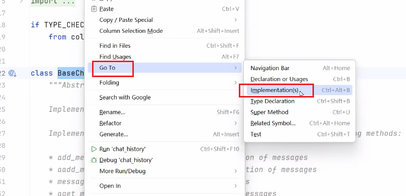

## 记忆缓存概述

1. 实现记忆功能，需要额外的模块保存我们和模型对话的上下文信息，然后在下次请求时，把所有的历史信息都输入给模型，让模型输出最终的结果
2. 记忆组件的三个基本功能：
   1. 读取记忆组件保存的历史对话信息
   2. 写入历史对话信息到记忆组件
   3. 存储历史对话消息
3. 在LangChain中，提供这个功能的模块就称为Memory(记忆)，用于存储用户和模型交互的历史信息
4. 给大模型添加记忆功能的方法如下：
   1. 在链执行前，将历史消息从记忆组件读取出来，和用户输入一起添加到提示词中，传递给大模型
   2. 在链执行完毕后，将用户的输入和大模型输出，一起写入到记忆组件中
   3. 在下次调用大模型时，重复这个过程

## 实现类

0.3之前，使用ConversationChain，1.0之后，使用的时RunnableWithMessageHistory

## RunnableWithMessageHistory

LangChain中所有可串联的组件(Prompt、Model、Parse、RunnableLambda等)都是继承自Runnable基类

### 优势

1. 模块化：允许自由组合提示模板、模型和内存管理逻辑
2. 灵活性：支持自定义对话历史存储(如：内存、数据库)和复杂对话流程
3. 兼容性：与LCEL和现代聊天模型无缝集成
4. 长期支持：在LangChain 0.3.x中稳定，且不会在1.0中移除

### 参数

| 参数                         | 类型                                     | 是否必需 | 描述                                                         |
| :--------------------------- | :--------------------------------------- | :------- | :----------------------------------------------------------- |
| **`runnable`**               | `Runnable`                               | **是**   | 你需要包装的、实际执行核心逻辑的原始链（如 `prompt | model`）。 |
| **`get_session_history`**    | `GetSessionHistoryCallable`              | **是**   | 一个负责根据配置（如 `session_id`）获取或创建聊天历史对象的函数。 |
| **`input_messages_key`**     | `str | None`                             | 否       | 当原始链的输入是字典时，用它来指定代表**新用户输入**的那个键。 |
| **`output_messages_key`**    | `str | None`                             | 否       | 当原始链的输出是字典时，用它来指定代表**模型输出消息**的那个键。 |
| **`history_messages_key`**   | `str | None`                             | 否       | 当原始链的输入是字典时，用它来指定用于存放**历史消息**的那个键。 |
| **`history_factory_config`** | `Sequence[ConfigurableFieldSpec] | None` | 否       | 配置传递给历史记录工厂（`get_session_history`）的自定义参数。这让你可以摆脱单一的 `session_id`，使用如 `user_id` 和 `conversation_id` 等多个参数来定位对话。 |
| **`**kwargs`**               | `Any`                                    | 否       | 传递给父类 `RunnableBindingBase` 的额外参数，例如可以设置 `name` 属性来为当前实例命名。 |

## BseChatMessageHistory与RunnableWithMessageHistory结合

### BseChatMessageHistory

#### 作用

用来保存聊天消息历史的抽象基类

#### 属性

1. messages:List[BaseMessage]：用来接收和读取历史消息的只读属性

### 方法

1. add_messages：批量添加消息，默认实现是每个消息都去调用一次add_message
2. add_message：单独添加消息，实现类必须重写这个方法，否则会报异常
3. clear()：清空所有消息，实现类必须重写这个方法

## 常用的历史消息组件及特性

| 组件名称                        | 特性                              | 缺点                         |
| ------------------------------- | --------------------------------- | ---------------------------- |
| InMemoryChatMessageHistory      | 基于`内存存储`的聊天消息历史组件  | 程序断电、重启，数据就没有了 |
| FileChatMessageHistory          | 基于`文件存储`的聊天消息历史组件  | I/O比较慢                    |
| RedisChatMessageHistory         | 基于`Redis存储`的聊天消息历史组件 |                              |
| ElasticsearchChatMessageHistory | 基于`ES存储`的聊天消息历史组件    |                              |

可以通过如下方法，查看其他的实现类



### (内存)InMemoryChatMessageHistory

1. 使用`InMemoryChatMessageHistory`实例化
2. 然后使用`add_user_message`和`add_message` 添加历史消息
3. 通过`ai_message = llm.invoke(history.messages)`将历史消息传递给大模型，并返回给变量`ai_message `
4. 可以使用`ai_message.content`查看AI回复
5. 遍历`history.messages`查看所有的历史消息

```python

from langchain.chat_models import init_chat_model
from langchain_core.chat_history import InMemoryChatMessageHistory
from loguru import logger
import os

# 设置本地模型，不使用深度思考
llm = init_chat_model(
    model="qwen-plus",
    model_provider="openai",
    api_key=os.getenv("aliQwen-api"),
    base_url="https://dashscope.aliyuncs.com/compatible-mode/v1"
)


# 创建内存聊天历史记录实例，用于存储对话消息
history = InMemoryChatMessageHistory()

# 添加用户消息到聊天历史记录
history.add_user_message("我叫张三，我的爱好是学习")

# 调用语言模型处理聊天历史中的消息
ai_message = llm.invoke(history.messages)

# 记录并输出AI回复的内容
logger.info(f"第一次回答\n{ai_message.content}")

# 将AI回复添加到聊天历史记录中
history.add_message(ai_message)

# 添加新的用户消息到聊天历史记录
history.add_user_message("我叫什么？我的爱好是什么？")

# 再次调用语言模型处理更新后的聊天历史
ai_message2 = llm.invoke(history.messages)

# 记录并输出第二次AI回复的内容
logger.info(f"第二次回答\n{ai_message2.content}")

# 将第二次AI回复添加到聊天历史记录中
history.add_message(ai_message2)

# 遍历并输出所有聊天历史记录中的消息内容
for message in history.messages:
    logger.info(message.content)
```

### (内存)RunnableWithMessageHistory

```python
"""
可持续记忆（RunnableWithMessageHistory）
"""

from langchain_core.output_parsers import StrOutputParser
from langchain_core.prompts import ChatPromptTemplate, MessagesPlaceholder
from langchain_core.runnables import RunnableWithMessageHistory, RunnableConfig
from langchain.chat_models import init_chat_model
from langchain_core.chat_history import InMemoryChatMessageHistory
from loguru import logger
import os

# 设置本地模型
llm = init_chat_model(
    model="qwen-plus",
    model_provider="openai",
    api_key=os.getenv("aliQwen-api"),
    base_url="https://dashscope.aliyuncs.com/compatible-mode/v1"
)

# 定义 Prompt
prompt = ChatPromptTemplate.from_messages([
    # 用于插入历史消息
    MessagesPlaceholder(variable_name="history"),
    ("human", "{input}")
])

parser = StrOutputParser()
# 构建处理链：将提示词模板、语言模型和输出解析器组合
chain = prompt | llm | parser
# 创建内存聊天历史记录实例，用于存储对话历史
history = InMemoryChatMessageHistory()
# 创建带消息历史的可运行对象，用于处理带历史记录的对话
runnable = RunnableWithMessageHistory(
    chain,
    get_session_history=lambda session_id: history,
    input_messages_key="input",  # 指定输入键
    history_messages_key="history"  # 指定历史消息键
)
# 清空历史记录
history.clear()
# 配置运行时参数，设置会话ID
config = RunnableConfig(configurable={"session_id": "user-001"})

logger.info(runnable.invoke({"input": "我叫张三，我爱好学习。"}, config))
logger.info(runnable.invoke({"input": "我叫什么？我的爱好是什么？"}, config))
```

### (内存)RunnableWithMessageHistory(V2版本)

1. 定义一个stroe用来存储不同用户的会话，模拟数据库、redis

```python
"""
可持续记忆（RunnableWithMessageHistory）
"""

from langchain.chat_models import init_chat_model
from langchain_core.chat_history import InMemoryChatMessageHistory  # 内存型消息记录
from langchain_core.runnables.history import RunnableWithMessageHistory
from langchain_core.prompts import ChatPromptTemplate, MessagesPlaceholder
from langchain_core.output_parsers import StrOutputParser
import os

# 设置本地模型
llm = init_chat_model(
    model="qwen-plus",
    model_provider="openai",
    api_key=os.getenv("aliQwen-api"),
    base_url="https://dashscope.aliyuncs.com/compatible-mode/v1"
)


# 定义全局的“会话存储”，用来保存每个 session 的聊天历史
#    （真实项目中可改为 Redis、SQLite 等）
store = {}

def get_session_history(session_id: str):
    """
    根据 session_id 获取对应的历史消息对象。
    如果不存在则创建一个新的 InMemoryChatMessageHistory。
    """
    if session_id not in store:
        store[session_id] = InMemoryChatMessageHistory()
    return store[session_id]


# 定义 Prompt 模板
#     - system: 给模型设定角色
#     - MessagesPlaceholder: 历史消息将注入这里
#     - human: 当前用户输入
prompt = ChatPromptTemplate.from_messages([
    ("system", "你是一个友好的中文助理，会根据上下文回答问题。"),
    MessagesPlaceholder("history"),
    ("human", "{question}")
])


#构建基本链：Prompt → LLM → 输出解析
memory_chain = prompt | llm | StrOutputParser()

# -----------------------------------------------------
# 将链包装为支持记忆的版本
with_history = RunnableWithMessageHistory(
    memory_chain,              # 原始链
    get_session_history,       # 获取历史函数
    input_messages_key="question",  # 对应 prompt 输入的 key
    history_messages_key="history", # 对应 MessagesPlaceholder 的变量名
)

# -----------------------------------------------------
# 模拟一个会话，用 session_id 区分不同用户
cfg = {"configurable": {"session_id": "user-001"}}

# 第一次提问：告诉模型“我叫张三”
print("用户：我叫张三。")
print("AI：", with_history.invoke({"question": "我叫张三。"}, cfg))

# 第二次提问：让模型回忆前面的对话
print("\n 用户：我叫什么？")
print("AI：", with_history.invoke({"question": "我叫什么？"}, cfg))
```

## Redis Stack

Redis Stack = 原生Redis + 搜索 + 图 + 时间序列 + JSON + 概率解构 + 可视化工具 + 开放框架支持

安装：

前面的一个端口是本机端口，如果6379占用，可以使用`端口:6379`来改成其他端口

如下：访问的是26379

```bash
docker run -d --name redis-stack-server -p 26379:6379 redis/redis-stack-server
```

Python3 + LangChain 1.0 ,只适配5.3.1， 使用pip install redis==5.3.1

### 核心组件

1. RedisSearch: 提供全文搜索能力，支持复杂的文本搜索、聚合和过滤，以及向量数据的存储和检索
2. RedisJSON：原生支持JSON数据的存储、索引和查询，可高效存储和操作嵌套的JSON文档
3. RedisGraph：支持图数据模型，使用Cypher查询语言进行图遍历查询
4. RedisBloom：支持Bloom、Cuckoo、Count-Min Sketch等概率数据

### RedisChatMessageHistory

1. Redis的设置：decode_responses： False 返字节串，True 返字符串，图片等格式，用字节串

```python
from langchain.chat_models import init_chat_model
from langchain_community.chat_message_histories import RedisChatMessageHistory
from langchain_core.runnables.history import RunnableWithMessageHistory
from langchain_core.prompts import ChatPromptTemplate, MessagesPlaceholder
from langchain_core.runnables import RunnableConfig
import os
import redis  #导入原生redis库，pip install redis==5.3.1
from loguru import logger

REDIS_URL = "redis://localhost:26379"
# 创建原生Redis客户端,decode_responses 控制 Redis 
# decode_responses返回数据的类型：False 返字节串，True 返字符串
redis_client = redis.Redis.from_url(REDIS_URL, decode_responses=True)

# 设置本地模型
llm = init_chat_model(
    model="qwen-plus",
    model_provider="openai",
    api_key=os.getenv("aliQwen-api"),
    base_url="https://dashscope.aliyuncs.com/compatible-mode/v1"
)

# 创建提示模板
prompt = ChatPromptTemplate.from_messages([
    MessagesPlaceholder("history"),
    ("human", "{question}")
])

def get_session_history(session_id: str) -> RedisChatMessageHistory:
    """获取或创建会话历史（使用 Redis）"""
    # 创建 Redis 历史对象
    history = RedisChatMessageHistory(
        session_id=session_id,
        url=REDIS_URL,
        # ttl=3600  # 注释：关闭自动过期，避免重启后数据被清理
    )

    return history

# 创建带历史的链
chain = RunnableWithMessageHistory(
    prompt | llm,
    get_session_history,
    input_messages_key="question",
    history_messages_key="history"
)

# 配置
# session_id 就是登录大模型的各自帐户，类似登录手机号码，各不相同
config = RunnableConfig(configurable={"session_id": "user-001"})

# 主循环
print("开始对话（输入 'quit' 退出）")
while True:
    question = input("\n输入问题：")
    if question.lower() in ['quit', 'exit', 'q']:
        break

    response = chain.invoke({"question": question}, config)
    logger.info(f"AI回答:{response.content}")

    # 等同于redis-cli的SAVE命令，强制写入dump.rdb
    redis_client.save()
```


