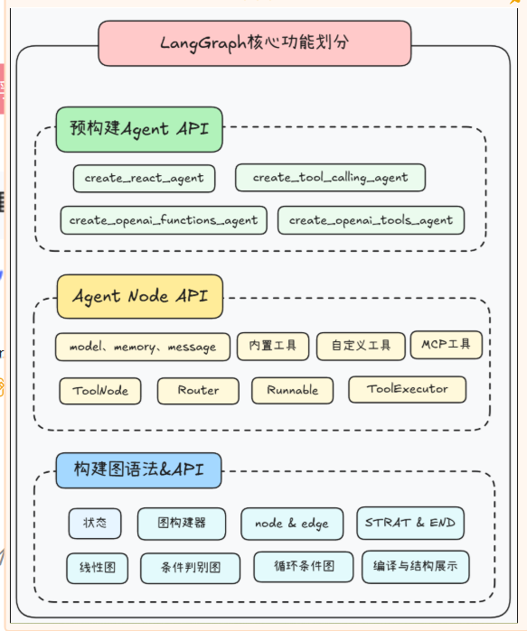
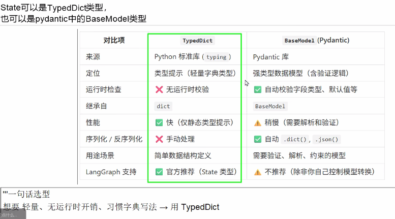

## 基础概念

### 定义

基于LangChain构建的、面向智能体多轮交互/状态持久化/分支并行的图结构工作流框架

### 灵魂四件套

**状态(State)、节点(Nodes)、边(Edges)、图(Graph)**

1. 节点： 执行逻辑
2. 边：定义顺序

### 组成

**LangGraph = LangChain + 图编排 + 状态机**

### 获取图信息

**通过graph.get_graph()**可以获取图的结构信息，包括节点和边的详细信息，基于这个信息，可以使用如下方式进行可视化优化：

1. 生成Mermaid代码来可视化图结构：`app.get_graph().draw_mermaid()`
2. 生成简单的ASCII文本图表，但需要安装额外的依赖`app.get_graph().print_ascii()`

### LangChain困境

1. Chain太流水线，无法优雅的处理循环和条件分支，不适合复杂任务
2. Agent太自由，像个黑箱，难以控制、调试和保证稳定性

### LangGraph功能

1. LangGraph提供了强大的状态管理机制，允许Agent在`不同节点之间传递和维护信息`，从而实现长期的记忆和多轮对话能力。通过定义`节点和边`，可以精确控制Agent的执行逻辑，包括条件分支，循环和并行执行
2. LangGraph 能够无缝集成各种外部工具(如搜索引擎、数据库、API等)，让Agent能够获取实时信息、执行特定操作，极大的拓展了LLM的能力边界
3. 图结构使得Agent的运行路径清晰可见，便于理解Agent的决策过程，并在出现问题时进行快速定位和调试
4. 模块化与可用性：每个节点都可以是一个独立的、可复用的组件，维护高且易于扩展。通过子图机制，复杂的工作流可以被分解为多个可独立开发和测试的模块，提高了开发和测试效率

## LangGraph架构



## 图构建说明

### 结构解析

1. 使用类的语法，构建一个State`状态类型说明`
   1. 如果不想定义这个类型，可以在`graph = StateGraph(HelloState)`中，直接使用dict，如`StateGraph(dict)`
   1. 可以使用TypeDict
   1. 也可以使用BaseModel，(需要从pydantic中引入使用)

   

2. 定义Node节点
   1. 第一个参数是状态State
   2. 第二个参数是运行时的一些上下文runTime

3. 使用StateGraph构建图实例

4. 使用add_node在图上添加节点

5. 使用add_edge在图上添加线(边)， 参数是`起始节点`和`结束节点`,有两种特殊的`Start`、`END`节点，定义开始和结束，需要从`langgraph.graph`解构

6. 使用 `graph.compile`编译图

7. 使用invoke填充使用
   1. 参数只能是字典

8. 打印图
   1. app.get_graph().print_ascii()：打印图的ascii可视化结构
   2. app.get_graph().draw_mermaid() ：打印图的Mermaid代码可视化结构

### 状态说明

helloState，通过Invoke，得到了name的值
通过第一个node，得到了greeting的值
再传入到第二个node，改变了greeting的值，
这就是所谓的state的含义，在node之间发生了变化

### 示例代码一

1. 下面的HelloState，使用TypedDict是无法用  .  的方式取值的

2. 如果想用  .  的方式取值，可以使用BaseModel定义

   ```python
   class State(BaseModel):
       x: int
       
       
   def addition(state: State):
       print(f'加法节点收到的初始值:{state}')
       return State(x=state.x + 1)  # ✅ 可以用点号
   ```

   

```python
from typing import TypedDict, Annotated, List, Dict
from langgraph.graph import StateGraph, START, END
import uuid

# 1．定义State(可选)
class HelloState(TypedDict):
    name: str
    greeting: str


# 2.定义节点Node
def greet(helloState: HelloState) -> dict:
    name = helloState["name"]
    return {"greeting": f"你好,{name}"}

def add_emoji(helloState:HelloState) -> dict:
    greeting = helloState["greeting"]
    return {"greeting": greeting + "  。。。😄"}


# 3.构建图graph
graph = StateGraph(HelloState)

graph.add_node("greeting",greet)
graph.add_node("add_emoji",add_emoji)

graph.add_edge(START, "greeting")
graph.add_edge("greeting","add_emoji")
graph.add_edge("add_emoji",END)


# 4.编译图
app = graph.compile()

# 5.运行
# invoke()方法只接收状态字典作为核心参数
result = app.invoke({"name":"z3"})
print(result)
print(result["greeting"])


#
# #6 打印图的边和节点信息
#6.1 打印图的ascii可视化结构
print(app.get_graph().print_ascii())
print("="*50)
#
# #6.2 打印图的Mermaid代码可视化结构并通过https://www.processon.com/mermaid编辑器查看
print(app.get_graph().draw_mermaid())
print("="*50)


#
# #6.3 生成 PNG并写入文件
# png_bytes = app.get_graph().draw_mermaid_png(max_retries=2,retry_delay=2.0)
# output_path = "langgraph" + str(uuid.uuid4())[:8] + ".png"
# with open(output_path, "wb") as f:
#     f.write(png_bytes)
# print(f"图片已生成：{output_path}")

"""
上面第3种方式，容易bug,时好时坏
ValueError: Failed to reach https://mermaid.ink  API while trying to render your graph after 1 retries. 
To resolve this issue:
1. Check your internet connection and try again
2. Try with higher retry settings: `draw_mermaid_png(..., max_retries=5, retry_delay=2.0)`
3. Use the Pyppeteer rendering method which will render your graph locally in a browser: 
`draw_mermaid_png(..., draw_method=MermaidDrawMethod.PYPPETEER)`
"""


```

### 示例代码二

```python
'''
我们先在不接入大模型的情况下构建一个加减法图工作流，
我们这里自定义两个简单函数：一个是加法函数接收当前State并将其中的x值加1，
另一个是减法函数接收当前State并将其中的x值减2，
然后添加名为addition和subtraction的节点，并关联到两个函数上，最后构建出节点之间的边。
'''

from langgraph.constants import START, END
from langgraph.graph import StateGraph


def addition(state):
    print(f'加法节点收到的初始值:{state}')
    return {"x": state["x"] + 1}

def subtraction(state):
    print(f'减法节点收到的初始值:{state}')
    return {"x": state["x"] - 2}


graph = StateGraph(dict)
# 向图构建器中添加节点
# 添加加法运算节点和减法运算节点到构建器中
graph.add_node("addition", addition)
graph.add_node("subtraction", subtraction)

# 定义节点之间的执行顺序 edges
# 设置节点间的依赖关系，形成执行流程图
graph.add_edge(START, "addition")
graph.add_edge("addition", "subtraction")
graph.add_edge("subtraction", END)
# 打印图的边和节点信息
print(graph.edges)
print()
print(graph.nodes)

# 编译图构建器生成计算图
app = graph.compile()
# invoke()方法只接收状态字典作为核心参数，定义一个初始状态字典，包含键值对"x": 5
initial_state={"x": 5}
# 调用graph对象的invoke方法，传入初始状态，执行图计算流程
result= app.invoke(initial_state)
print(f"最后的结果是:{result}")

# # 打印图的可视化结构
print(app.get_graph().print_ascii())
print()
# 打印图的可视化结构，生成更加美观的Mermaid 代码，通过processon 编辑器查看
print(app.get_graph().draw_mermaid())

```

### 结合LLM

```python
"""
LangGraph 简单案例HelloWorld：
构建一个最小的有向图，流程是：START → 模型节点 → END

LangGraph的灵魂：State(状态) + Nodes(节点) + Edges(边) + Graph(图)
"""

import uuid
from typing import TypedDict, Annotated, List
from langgraph.graph import StateGraph, START, END
from langgraph.graph.message import add_messages
import os
from langchain.chat_models import init_chat_model
from langchain_core.messages import HumanMessage


# ========== 1. 定义状态（State） ==========
# 存储对话消息
class AtguiguState(TypedDict):
    # messages 是一个消息列表，Annotated + add_messages 表示支持自动追加消息
    messages: Annotated[List, add_messages]

# ========== 2. 定义大模型 ==========
llm = init_chat_model(
    model="qwen-plus",
    model_provider="openai",
    api_key=os.getenv("aliQwen-api"),
    base_url="https://dashscope.aliyuncs.com/compatible-mode/v1"
)

# ========== 3. 定义节点函数 ==========
# 节点：调用大模型，并把回复加入到 state["messages"] 里
def model_node(state: AtguiguState):
    reply = llm.invoke(state["messages"])   # 输入历史消息，调用模型
    return {"messages": [reply]}            # 返回新消息，自动加到 state

# ========== 4. 构建图结构 ==========
graph = StateGraph(AtguiguState)            # 初始化图，指定 State 类型

graph.add_node("model", model_node)         # 添加一个节点，名字叫 "model"

graph.add_edge(START, "model")      # 从 START 到 "model"
graph.add_edge("model", END)        # 从 "model" 到 END
# 打印图的边和节点信息
#print(graph.edges)
print()
#print(graph.nodes)

# ========== 5. 编译==========
app = graph.compile()

# ========== 6. 运行 ==========
#result = app.invoke({"messages": [HumanMessage(content="请用一句话解释什么是 LangGraph。")]})
result = app.invoke({"messages": "请用一句话解释什么是 LangGraph。"})

# 打印模型的最后一条回复
print("模型回答：", result["messages"][-1].content)

print()
# =========================
#1. 打印图的ascii可视化结构
print(app.get_graph().print_ascii())
print("="*50)

#2. 打印图的Mermaid代码可视化结构并通过https://www.processon.com/mermaid编辑器查看
print(app.get_graph().draw_mermaid())
print("="*50)

#3. 生成 PNG并写入文件
# png_bytes = app.get_graph().draw_mermaid_png()
# output_path = "langgraph" + str(uuid.uuid4())[:8] + ".png"
# with open(output_path, "wb") as f:
#     f.write(png_bytes)
# print(f"图片已生成：{output_path}")
```


