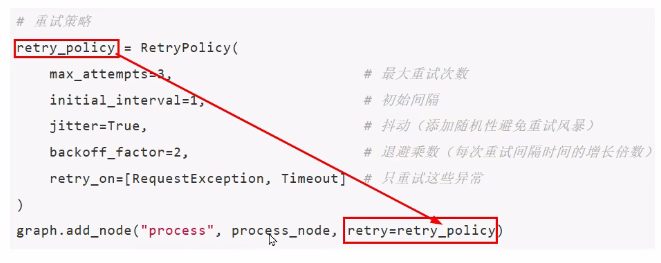

## 说明

### 定义

在LangGraph中，节点(Node)是一个基本的处理单元，代表工作流的一个步骤

可以是：

1. 一个Agent
2. 调用大模型
3. 一个工具或Python 函数(可以是同步，也可以是异步)，可以接收如下参数：
   1. state： 图的状态
   2. config：一个RunnableConfig对象，包含诸如thread_id之类的配置信息以及注入tags之类的跟踪信息
   3. runtime：一个Runtime对象，包含运行时Context以及其他信息，如Store和stream_writer

定义好node函数后，使用add_node方法将这些节点添加到图中。如果在向图中添加节点时未指定名称，系统会为其分配一个与函数名相同的默认名称

### 设计原则

1. 单一性原则：每个节点应该只负责一项职责，避免功能过于复杂
2. 无状态设计：节点本身不应该报错状态，所有数据都通过输入状态传递
3. 幂等性：相同的输入应该产生相同的输出，确保可重试性
4. 可测试性：节点逻辑应该易于单元测试

### 特殊的节点

1. `__START__`：开始节点

   1. 确定应该首先调用哪些节点

   2. ```python
      from langgraph.graph import START
      
      # 第一个执行的节点是node_start
      
      graph.add_edge(START, "node_start")
      ```

   3. 也可以通过`graph.set_entry_point("node_start")`函数设置起始节点，结果等价于`graph.add_edge(START, "node_start")`

2. `__END__`：结束节点

   1. 表示后续没有其他节点可以继续执行了
   1. 也可通过`graph.set_finish_point("process")`， 等价于`stateGraph.add_edge("process", END)`

### 代码实现

1. 使用partial添加参数
2. 使用retry设置重试参数

```python
from functools import partial
from typing import TypedDict

from langgraph.graph import StateGraph, START, END
from langgraph.types import RetryPolicy
from requests import RequestException, Timeout


# 定义状态
class GraphState(TypedDict):
    process_data: dict # 默认更新策略


# 定义一个节点，入参为state
def input_node(state: GraphState) -> GraphState:
    print(f'input_node收到的初始值:{state}')
    return {"process_data": {"input": "input_value"}}

# 定义带参数的node节点
def process_node(state: dict, param1: int, param2: str) -> dict:
    print(state, param1, param2)
    return {"process_data": {"process": "process_value"}}


# 重试策略,add_node方法时可选
retry_policy = RetryPolicy(
    max_attempts=3,                       # 最大重试次数
    initial_interval=1,                   # 初始间隔
    jitter=True,                          # 抖动（添加随机性避免重试风暴）
    backoff_factor=2,                     # 退避乘数（每次重试间隔时间的增长倍数）
    retry_on=[RequestException, Timeout]  # 只重试这些异常
)


stateGraph = StateGraph(GraphState)
# 添加inpu节点
stateGraph.add_node("input", input_node)
# 给process_node节点绑定参数
process_with_params = partial(process_node, param1=100, param2="test")
# 添加带参数的node节点
stateGraph.add_node("process", process_with_params,retry=retry_policy)

# 定义节点之间的执行顺序 edges
# 设置节点间的依赖关系，形成执行流程图
stateGraph.add_edge(START, "input")
stateGraph.add_edge("input", "process")
stateGraph.add_edge("process", END)

# 编译图构建器生成计算图
graph = stateGraph.compile()


# # 打印图的边和节点信息
print(stateGraph.edges)
print(stateGraph.nodes)
# 打印图的可视化结构
print(graph.get_graph().print_ascii())

print()

# 定义一个初始状态字典，包含键值对"x": 5
initial_state={"process_data": 5}
# 调用graph对象的invoke方法，传入初始状态，执行图计算流程
result= graph.invoke(initial_state)
print(f"最后的结果是:{result}")
```

## 节点缓存

### 说明

LangGraph支持基于节点输入对任务/节点进行缓存。使用缓存的方法如下：

1. 编译图(或指定入口点)时指定缓存
2. 为节点指定缓存策略。每个缓存策略支持：
   1. key_func：用于根据节点的输入生成缓存键
   2. ttl：缓存的生存时间(以秒为单位)。如果未指定，缓存将永不过期

#### 缓存键与命中

当一个节点开始执行时，系统会使用其配置的key_func 根据当前节点的输入数据，生成一个唯一的键，LangGraph会检查缓存中是否存在这个键

如果存在(缓存命中)：则直接返回之前存储的结果，跳过该节点的实际执行

如果不存在(缓存未命中)：则正常执行节点函数，并将结果与缓存键关联后存入缓存

#### 缓存有效期

ttl参数能控制缓存的有效期

例如：对于依赖实时数据的天气查询节点，可以设置较短的ttl（如60秒）。而对于处理静态信息或变化不频繁的数据节点，则可以设置较长的ttl，甚至不设置（None），让缓存永久有效，直到手动清除

### 代码示例

1. add_node此处增加了第三个参数，cache_policy，用来设置缓存策略

2. 指定缓存到内存里，InMemoryCache，也可以使用MemoryCache，都是一样的作用，只不过要解构出MemoryCache

3. 若缓存到redis中，使用如下方式

   ```python
   from langgraph.graph import StateGraph
   from langgraph.cache.redis import RedisCache
   from langgraph.types import CachePolicy
   import redis
   
   # 1. 连接 Redis
   redis_client = redis.Redis.from_url("redis://localhost:6379/0")
   
   # 2. 构建图
   builder = StateGraph(State)
   builder.add_node(
       "expensive_node",
       expensive_node,
       cache_policy=CachePolicy(ttl=300)  # 5分钟过期
   )
   
   # 3. 编译时使用 RedisCache
   graph = builder.compile(cache=RedisCache(redis_client))
   
   # 4. 正常调用
   result = graph.invoke({"x": 5})
   ```

   

```python
import time
from typing_extensions import TypedDict
from langgraph.graph import StateGraph
from langgraph.cache.memory import InMemoryCache
from langgraph.types import CachePolicy


# 定义状态类，也就是你的业务实体entity
class State(TypedDict):
    x: int
    result: int

# 创建图
builder = StateGraph(State)

# 定义节点：模拟耗时计算（sleep3秒）
def expensive_node(state: State) -> dict[str, int]:
    time.sleep(3)
    return {"result": state["x"] * 2}

#     builder.add_node("node1", node_default_1)

# 仅设置自定义 key_func，指定缓存的逻辑
def my_key_func(state, config=None):
    # 假设状态是一个字典，我们只根据 'user_id' 字段来缓存
    return state.get("user_id", "default_user")

# 添加节点
builder.add_node(node="expensive_node",action=expensive_node,
    # 不用传key_fn，底层自动用默认逻辑
    cache_policy=CachePolicy(ttl=8，key_func=my_key_func)
)

# 设置入口和出口
builder.set_entry_point("expensive_node")
builder.set_finish_point("expensive_node")

# 编译图，指定内存缓存
app = builder.compile(cache=InMemoryCache())

# 第一次执行：耗时3秒（无缓存）
print("第一次执行（无缓存，耗时3秒）：")
print(app.invoke({"x": 5}))
# 第二次执行：瞬间返回（利用缓存，8秒内有效）
print("\n1111111111111111111111111111")
print("第二次运行利用缓存并快速返回：")
print(app.invoke({"x": 5}))

# 可选：测试8秒后缓存过期（取消注释查看）
print("\n等待8秒，缓存过期...")
time.sleep(8)
print("8秒后第三次执行（重新计算，耗时3秒）：")
print(app.invoke({"x": 5}))
```

## 错误处理(异常)

### 说明

LangGraph还提供了错误处理和重试机制来指定重试次数、重试间隔、重试异常等，用于保证系统的可靠性

为节点添加重试策略，需要在add_node中设置retry_policy参数。retry_policy参数接收一个RetryPolicy命名元组对象。默认情况下，retry_on参数使用default_retry_on函数，该函数会在遇到任何异常时重试



### 示例代码

1. 封装`build_retry_graph`,用来`构建节点和边的添加、策略的绑定`

```python
"""
LangGraph 节点重试策略演示

默认重试策略：max_attempts=5，对Exception重试、对ValueError/TypeError等不重试，异常过滤列表完全相同；
自定义重试策略：max_attempts=5 + custom_retry_on，仅对包含{模拟API调用失败}的异常重试；throw new RuntimeExp("模拟API调用失败")
不可重试测试：ValueError直接抛错，无重试，max_attempts=3
"""
from typing import Dict, Any
from typing_extensions import TypedDict
from langgraph.graph import StateGraph, START, END
from langgraph.types import RetryPolicy


# 定义状态类型
class AtguiguState(TypedDict):
    result: str

# 全局计数器：记录API尝试次数
attempt_counter = 0


# 工具函数
def build_retry_graph(node_name: str, node_func, retry_policy: RetryPolicy):
    builder = StateGraph(AtguiguState)
    #为节点添加重试策略，需要在add_node中设置retry_policy参数。
    # retry_policy参数接受一个RetryPolicy命名元组对象。
    # 默认情况下，retry_on参数使用default_retry_on函数，该函数会在遇到任何异常时重试
    builder.add_node(node_name, node_func, retry_policy=retry_policy)
    builder.add_edge(START, node_name)
    builder.add_edge(node_name, END)
    return builder.compile()


# 模拟不稳定的API调用，使用全局变量跟踪尝试次数
def unstable_api_call(state: AtguiguState) -> Dict[str, Any]:
    """模拟不稳定API：前2次失败，第3次成功（全局计数器记录尝试次数）"""
    global attempt_counter
    attempt_counter += 1
    # 纯文本打印尝试次数
    print(f"尝试调用API，这是第 {attempt_counter} 次尝试")

    # 模拟失败/成功逻辑：前2次抛异常，第3次返回结果
    if attempt_counter < 3:
        raise Exception(f"模拟API调用失败abcd (尝试 {attempt_counter})")
    return {"result": f"API调用成功，经过 {attempt_counter} 次尝试"}

# 自定义重试条件判断函数
def custom_retry_on(exception: Exception) -> bool:
    """自定义重试规则：只对包含「模拟API调用失败」的异常重试"""
    print("########################:  "+str(exception))
    err_msg = str(exception)
    if "模拟API调用失败" in err_msg:
        print(f"捕获到可重试异常: {err_msg}")
        return True
    print(f"捕获到不可重试异常: {err_msg}")
    return False

# 模拟抛出 ValueError 的节点
def value_error_call(state: AtguiguState) -> Dict[str, Any]:
    """模拟抛出ValueError：默认重试策略对这类异常不重试"""
    print("调用会抛出 ValueError 的节点")
    raise ValueError("模拟 ValueError 异常")


# 测试方法1：默认重试策略
def test_default_retry():
    global attempt_counter
    print("1. 使用默认重试策略:")
    print("   默认策略会对除特定异常外的所有异常进行重试")
    print("   不会重试的异常包括: ValueError, TypeError, ArithmeticError, ImportError,")
    print("                     LookupError, NameError, SyntaxError, RuntimeError,")
    print("                     ReferenceError, StopIteration, StopAsyncIteration, OSError\n")

    print("测试默认重试策略:")
    attempt_counter = 0  # 重置计数器
    default_graph = build_retry_graph(
        node_name="unstable_api",
        node_func=unstable_api_call,
        retry_policy=RetryPolicy(max_attempts=5)  # 最多5次尝试，足够重试成功
    )
    try:
        result = default_graph.invoke({"result": ""})
        print(f"最终结果: {result}\n")
    except Exception as e:
        print(f"最终失败: {type(e).__name__}: {e}\n")


# 测试方法2：自定义重试策略（输出完全匹配要求）
def test_custom_retry():
    global attempt_counter
    print("2. 使用自定义重试策略:")
    print("   自定义策略只对特定错误进行重试\n")
    print("测试自定义重试策略:")
    attempt_counter = 0  # 重置计数器
    custom_graph = build_retry_graph(
        node_name="custom_retry_api",
        node_func=unstable_api_call,
        retry_policy=RetryPolicy(max_attempts=5, retry_on=custom_retry_on)
    )
    try:
        result = custom_graph.invoke({"result": ""})
        print(f"最终结果: {result}\n")
    except Exception as e:
        print(f"最终失败: {type(e).__name__}: {e}\n")


# 测试方法3：不可重试异常演示,测试 ValueError（默认策略不会重试）
def test_no_retry_exception():
    print("3. 测试不会重试的异常类型:")
    print("测试 ValueError（默认策略不会重试）:")
    no_retry_graph = build_retry_graph(
        node_name="value_error_node",
        node_func=value_error_call,
        retry_policy=RetryPolicy(max_attempts=3)
    )
    try:
        result = no_retry_graph.invoke({"result": ""})
        print(f"最终结果: {result}\n")
    except Exception as e:
        print(f"最终失败: {type(e).__name__}: {e}\n")


# 主演示函数
def run_demo():
    print("=== LangGraph 节点重试策略完整演示===")
    print("-" * 80 + "\n")
    #test_default_retry()
    #test_custom_retry()
    test_no_retry_exception()
    print("-" * 80)
    print("=== 演示结束 ===")


# 程序入口
if __name__ == "__main__":
    run_demo()
```

## 重试机制