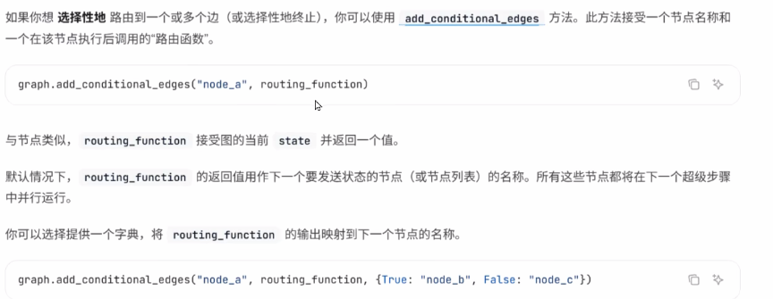

## 说明

### 定义

Edge定义了节点之间的连接和执行顺序，以及不同节点之间是如何通讯的

一个节点可以有多个出边（指向多个节点），多个节点也可以指向同一个节点（Map-Reduce)

### 类型

1. 普通边(Normal Edges)

   1. 直接从一个节点到下一个节点

      ```python
      graph.add_edge("节点1", "节点2")
      ```

2. 条件边(Conditional Edges)

   1. 调用要给函数来决定接下来要到哪个（或哪些）节点

      使用`routing_funciton`路由函数

      ```python
      graph.add_conditionlal_edges("节点名称", routing_funciton)
      ```

3. 入口点(Entry Point)

   1. 当用户输入到达时，首先调用哪个节点

4. 条件入口点(Conditional Entry Point)

   1. 当用户输入到达时，调用一个函数来决定首先调用哪个（或哪些）节点

### 核心功能

实现复杂的路由逻辑

## 条件边(Conditional Edges)

### 简单说明

1. 使用`graph.add_conditionlal_edges`添加路由边

   1. 参数一：节点
   2. 参数二：路由函数
   3. 参数三：字典封装的，输出映射到下一个节点的名称

2. 如下：

   如果`routing_function`返回的是True，路由到`"node_b"`

   如果返回的是Flase，路由到`"node_c"`



### 示例代码

#### 代码1：一对一节点

```python
"""
LangGraph 条件边
分支流程控制语句分支路由（Router → Weather / Chat）
使用langgraph构建了一个状态图，根据输入数值的奇偶性执行不同节点。
check_x接收并传递状态，
is_even判断奇偶，
handle_even和handle_odd分别处理偶数和奇数情况，最终输出结果。
"""

from typing import Optional
from langgraph.constants import START, END
from langgraph.graph import StateGraph
from loguru import logger
from pydantic import BaseModel


class MyState(BaseModel):
    """
    定义状态模型，用于在图节点之间传递数据
    Attributes:
        x (int): 输入的整数
        result (Optional[str]): 处理结果，可为"even"或"odd"
    """
    x: int
    result: Optional[str] = None

# 检查输入状态的节点函数
def check_x(state: MyState) -> MyState:
    """
    检查输入状态的节点函数
    Args:
        state (MyState): 包含输入数据的状态对象
    Returns:
        MyState: 返回原始状态对象，未做修改
    """
    logger.info(f"[check_x] Received state: {state}")
    return state

# 判断状态中x值是否为偶数的条件函数
def is_even(state: MyState) -> bool:
    """
    判断状态中x值是否为偶数的条件函数
    Args:
        state (MyState): 包含待判断数值的状态对象
    Returns:
        bool: 如果x是偶数返回True，否则返回False
    """
    return state.x % 2 == 0

# 处理偶数情况的节点函数
def handle_even(state: MyState) -> MyState:
    """
    处理偶数情况的节点函数
    Args:
        state (MyState): 包含偶数输入的状态对象
    Returns:
        MyState: 返回更新后的状态对象，result设置为"even"
    """
    logger.info("[handle_even] x 是偶数")
    return MyState(x=state.x, result="even")

#处理奇数情况的节点函数
def handle_odd(state: MyState) -> MyState:
    """
    处理奇数情况的节点函数
    Args:
        state (MyState): 包含奇数输入的状态对象
    Returns:
        MyState: 返回更新后的状态对象，result设置为"odd"
    """
    logger.info("[handle_odd] x 是奇数")
    return MyState(x=state.x, result="odd")

builder = StateGraph(MyState)
# 添加节点
builder.add_node("check_x", check_x)
builder.add_node("handle_even", handle_even)
builder.add_node("handle_odd", handle_odd)


# 添加条件边，根据is_even函数的返回值决定流向哪个节点
builder.add_conditional_edges("check_x", is_even, {
    True: "handle_even",
    False: "handle_odd"
})

# 添加起始边，从START节点流向check_x节点
builder.add_edge(START, "check_x")

# 添加结束边，从处理节点流向END节点
builder.add_edge("handle_even", END)
builder.add_edge("handle_odd", END)

# 编译图结构
graph = builder.compile()

# 打印图的可视化结构
print(graph.get_graph().print_ascii())

# 测试用例：输入偶数4
logger.info("输入 x=4（偶数）")
graph.invoke(MyState(x=4))

# # 测试用例：输入奇数3
# logger.info("输入 x=3（奇数）")
# graph.invoke(MyState(x=3))
```

#### 示例代码2：一对多节点

1. 如果`函数返回两个以上值`，可以使用Dict来写，`key，对应function结果，value对应节点`
2. 如果`一个返回结果，需要对应多个后续节点`，可以`写多个同样的key，value写不同节点`

```python
from langgraph.graph import StateGraph, START, END
from typing import TypedDict, List, Annotated


# 定义状态
class AtguiguState(TypedDict):
    x: int

def addition1(state):
    """
    执行加法运算的节点函数
    参数:
        state (dict): 包含输入数据的状态字典，必须包含键"x"
    返回:
        dict: 返回更新后的状态字典，其中"x"的值增加1
    """
    print(f'加法节点addition1收到的初始值:{state}')
    return {"x": state["x"] + 1}

def addition2(state):
    print(f'加法节点addition2收到的初始值:{state}')
    return {"x": state["x"] + 2}

def addition3(state):
    print(f'加法节点addition3收到的初始值:{state}')
    return {"x": state["x"] + 3}

def route_by_sentiment(state: AtguiguState) -> str:
    # 路由逻辑...返回最终的条件
    flag = state["x"]
    if flag == 1:
        return "condition_1"
    elif flag == 2:
        return "condition_2"
    else:
        return "condition_3"

graph = StateGraph(AtguiguState)
graph.add_node("node1", addition1)
graph.add_node("node2", addition2)
graph.add_node("node3", addition3)
# 添加路由函数，参数：当前节点，路由函数，路由函数返回的条件与node的映射
graph.add_conditional_edges(
    START,
    route_by_sentiment,
    {
        "condition_1": "node1",
        "condition_1": "node4",
        "condition_1": "node5",
        "condition_1": "node6",
        "condition_2": "node2",
        "condition_3": "node3"
    }
)

# 所有处理节点都连接到END
graph.add_edge("node1", END)
graph.add_edge("node2", END)
graph.add_edge("node3", END)
app = graph.compile()
# 定义一个初始状态字典，包含键值对"x": 具体数字
initial_state ={"x": 3}
# 调用graph对象的invoke方法，传入初始状态，执行图计算流程
result= app.invoke(initial_state)
print(f"最后的结果是:{result}")


# 打印图的边和节点信息
#print(graph.edges)
#print(graph.nodes)
# 打印图的ascii可视化结构
print(app.get_graph().print_ascii())
print("=================================")
print()
# 打印图的可视化结构，生成更加美观的Mermaid 代码，通过processon 编辑器查看
print(app.get_graph().draw_mermaid())
```

## 入口点

### 说明

入口点是图启动运行时的第一个节点，可以使用add_edge方法从虚拟STRAT节点到要执行的第一个节点，以指定图的入口

```python
from langgraph.graph import START

graph.add_edge(START, "node_a")
```

```python

from langgraph.graph import StateGraph, START, END
from typing import TypedDict, List, Annotated


# 定义状态
class AtguiguState(TypedDict):
    x: int

def addition1(state):
    """
    执行加法运算的节点函数
    参数:
        state (dict): 包含输入数据的状态字典，必须包含键"x"
    返回:
        dict: 返回更新后的状态字典，其中"x"的值增加1
    """
    print(f'加法节点addition1收到的初始值:{state}')
    return {"x": state["x"] + 1}

def addition2(state):
    print(f'加法节点addition2收到的初始值:{state}')
    return {"x": state["x"] + 2}

def addition3(state):
    print(f'加法节点addition3收到的初始值:{state}')
    return {"x": state["x"] + 3}

def route_by_sentiment(state: AtguiguState) -> str:
    # 路由逻辑...返回最终的条件
    flag = state["x"]
    if flag == 1:
        return "condition_1"
    elif flag == 2:
        return "condition_2"
    else:
        return "condition_3"

graph = StateGraph(AtguiguState)
graph.add_node("node1", addition1)
graph.add_node("node2", addition2)
graph.add_node("node3", addition3)
# 添加路由函数，参数：当前节点，路由函数，路由函数返回的条件与node的映射
graph.add_conditional_edges(
    START,
    route_by_sentiment,
    {
        "condition_1": "node1",
        "condition_2": "node2",
        "condition_3": "node3"
    }
)

# 所有处理节点都连接到END
graph.add_edge("node1", END)
graph.add_edge("node2", END)
graph.add_edge("node3", END)
app = graph.compile()
# 定义一个初始状态字典，包含键值对"x": 具体数字
initial_state ={"x": 3}
# 调用graph对象的invoke方法，传入初始状态，执行图计算流程
result= app.invoke(initial_state)
print(f"最后的结果是:{result}")


# 打印图的边和节点信息
#print(graph.edges)
#print(graph.nodes)
# 打印图的ascii可视化结构
print(app.get_graph().print_ascii())
print("=================================")
print()
# 打印图的可视化结构，生成更加美观的Mermaid 代码，通过processon 编辑器查看
print(app.get_graph().draw_mermaid())
```

## 条件入口边

### 说明

条件入口点允许你根据自定义逻辑从不同的节点开始。`也就是根据情况，来决定从STRAT节点接下来的节点`

你可以`使用虚拟START节点的add_contional_edges来实现此功能`

```python
from langgraph.graph import START

graph.add_conditional_edges(STRAT,routing_function)
```

你可以提供一个字典，将routing_function 的输出映射到下一个节点的名称

```python
graph.add_conditional_edges(STRAT, routing_function, {True:"node_b", False: "node_c"})
```

### 代码示例

```python
'''
LangGraph中条件入口点的典型应用场景
完整展示了条件入口点的核心概念：根据输入内容动态决定从START节点去往哪个处理节点。
'''
from typing import TypedDict
from langgraph.graph import StateGraph, START, END


# 1. 定义简单的状态
class SimpleState(TypedDict):
    user_input: str
    response: str
    node_visited: str


# 2. 路由函数 - 决定从START去哪
def route_input(state: SimpleState) -> str:
    """根据用户输入决定去哪个节点"""
    text = state["user_input"].lower()

    if "hello" in text or "hi" in text:
        return "greeting"  # 返回路由键
    elif "bye" in text or "exit" in text:
        return "farewell"  # 返回路由键
    else:
        return "question"  # 返回路由键


# 3. 各个处理节点
def handle_greeting(state: SimpleState) -> SimpleState:
    """处理问候"""
    state["response"] = "你好！很高兴见到你！"
    state["node_visited"] = "greeting_node"
    return state


def handle_farewell(state: SimpleState) -> SimpleState:
    """处理告别"""
    state["response"] = "再见！祝你有个美好的一天！"
    state["node_visited"] = "farewell_node"
    return state


def handle_question(state: SimpleState) -> SimpleState:
    """处理问题"""
    state["response"] = "我听到了你的问题，需要更多帮助吗？"
    state["node_visited"] = "question_node"
    return state


# 4. 创建图
def create_simple_graph():
    """创建一个简单的图"""
    stateGraph = StateGraph(SimpleState)

    # 添加节点
    stateGraph.add_node("greeting_node", handle_greeting)
    stateGraph.add_node("farewell_node", handle_farewell)
    stateGraph.add_node("question_node", handle_question)

    '''条件入口点
     add_conditional_edges(START, route_function, mapping)
         START：从图的起点开始
         route_function：决定去哪里的函数，返回一个字符串（路由键）
         mapping（可选）：路由键到节点名的映射

    START → route_input()函数 → 返回"greeting" → 映射到"greeting_node" → 执行handle_greeting → END
    '''
    stateGraph.add_conditional_edges(
        START,  # 起点
        route_input,  # 路由函数
        # 路由映射（可选）：路由函数的返回值 -> 节点名
        {
            "greeting": "greeting_node",  # route_input返回"greeting"时，去greeting_node
            "farewell": "farewell_node",  # route_input返回"farewell"时，去farewell_node
            "question": "question_node"  # route_input返回"question"时，去question_node
        }
    )

    # 所有节点都到END
    stateGraph.add_edge("greeting_node", END)
    stateGraph.add_edge("farewell_node", END)
    stateGraph.add_edge("question_node", END)

    return stateGraph.compile()


# 5. 使用示例
def run_example():
    # 创建图
    graph = create_simple_graph()
    # 测试不同的输入
    test_inputs = [
        "Hello everyone!",
        "Goodbye now",
        "What time is it?"
    ]

    for user_input in test_inputs:
        print(f"\n输入: {user_input}")
        print("-" * 30)

        # 创建初始状态
        initial_state = SimpleState(
            user_input=user_input,
            response="",
            node_visited=""
        )

        # 执行图
        result = graph.invoke(initial_state)

        print(f"路由决策: {route_input(initial_state)}")
        print(f"访问的节点: {result['node_visited']}")
        print(f"响应: {result['response']}")

    print()
    # 打印图的ascii可视化结构
    print(graph.get_graph().print_ascii())
    print("=================================")
    print()
    # 打印图的可视化结构，生成更加美观的Mermaid 代码，通过processon 编辑器查看
    print(graph.get_graph().draw_mermaid())


# 运行示例
if __name__ == "__main__":
    print("简单条件入口点示例")
    print("=" * 40)
    run_example()


```


