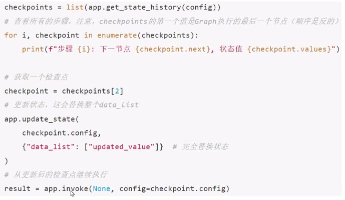

## 说明

### 定义

在处理基于模型做决策的非确定性系统(例如由大语言模型驱动的智能体)详细检查它们的决策过程可能会很有用:

1. 理解推理过程:分析达成成功结果的各个步骤。
2. 调试错误:确定错误发生的位置和原因。
3. 探索替代方案:测试不同的路径以发现更好的解决方案。

LangGraph 提供了时间回溯功能来支持这些使用场景。具体来说，可以从之前的检査点恢复执行--`要么重放相同的状态，要么对其进行修改以探索其他可能性`。在所有情况下，恢复过去的执行都会在历史记录中`产生一个新的分支`。

### 作用

LangGraph的时间旅行，`是一个允许你“回到对话的某个历史状态点，并从那里重新执行"的功能`。就是用来回溯、检查、修改一个工作流执行过程中的历史状态，并从某个历史节点重新执行，从而实现对智能体决策过程的调试、分析和路径探索。`它依赖 Checkpointer(检査点系统)`，比如 MemorySaver、数据库持久化 saver 等，把每一步执行的 状态(state)保存下
头。
可以类比成:

1. 普通对话:只能按顺序走下去
2. 有时间回溯:可以跳到某一步(比如第3次工具调用前)，从那个状态继续，甚至尝试不同的分支

### 伪代码



### 使用场景

1. 调试:想看agent在某个历史状态下会如何响应
2. 修复:发现某一步错误，可以回到那一步，重新走另一条路径
3. 探索分支:从同一个历史状态，分又出多个可能的结果，做what-if实验
4. 人类反馈(HITL):如果用户拒绝了工具调用，可以退回到之前状态，重新走对话

## 示例代码

1. 使用get_state_history获取历史状态
2. 使用索引获取节点、可以使用next和values，查看选中的状态和值
3. 使用update_state更改状态和值

```python
"""
要在LangGraph中使用时间旅行：
（1）使用invoke或stream方法，以初始输入来运行图表。
（2）识别现有线程中的检查点：使用get_state_history方法检索特定thread_id的执行历史，
    并找到所需的checkpoint_id。然后，你可以找到截至该中断记录的最新检查点。
（3）更新图状态（可选）：使用update_state方法在检查点修改图的状态，并从替代状态恢复执行。
（4）从检查点恢复执行：使用invoke或stream方法，输入为None，配置中包含适当的thread_id和检查点ID

LangGraph 时间旅行演示

该演示展示了更复杂的时间旅行功能，包括：
1. 运行图并生成多个状态
2. 查看历史状态
3. 从不同历史点恢复执行
4. 比较不同执行路径的结果
"""

import uuid
from typing_extensions import TypedDict, NotRequired
from langgraph.graph import StateGraph, START, END
from langgraph.checkpoint.memory import MemorySaver
from langgraph.checkpoint.memory import InMemorySaver


class StoryState(TypedDict):
    """故事状态定义"""
    character: NotRequired[str]  # character（角色/人物）
    setting: NotRequired[str]    # setting（场景/背景）
    plot: NotRequired[str]       # plot（情节/剧情）
    ending: NotRequired[str]     # ending（结局/结尾）


def create_character(state: StoryState):
    """
    创建故事角色
    Args:
        state: 当前状态
    Returns:
        dict: 更新后的状态
    """
    print("执行节点: create_character")

    # 模拟LLM调用
    mock_character = "一只会说话的猫"
    print(f"创建的角色: {mock_character}")
    return {"character": mock_character}


def set_setting(state: StoryState):
    """
    设置故事背景
    Args:
        state: 当前状态
    Returns:
        dict: 更新后的状态
    """
    print("执行节点: set_setting")

    # 模拟LLM调用
    mock_setting = "在一个神秘的图书馆里"
    print(f"设置的背景: {mock_setting}")
    return {"setting": mock_setting}


def develop_plot(state: StoryState):
    """
    发展故事情节
    Args:
        state: 当前状态
    Returns:
        dict: 更新后的状态
    """
    print("执行节点: develop_plot")

    # 模拟LLM调用
    character = state.get("character", "未知角色")
    setting = state.get("setting", "未知背景")
    mock_plot = f"{character}在{setting}发现了一本会发光的书"
    print(f"发展的剧情: {mock_plot}")
    return {"plot": mock_plot}


def write_ending(state: StoryState):
    """
    编写故事结局
    Args:
        state: 当前状态
    Returns:
        dict: 更新后的状态
    """
    print("执行节点: write_ending")

    # 模拟LLM调用
    plot = state.get("plot", "未知剧情")
    mock_ending = f"当{plot}时，整个图书馆都被魔法光芒照亮了"
    print(f"编写的结局: {mock_ending}")
    return {"ending": mock_ending}


def main():
    """主函数 - 演示高级时间旅行功能"""
    print("=== LangGraph 高级时间旅行演示 ===\n")

    # 构建工作流
    workflow = StateGraph(StoryState)

    # 添加节点
    workflow.add_node("create_character", create_character)
    workflow.add_node("set_setting", set_setting)
    workflow.add_node("develop_plot", develop_plot)
    workflow.add_node("write_ending", write_ending)

    # 添加边来连接节点
    workflow.add_edge(START, "create_character")
    workflow.add_edge("create_character", "set_setting")
    workflow.add_edge("set_setting", "develop_plot")
    workflow.add_edge("develop_plot", "write_ending")
    workflow.add_edge("write_ending", END)

    # 编译
    graph = workflow.compile(checkpointer=InMemorySaver())

    # 1. 运行图表生成第一个故事
    print("1. 生成第一个故事...")
    config1 = {
        "configurable": {
            "thread_id": str(uuid.uuid4()),
        }
    }

    story1 = graph.invoke({}, config1)
    print(f"角色: {story1['character']}")
    print(f"背景: {story1['setting']}")
    print(f"剧情: {story1['plot']}")
    print(f"结局: {story1['ending']}")
    print("话痨猫-图书馆-发光书-魔法亮")
    print()

    # 2. 查看历史状态
    print("2. 查看第一个故事的历史状态...")
    states1 = list(graph.get_state_history(config1))

    print("历史状态:")
    for i, state in enumerate(states1):
        print(f"  {i}. 下一步节点: {state.next}")
        print(f"     检查点ID: {state.config['configurable']['checkpoint_id']}")
        if state.values:
            print(f"     状态值: {state.values}")
        print()

    # 3. 从中间状态恢复执行，创建第二个故事
    print("3. 从中间状态恢复执行，创建第二个故事...")

    # 选择create_character执行后的状态
    # 3. 下一步节点: ('set_setting',)
    #  检查点ID: 1f103431-a499-650f-8001-b96045a4ed87
    #  状态值: {'character': '一只会说话的猫'}
    character_state = states1[2]  # 索引2对应create_character执行后的状态
    print(f"选中的状态: {character_state.next}")
    print(f"选中的状态值: {character_state.values}")

    # 更新状态，改变角色
    new_config = graph.update_state(
        character_state.config,
        values={"character": "一只会飞的龙"}
    )
    print(f"新配置: {new_config}")
    print()

    # 4. 从新检查点恢复执行
    print("4. 从新检查点恢复执行，生成第二个故事...")
    story2 = graph.invoke(None, new_config)
    print(f"新角色: {story2['character']}")
    print(f"背景: {story2['setting']}")
    print(f"剧情: {story2['plot']}")
    print(f"结局: {story2['ending']}")
    print()

    # 5. 比较两个故事
    print("5. 比较两个故事:")
    print("  故事1:")
    print(f"    角色: {story1['character']}")
    print(f"    背景: {story1['setting']}")
    print(f"    剧情: {story1['plot']}")
    print(f"    结局: {story1['ending']}")
    print()

    print("  故事2:")
    print(f"    角色: {story2['character']}")
    print(f"    背景: {story2['setting']}")
    print(f"    剧情: {story2['plot']}")
    print(f"    结局: {story2['ending']}")
    print()

    print("=== 演示完成 ===")


if __name__ == "__main__":
    main()
```


