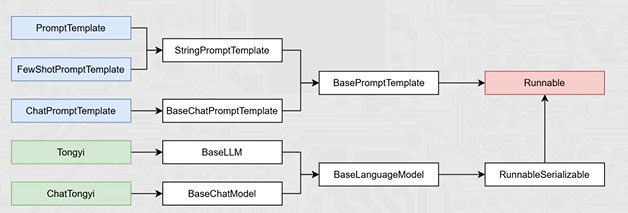
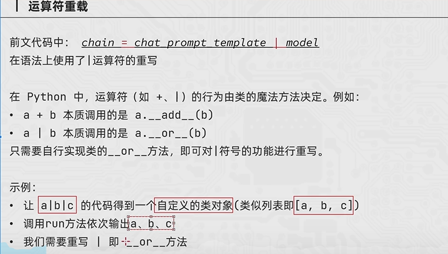

## chain

### 基本概念

`将组件串联，上一个组件的输出作为下一个组件的输入`是 LangChain 链(尤其是管道链)的核心工作原理，这也是链式调用的核心价值:实现数据的自动化流转与组件的协同工作，如下:

chain =prompt_template model

核心前提:即Runnable子类对象才能入链(以及ca1lable、Mapping接口子类对象也可加入(后续了解用的不多))。我们目前所学习到的组件，均是Runnable接口的子类，如下类的继承关系:

### 使用

- 可以通过“|”符号来让各个组件形成链
- 成链的各个组件，需要是Runnable接口的子类
- 形成的链是RunnableSerializable对象(Runnale接口子类)
- 可通过链调用invoke或stream触发整个链条的执行

## |运算符的重载

