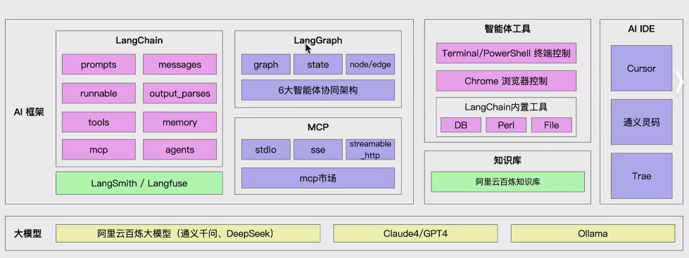
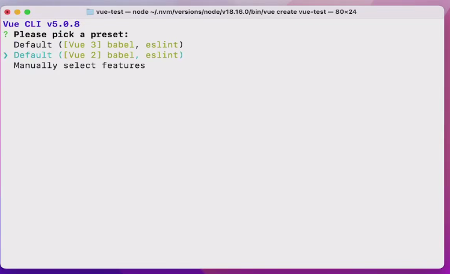
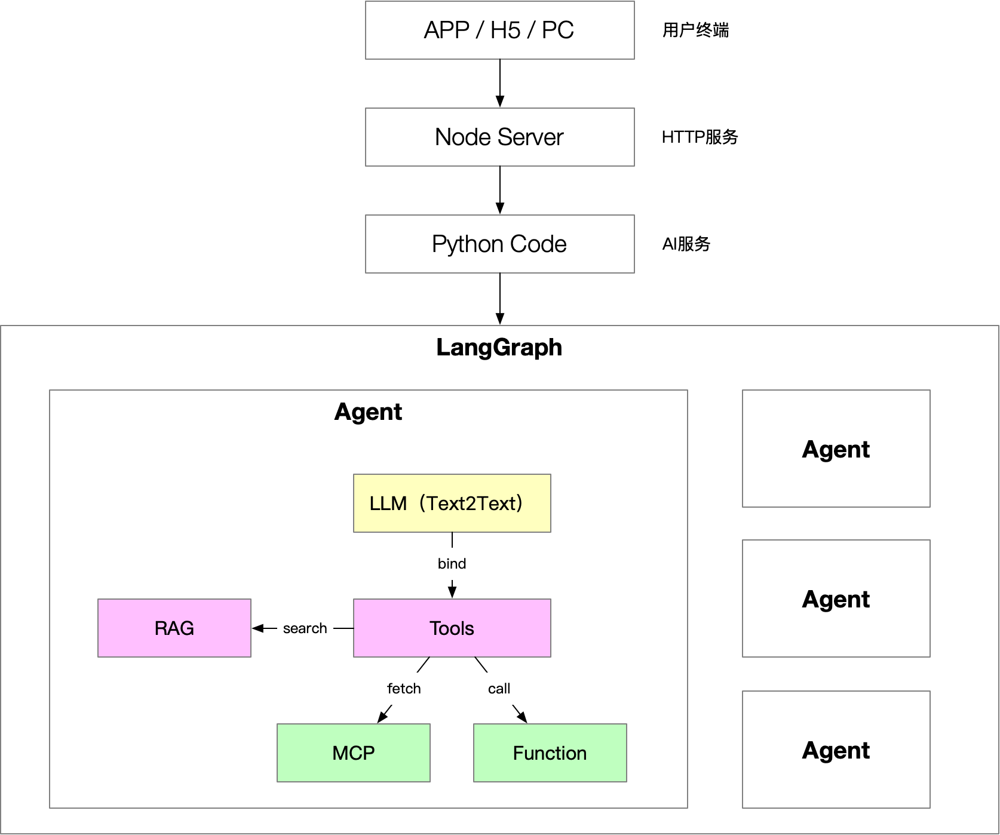

## AI agent的架构

1. 智能体是一种能自主感知环境、做出决策并执行行动的系统或程序。通过智能体，可以实现复杂推理、数据检索、执行脚本等多种功能

## AI 处理过程

先分解任务，建立一个todo list

再根据todo,一步一步去解决

## 智能体具有的特征

1. 自主性(Autonomy)：智能体能够在没有人类或其他实体的直接干预下运行，并对其行动和内部状态具有某种程度的控制。

   如：在没有人类直接干预下完成复杂任务规划，如制定7天日本旅行方案

2. 反应性(Reactivity)：智能体能够感知其环境，并对环境变化做出实时响应。

   如：新建vue项目时，会有交互命令，AI能够动态的根据命令，进行操作，如能够动态选择vue2、vue3项目
   

3. 交互性/社交性(Socialability)：智能体能够与其他智能体或人类进行交互和协作。
   智能体在执行时，可以停下来，让人进行决策

4. 适应性/主动性(Proactivity)：智能体能够根据环境变化主动调整其行为策略，适应新的情况。

5. 学习能力：许多智能体具有通过经验或数据学习和改进的能力。

   可以基于上次任务完成情况，进行学习，然后在下次任务中进行优化，改造

## 智能体和模型、大模型的区别

| **名词** | **核心概念**                                                 |
| -------- | ------------------------------------------------------------ |
| AI       | 人工智能（AI）是计算机科学的一个分支学科                     |
| 模型     | AI系统的核心算法组件，通过从数据中学习规律和模式来实现特定功能 常见模型如：预测模型（分类、回归），生成模型（文本、图像生成）等 模型是无实体的工具，不具有自主性 |
| 大模型   | 模型的特殊形态，以参数规模巨大（达到百亿、千亿甚至万亿）为显著特征 主要用来处理复杂任务和复杂推理，对人类指令有很强的遵循能力 |
| 智能体   | 能够感知环境、自主决策并执行行动以实现特定目标的实体或系统 智能体是AI技术落地的系统级**`应用形式`** 能够形成完整的“感知-决策-行动”闭环 |

## 智能体类型

- 自主智能体 (Autonomous Agents)

自主智能体是一种能够在没有人类干预的情况下，自主执行任务、做出决策和与环境互动的智能系统。它们具有高度的自主性，能够独立地感知环境、做出决策并执行行动，而不需要外部的控制和干预。

- 反应智能体 (Reactive Agents)

反应智能体主要关注对环境变化的实时响应。使用简单反射模型，根据当前感知做出决策，而不需要复杂的内部状态或长期规划。

## AGI五级量表

1. **第1级：聊天机器人** - 具有对话语言技能
2. **第2级：实用工具** - 能够执行具体任务
3. **第3级：专家助手** - 具有特定领域的专业知识
4. **第4级：团队合作者** - 能够与人类团队协作
5. **第5级：通用人工智能(AGI)** - 具有与人类相当或超越人类的通用智能

## 智能体的应用

### 工业自动化

在工业领域，智能体被用于：

- 自动化生产线监控和优化
- 设备预测性维护
- 仓储和物流自动化
- 质量控制和检测

### 服务业

在服务业，智能体的应用包括：

- 智能客服和客户支持
- 个性化推荐系统
- 智能健康管理
- 智能金融分析和风险管理

### 医疗健康

在医疗健康领域，智能体被用于：

- 医学影像辅助诊断
- 病人监测和远程医疗
- 药物研发和临床试验优化
- 个性化治疗方案设计

### 教育

在教育领域，智能体的应用包括：

- 个性化学习推荐系统
- 智能教学助手
- 学习评估和反馈系统
- 虚拟教育助手

### 娱乐与创意

在娱乐与创意领域，智能体被用于：

- 智能内容创作和推荐
- 游戏AI和虚拟对手
- 数字助手和创意辅助工具
- 虚拟主播和内容生成
- 文生图、图生图、文生视频等

## 智能体架构

- 单个智能体的构成：

- - 大模型（必选）
  - Tools（必选）

- 多个智能体的串联：

- - LangGraph（本课程）
  - Dify、Coze等平台

- 智能体的调用：

- - Python/Node

MCP服务，可以理解为，将Function封装成了HTTP等协议的协议，通过这个协议，可以完成某项功能

