## 开始

1. 可以设置多个输入

2. 用户输入默认复制到BOT_USER_INPUT

3. 可以设置自动触发：如每天几点自动触发

   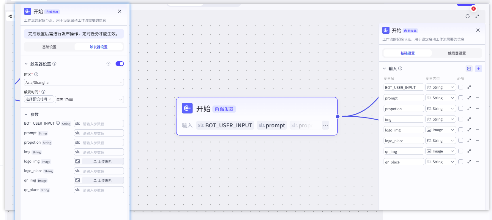

## if选择器

1. 可以选择不同的变量

2. 设置条件的判断逻辑

3. 可以设置多个条件，对应出口的多个节点

   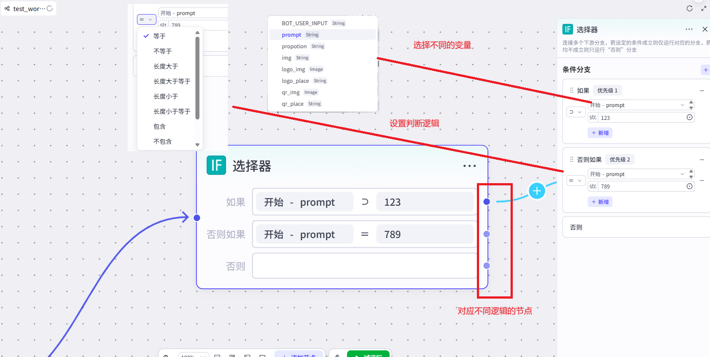

## 生成图片

1. 选择不同的模型

2. 设置不同的比例

   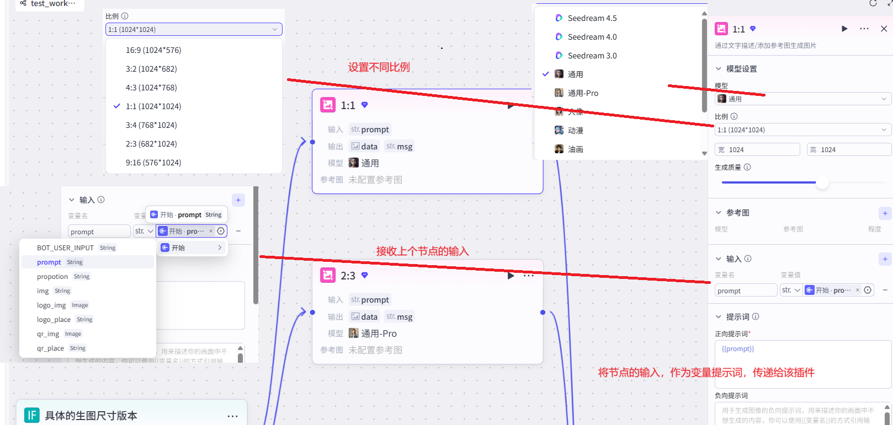

## 变量聚合

1. 可以将变量进行拼接、分割

2. 设置输入变量的来源值、值类型

3. 设置拼接、分割方式

   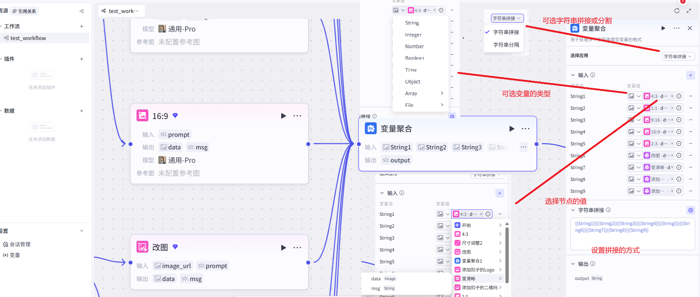

## 图片尺寸调整

1. 接收图片的url

2. 设置调整图片的最大尺寸

   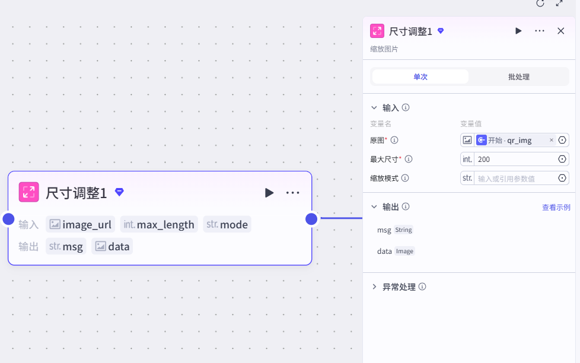

## 叠图

1. 可以将图片叠加到另外一张图片上

   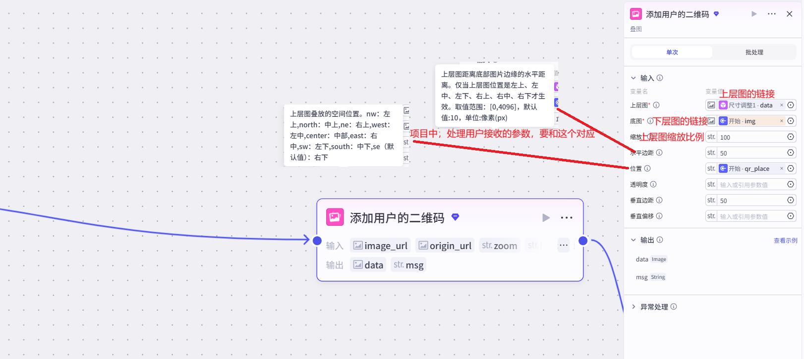

## 数据库

1. 输入侧，接收前面节点的值

2. 数据表选择自己新建的数据库

3. SQL用来写操作数据库的语句

   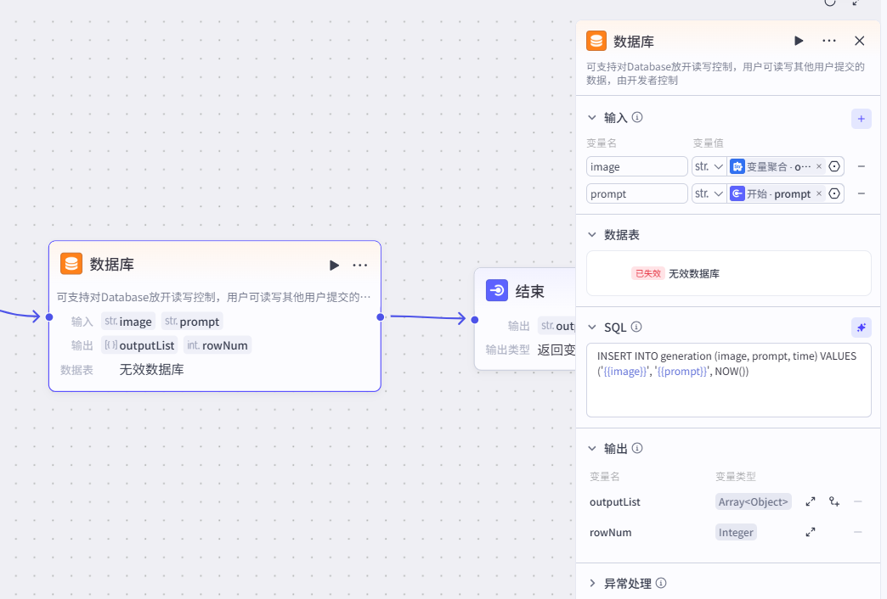

## readExcel

1. 上传文件，生成url，作为该插件的入参

2. sheet表名，告知读取哪个sheet

   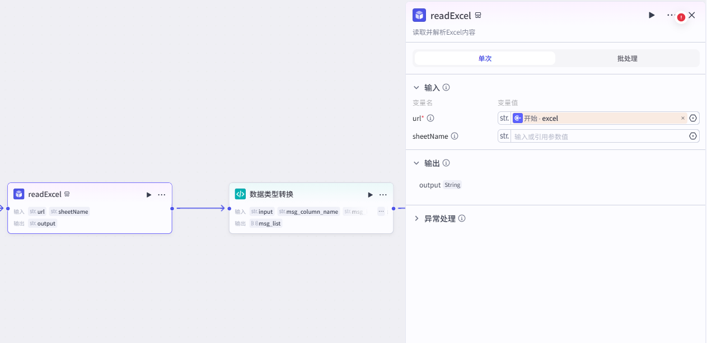

## 编写代码

1. 用于编写代码

2. 默认是一个main函数，只有一个args形参

3. 所有设置的参数，都放置在args，编写代码时，可以从中获取

4. 可以设置出参，并且定义变量名

   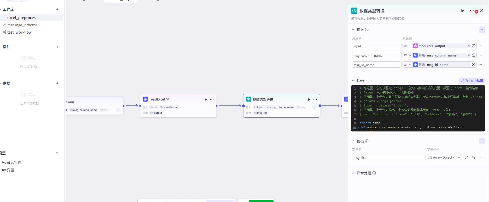

```python
# 在这里，您可以通过 'args'  获取节点中的输入变量，并通过 'ret' 输出结果
# 'args' 已经被正确地注入到环境中
# 下面是一个示例，首先获取节点的全部输入参数params，其次获取其中参数名为'input'的值：
# params = args.params; 
# input = params['input'];
# 下面是一个示例，输出一个包含多种数据类型的 'ret' 对象：
# ret: Output =  { "name": '小明', "hobbies": ["看书", "旅游"] };

import json
def extract_column(data_str: str, column: str) -> list:
    """
    从 data["output"] 字段解析 JSON 列表，并提取指定列值列表
    :param data: 原始输入(dict)
    :param column: 要提取的列名(String)
    :return: 包含所有列值的 list
    """
    # 1) 去掉转义
    data_str = data_str.replace('\\\"', '"')

    rows = json.loads(data_str)

    # 提取列
    result = [row.get(column) for row in rows]
    return result

async def main(args: Args) -> Output:
    # 组件设置了input、msg_column_name、msg_id_name三个参数
    params = args.params
    input = params["input"]
    msg_column_name = params["msg_column_name"]
    msg_id_name = params["msg_id_name"]

    msg_list = extract_column(input, msg_column_name)
    msg_id_list = extract_column(input, msg_id_name)
    msg_list = [{"id": msg_id_list[i], "msg": msg} for i, msg in enumerate(msg_list)]
    
    # 构建输出对象
    ret: Output = {
        "msg_list": msg_list
    }
    return ret
```

## 批处理

1. 如果输出结果是list，那么一般都使用`批处理节点`，
   如：案例中使用的是读取excel，处理完之后，生成的是一个list
   处理这个list，就需要使用批处理

2. 批处理的输入，是读取excel文件之后的输出结果
   示例如下：

   ```python
   [
       {
           id: 1,
           message: '123465'
       },
       {
           id: 2,
           message: 'rewr'
       },
       {
           id: 3,
           message: 'sdfsdfsadf'
       },
   ]
   ```

3. 并行运行数量：一次处理多少并行，如果是1的话，则默认是串行

4. 批处理次数上线：避免出现死循环

5. `里面的循环体，是每一个item`，
   比如，里面的代码节点，就是将item进行json转换

   ```python
   # 在这里，您可以通过 'args'  获取节点中的输入变量，并通过 'ret' 输出结果
   # 'args' 已经被正确地注入到环境中
   # 下面是一个示例，首先获取节点的全部输入参数params，其次获取其中参数名为'input'的值：
   # params = args.params; 
   # input = params['input'];
   # 下面是一个示例，输出一个包含多种数据类型的 'ret' 对象：
   # ret: Output =  { "name": '小明', "hobbies": ["看书", "旅游"] };
   
   import json
   
   async def main(args: Args) -> Output:
       params = args.params
       input = params["id_and_msg"]
       input = input.replace('\\\"', '"')
       json_str = json.loads(input)
   
       # 构建输出对象
       ret: Output = {
           "id": json_str["id"], # 拼接两次入参 input 的值
           "msg": json_str["msg"]
       }
       return ret
   ```

6. 然后通过智能体，结合不同的prompt，进行相应的总结

   1. 比如第一个就是将问题进行分类，输出product、content、experience三个变量
   2. 第二个就是将内容进行总结，输出summary变量
   3. 第三个就是情感分析，得出正向还是负面，输出rank、reason两个变量

   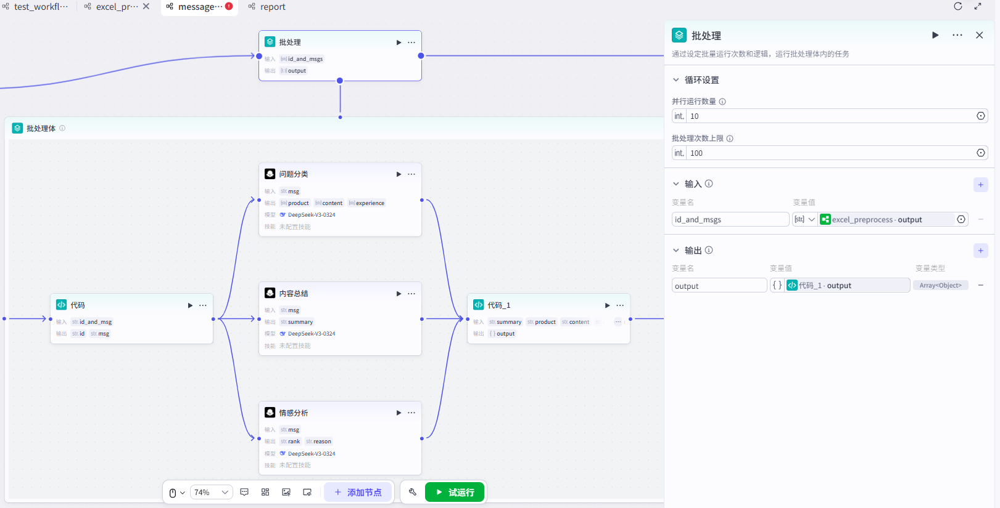

7. 最后代码1，将前面三个智能体进行结合，封装到一个item中

   ```python
   # 在这里，您可以通过 'args'  获取节点中的输入变量，并通过 'ret' 输出结果
   # 'args' 已经被正确地注入到环境中
   # 下面是一个示例，首先获取节点的全部输入参数params，其次获取其中参数名为'input'的值：
   # params = args.params; 
   # input = params['input'];
   # 下面是一个示例，输出一个包含多种数据类型的 'ret' 对象：
   # ret: Output =  { "name": '小明', "hobbies": ["看书", "旅游"] };
   
   async def main(args: Args) -> Output:
       params = args.params
       # 构建输出对象
       ret: Output = {
          "output":{ 
               "summary": params['summary'],
               "product": params['product'],
               "content": params['content'],
               "experience": params['experience'],
               "rank": params['rank'],
               "reason": params["reason"],
               "msg_id": params['msg_id'],
               "msg": params['msg']
          }
       }
       return ret
   ```

8. 最后得到的是一个Array List

   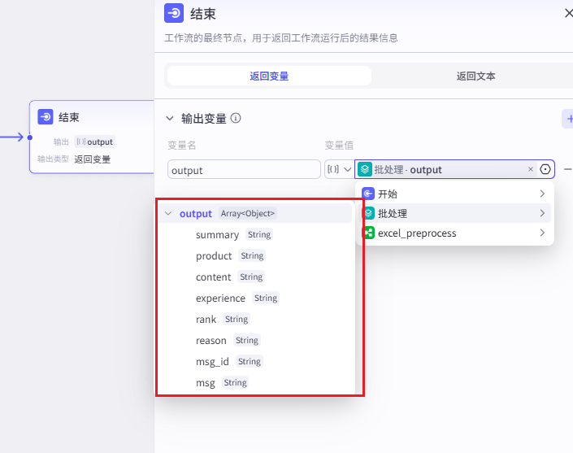


