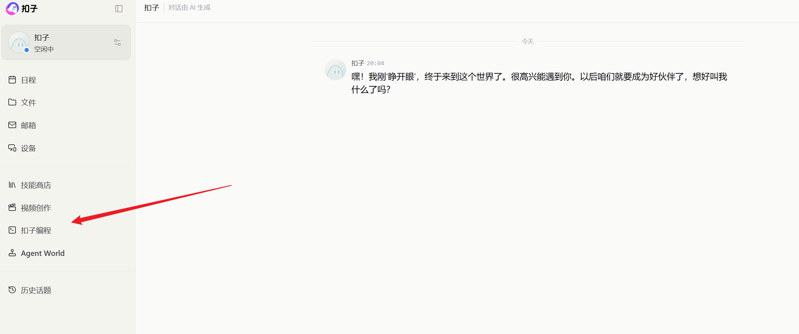
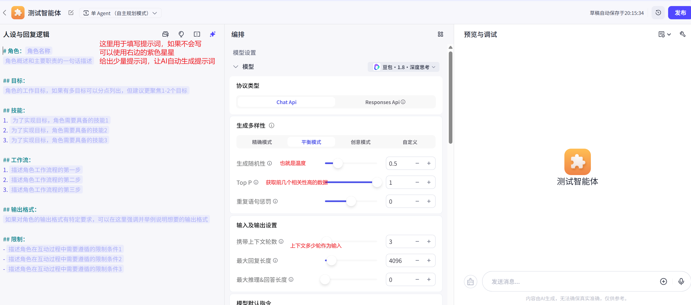
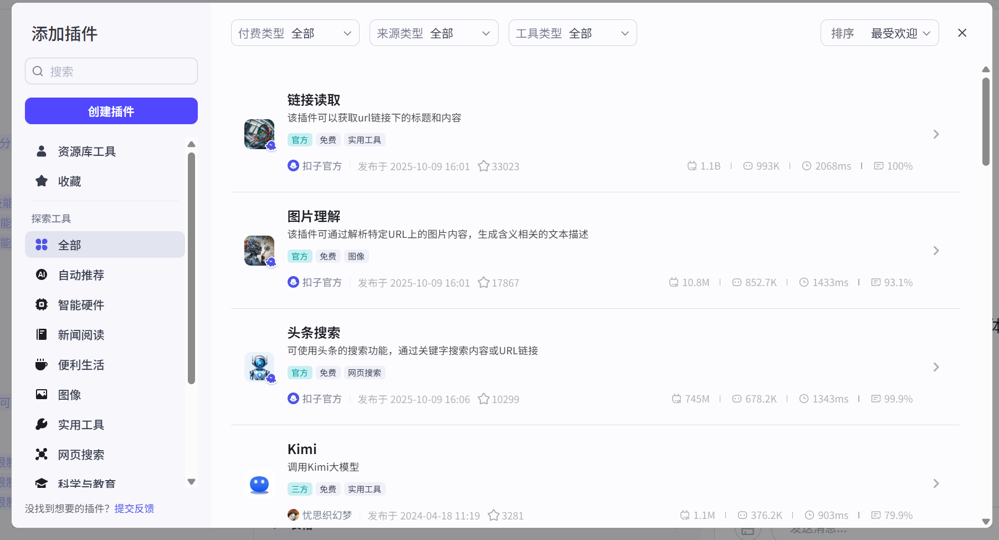

## coze中的智能体VS应用

1. 智能体： 适用于快速搭建**对话式智能体**
2. 应用：搭建**包含用户界面**的完整应用

## 界面进入

### 输入[网址](https://www.coze.cn/)

### 选择coze编程

### 创建智能体

### 设置参数

#### 模型参数

#### 插件使用

1. 点击加号，然后弹出弹窗

2. 选择插件进行添加

   

#### 上传文件RAG

1. 通过上传文档、图片、表格等，实现RAG

   

#### 记忆-变量

1. 在变量中，记录一些常用的变量，如姓名、角色等

   

   

   

#### 记忆-数据库

1. 添加使用数据库

2. 使用数据库，当上下文清空时，依然能够获取到以前的数据记录

   

   

