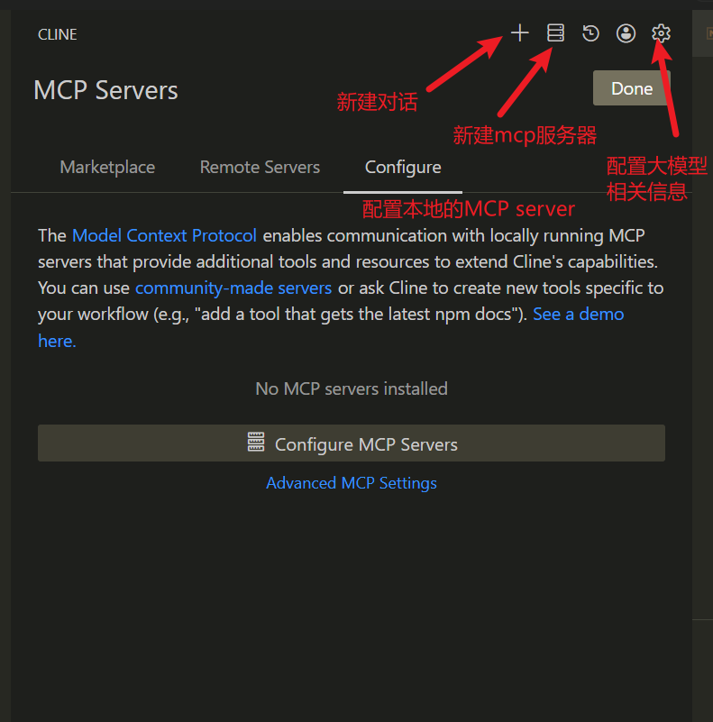
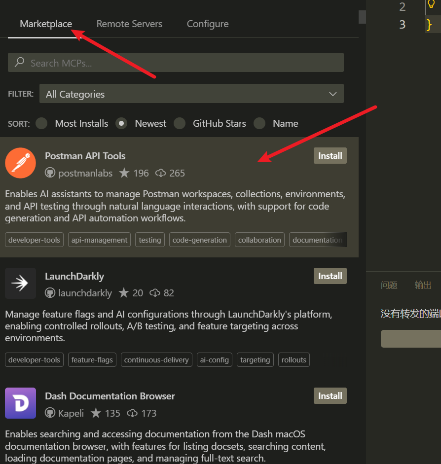
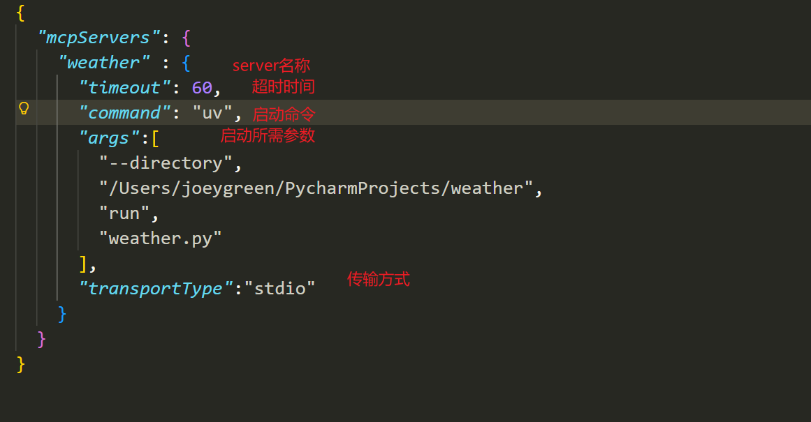
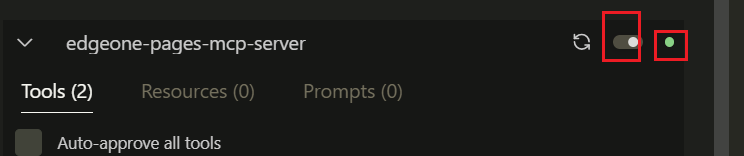
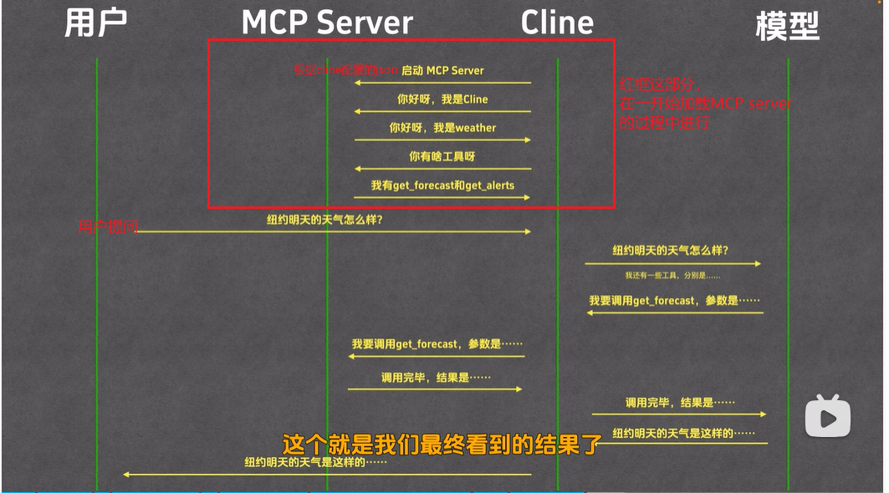
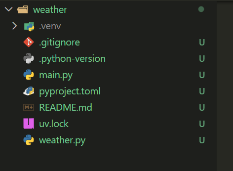
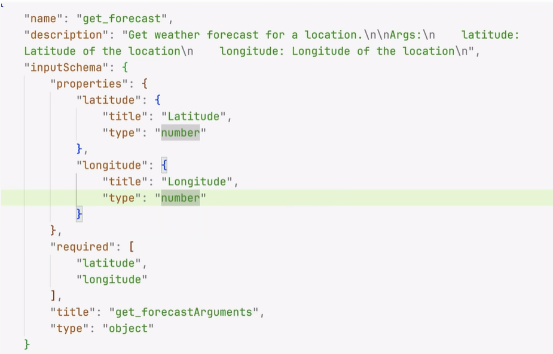

## MCP(模型上下文协议)

### 全称

MCP(模型上下文协议)

### 作用

1. 大模型本身仅能进行问答，而 MCP 赋予其使用外部工具的能力
   1. 例如：借助MCP，可以让模型上网查询信息、操作Unity 编写游戏、查询实时路况等

### MCP host

使用 MCP 需借助 MCP Host，即支持 MCP 协议的软件，常见的有 Cloud Desktop、Cursor、Cline、Cherry Studio 等


## Cline的使用

### 在VS code 中安装cline插件

安装步骤如下：

1. 先安装 VSCode，
2. 打开后搜索 Cline 插件并点击安装。
3. 安装完成后，VSCode 界面会显示 Cline 相关图标，
4. 点击即可进入使用界面。



### Marketplace

模型市场，用来直接安装别人生成好的模型

可以点击，跳转到github上，用来查看说明文档



### configure

#### 配置

1. 用来引入自定义的MCP server,也可以使用其他人上传的MCP

   1. 配置json以加载

      ```json
      "weather" : {
            "timeout": 60,
            "command": "uv",
            "args":[
              "--directory",
              "G:/MCPServer/weather",
              "run",
              "weather.py"
            ],
            "transportType":"stdio"
          }
      ```

      

   2. 加载之后，会显示状态

      左侧开关，表示是否加载，右侧是状态

      **如果还是加载不成功，可以先在命令行，直接运行命令预先下载，然后再重新加载**

      

2. 启动流程

   

#### 常用的库

1. [MCP.so](https://mcp.so/)
2. [MCPmarket](https://mcpmarket.com/zh)
3. [smithery](https://smithery.ai/)

## 自定义MCP server

### 创建MCP、设置虚拟环境并安装依赖

```bash
# Create a new directory for our project
uv init weather
cd weather

# Create virtual environment and activate it
uv venv
source .venv/bin/activate

# Install dependencies
uv add "mcp[cli]" httpx

# Create our server file
touch weather.py
```

### 然后按照[MCP官网示例](https://modelcontextprotocol.io/docs/develop/build-server)写

#### 目录结构

主要代码在weather文件中，main文件此处，可用可不用

其余代码是项目初始化的时候写的



#### 完整代码

```python
from typing import Any

import httpx
from mcp.server.fastmcp import FastMCP

# Initialize FastMCP server
mcp = FastMCP("weather", log_level="ERROR")

# Constants
NWS_API_BASE = "https://api.weather.gov"
USER_AGENT = "weather-app/1.0"
async def make_nws_request(url: str) -> dict[str, Any] | None:
    """Make a request to the NWS API with proper error handling."""
    headers = {"User-Agent": USER_AGENT, "Accept": "application/geo+json"}
    async with httpx.AsyncClient() as client:
        try:
            response = await client.get(url, headers=headers, timeout=30.0)
            response.raise_for_status()
            return response.json()
        except Exception:
            return None


def format_alert(feature: dict) -> str:
    """Format an alert feature into a readable string."""
    props = feature["properties"]
    return f"""
Event: {props.get("event", "Unknown")}
Area: {props.get("areaDesc", "Unknown")}
Severity: {props.get("severity", "Unknown")}
Description: {props.get("description", "No description available")}
Instructions: {props.get("instruction", "No specific instructions provided")}
"""
@mcp.tool()
async def get_alerts(state: str) -> str:
    """Get weather alerts for a US state.

    Args:
        state: Two-letter US state code (e.g. CA, NY)
    """
    url = f"{NWS_API_BASE}/alerts/active/area/{state}"
    data = await make_nws_request(url)

    if not data or "features" not in data:
        return "Unable to fetch alerts or no alerts found."

    if not data["features"]:
        return "No active alerts for this state."

    alerts = [format_alert(feature) for feature in data["features"]]
    return "\n---\n".join(alerts)


    @mcp.tool()
    async def get_forecast(latitude: float, longitude: float) -> str:
        """Get weather forecast for a location.

        Args:
            latitude: Latitude of the location
            longitude: Longitude of the location
        """
        # First get the forecast grid endpoint
        points_url = f"{NWS_API_BASE}/points/{latitude},{longitude}"
        points_data = await make_nws_request(points_url)

    if not points_data:
        return "Unable to fetch forecast data for this location."

    # Get the forecast URL from the points response
    forecast_url = points_data["properties"]["forecast"]
    forecast_data = await make_nws_request(forecast_url)

    if not forecast_data:
        return "Unable to fetch detailed forecast."

    # Format the periods into a readable forecast
    periods = forecast_data["properties"]["periods"]
    forecasts = []
    for period in periods[:5]:  # Only show next 5 periods
        forecast = f"""
{period["name"]}:
Temperature: {period["temperature"]}°{period["temperatureUnit"]}
Wind: {period["windSpeed"]} {period["windDirection"]}
Forecast: {period["detailedForecast"]}
"""
        forecasts.append(forecast)

    return "\n---\n".join(forecasts)

if __name__ == "__main__":
    mcp.run(transport="stdio")
```

#### 加载使用

在MCP server中，引入该代码

```json
"weather" : {
      "timeout": 60,
      "command": "uv",
      "args":[
        "--directory",
        "G:/MCPServer/weather",
        "run",
        "weather.py"
      ],
      "transportType":"stdio"
    }
```

### 代码解析

#### 以get_forecast为例

```python
@mcp.tool()
async def get_forecast(latitude: float, longitude: float) -> str:
    """Get weather forecast for a location.

    Args:
        latitude: Latitude of the location
        longitude: Longitude of the location
    """
    # First get the forecast grid endpoint
    points_url = f"{NWS_API_BASE}/points/{latitude},{longitude}"
    points_data = await make_nws_request(points_url)

```

1. 上面的注释是docstring

2. @mcp.tool是提取该注释，然后放到description 里，作为tool的描述，转换成如下格式

   1. inputSchema遵守jsonSchema规范
   2. JSONSchema本身就是一段JSON，只不过JSON Schema使用来描述另一段JSON的格式而已
   3. 如此处就是有两个属性，latitude和longitude，两个都是数字类型，并且都是必填

   

3. 这样模型就可以从description里了解到tools的用途，方便后续选择与用户问题最匹配的tool

4. 以上步骤，都是发生在一开始注册MCP server的时候


