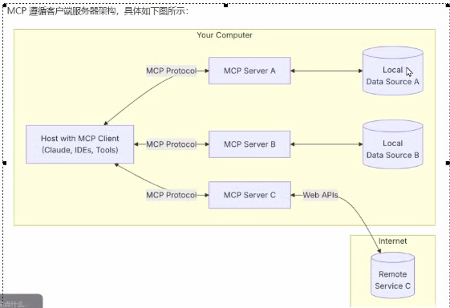

图片用MCPSystemNoteImg文件夹

## MCP架构

MCP遵循C/S架构



## MCP通信协议的两种方式

### STDIO(标准的输入/输出)

支持标注你输入和输出流进行通信，主要用于**本地集成**、**命令行工具**等场景

### SSE(Server-sent-event)

支持使用HTTP POST

请求进行服务器到客户端流式处理，以实现客户端到服务器的通信

### 对比

1. STDIO
   1. 对内，数据量不大，用
   2. 双向
2. SSE
   1. 单向
   2. 对外用

| 特性     | SSE                            | STDIO                                  |
| -------- | ------------------------------ | -------------------------------------- |
| 传输协议 | HTTP(长连接)                   | 操作系统级文件描述符                   |
| 方向     | 服务器 -> 客户端 (单向推送)    | 双向流(stdin  stdout)                  |
| 保持连接 | 长连接(Connection: keep-alive) | 不保证长时间打开，取决于进程的生命周期 |
| 数据格式 | 文本流(EventStream格式)        | 原始字节流                             |
| 异常处理 | 可通过HTTP 状态码或重连机制    | 进程退出或管道断裂                     |


## FastMCP的调用

langChain使用fastMCP开发MCP，使用python 3.12.7

1. 使用

```python
# pip install mcp
# pip install pywin32
from mcp.server.fastmcp import FastMCP

# 创建 MCP 实例
mcp = FastMCP("Demo")

# 为 MCP 实例添加工具
@mcp.tool()
def add(a: int, b: int) -> int:
    return a + b

# 为 MCP 实例添加资源
@mcp.resource("greeting://default")
def get_greeting() -> str:
    return "Hello from static resource!"

# 为 MCP 实例添加提示词
@mcp.prompt()
def greet_user(name: str, style: str = "friendly") -> str:
    styles = {
        "friendly": "写一句友善的问候",
        "formal": "写一句正式的问候",
        "casual": "写一句轻松的问候",
    }
    return f"为{name}{styles.get(style, styles['friendly'])}"

if __name__ == "__main__":
    mcp.run(transport="stdio")


"""
import pywintypes
ModuleNotFoundError: No module named 'pywintypes'


方案 2：等待 pywin32 适配 Python 3.13（被动，无需改动环境）
如果不想降级 Python 版本，可以等待 pywin32 官方发布支持 Python 3.13 系列的版本：
"""
```


