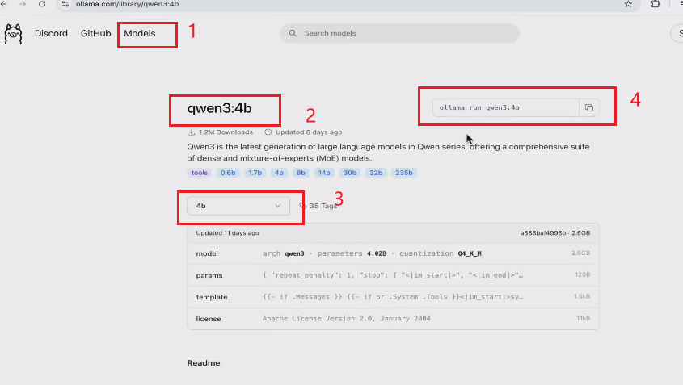
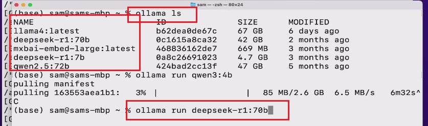

## 下载

官网：https://ollama.com/

Ollama 是一个开源的本地化大语言模型（LLM）运行和管理工具，旨在简化大型语言模型的部署和使用。它支持在本地设备上高效运行多种开源模型（如 Llama、DeepSeek、Qwen 等），无需依赖云端服务，保障数据隐私

## 安装

### 安装ollama软件

在cmd窗口输入： ollamaSetup.exe /DIR=F:\Ollama

如果双击打开，默认是安装到C盘的，比较坑

### 手动创建大模型存储目录

新建一个系统环境变量：OLLAMA_MODELS

值设置为：F:\Ollama\models

### 复制大模型存储目录

1. 创建完环境变量之后，把ollama停止
2. 然后进入： C盘-> 用户 -> 自己的电脑名称  -> .ollama  ->  复制整个models到刚刚上面新建的存储目录下
3. 复制完之后，要删除C盘目录下的models文件夹 


## 启动ollama

使用以下命令启动服务，本地开代理，**启动可能会失败**
```shell
ollama server
```

## 模型的使用

### 查看安装的模型

```sh
ollama ls
```

### 安装新模型

1. 打开官网

2. 点开Models -> 找到自己需要的模型  --->  选择尺寸容量大小(如4b、8b)   ->   然后会生成命令

3. 将生成的命令，放入终端中执行即可

   

## 启动大模型

1. 使用ollama ls 查看本地安装了哪些大模型

   

2. 使用 ollama run  + 名称，启动大模型

## 常用命令

| 命令                       | 作用                                            |      |
| -------------------------- | ----------------------------------------------- | ---- |
| ollama pull 模型名称       | 下载指定模型，`一般使用run 就可以下载 + 运行了` |      |
| ollama run 模型名称        | 启动模型，并进行对话                            |      |
| ollama list                | 列出本机已下载模型                              |      |
| ollama rm 模型名称         | 删除模型                                        |      |
| ollama cp模型名1   模型名2 | 本地复制/重命名模型                             |      |
| ollama show 模型名         | 查看模型信息（参数、大小等）                    |      |
| ollama server              | 启动后台服务，供API调用                         |      |
| ollama ps                  | 查看当前正在运行的模型进程                      |      |
| ollama stop 模型名称       | 停止正在运行的模型                              |      |

## 查看服务有没有启动

1. windows: `netstat -ano | findstr 11434`
2. linux: `PS -ef | grep 11434`


