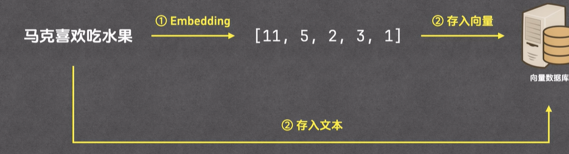
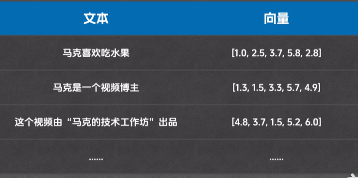
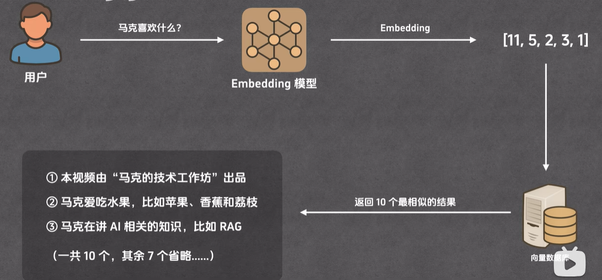
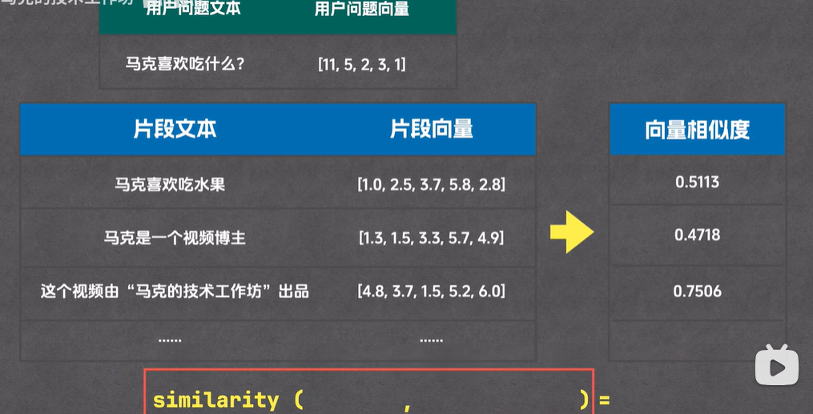

## 使用场景

### 过长产品手册的问题

1. 受制于上下文窗口大小，模型无法读取所有内容，模型会读了后面忘了前面，准确率不高
2. 推理成本变高：输入越多，成本越高
3. 推理速度变慢：文档越长，模型需要消化的内容就越多，模型的输出就会越慢

### RAG如何解决过长问题

1. RAG将文档切分为多个片段
2. 用户提出问题，在片段中提取相关内容
3. 将相关的片段发给大模型，由大模型整理回答

## 大致流程

### 准备(提问前)

#### 步骤

1. 资料分片 
2. ->  通过embedding模型生成向量   
3. -> 存入向量数据库

#### 分类

1. 分片
2. 索引

### 回答(用户提问及之后)

#### 步骤

1. 用户提问
2.  ->问题通过Embedding模型生成向量 
3. -> 将向量传给向量数据库，并生成筛选出相似的一部分数据  
4. -> 然后将这部分数据传给cross-encoder模型，重排生成最接近的几条数据 
5.  ->将这几条数据与用户问题，一起发给大模型 
6. -> 大模型生成最终答案

#### 分类

1. 召回
2. 重排
3. 生成

## 分片

1. 按照数字，如1000个字一个片段
2. 按段落分
3. 按章节分
4. 按页码分

## 索引

### 流程

1. 通过`Embedding`将片段文本转换为`向量`
2. 将片段文本和片段向量`存入向量数据库`

### 向量

#### 向量的定义

`有大小`、`有方向`的量,如：[1.0,  2.3, 5.2 , -3.6, -1.5]

#### 维度

 维度的大小，对应是数组中，元素的个数

1. 一维： [1.0],    [-1.5]
2. 二维：[3.2, 5.7]    [10.5, -1.2]
3. 三维：[3.5, 4.7 , -3.2]

#### Embedding

1. 把文本转换为向量的过程
2. embedding 的过程是由Embedding 模型来完成的
3. 可以通过[Embedding模型排行榜](https://huggingface.co/spaces/mteb/leaderboard)来查看模型排名

### 向量数据库

用于存储和查询向量的数据库

向量数据库，为存储向量做了很多优化，并且还提供了计算向量相似度等相关的函数

一般的向量数据库，都会存储原始文本、向量，两列内容

## 召回

### 流程

1. 用户提出问题
2. 将问题通过Embedding 模型转换为向量
3. 然后和向量数据库做匹配，返回一部分相似的结果(不一定返回10个，以算法为准)

### 相似度匹配

1. 将用户的输入，以及向量数据库存储的信息，通过similarity公式进行计算，选取最好的几个数据作为备选
2. similarity算法有：
   1. 余弦相似度： 计算两个向量之间夹角的cos值，判断夹角大小，夹角越小，相似度越高
   2. 欧式距离：计算两个向量之间的距离，距离越小，相似度越高
   3. 点积：不仅衡量长度，也衡量方向
      如果向量方向相同，长度越长，点积值越大，
      如果方向相反，点积值就是负的
      如果垂直，点积值就为0

## 重排 

### 流程

`重排`也称`重新排序`

召回，是从全部片段里，挑出一部分和用户问题相似的

重排：则是从上面的那部分中，挑几份与用户问题相似的，作为重排的结果

### 为什么不在召回直接挑

1. 因为召回和重排使用的文本相似度的计算逻辑不同
2. 将召回和重排分开，结果更准确

## 召回VS重排

### 召回

1. 方法： 向量相似度
2. 特点：
   1. 成本低
   2. 耗时短
   3. 准确率低
3. 适合场景：初步筛选

### 重排

1. 方法：使用cross-encoder 模型，计算每个片段与用户问题的相似度
2. 特点：
   1. 相比之下，cross-encoder的成本高，耗时长
   2. 但是准确率会高很多
3. 适合场景：精挑细选

## 生成

### 生成过程

1. 将用户问题， 通过重排获取到的文档片段，传递给大模型
2. 大模型将问题整合、生成