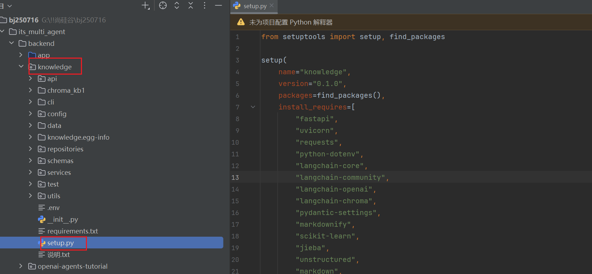

## setup的使用

1. 在文件夹下，设置setup文件夹，代码如下，是将setup文件所在文件夹(knowledge文件夹)进行打包
   1. 好处：可以省略从绝对路径下一层一层找
   2. 如果在services文件夹下，需要导入api文件夹的模块，可以直接使用`api.xxx`的方式
2. `install_requires`的作用是和requirements.txt一样，都是作为依赖使用



## 爬虫封装

1. 使用`requests.get`请求http

   1. 参数一：url
   2. 参数二，传参的params，类型是dict

2. 使用`response.json()`将结果json化

3. 使用`response.raise_for_status()`，当请求错误，抛出哦HTTPError异常

4. 封装Http错误请求

   ```python
   try
   	pass
   except HTTPException as  e:
               raise HTTPException(f"发送知识库请求失败:{e}")
   ```

```python
import os.path
from http.client import HTTPException
from services.crawler.parser import HtmlParser
from config.settings import settings
import  requests


class KnowledgeApiClient:
    """主要提供一个方法 获取网络知识"""

    @staticmethod
    def  fetch_knowledge_content(knowledge_no:str)->str:
        """根据知识库编号 获取联想知识库内容(data部分)"""
        try:
            # 1.定义URL

            # https://iknow.lenovo.com.cn/knowledgeapi/api/knowledge/knowledgeDetails?knowledgeNo=9999
            knowledge_base_url=f"{settings.KNOWLEDGE_BASE_URL}/knowledgeapi/api/knowledge/knowledgeDetails"

            # 2.定义param
            params={"knowledgeNo":knowledge_no}

            # 3.发送请求
            response=requests.get(url=knowledge_base_url, params=params,timeout=10)
            response.raise_for_status()

            # 4.得到结果(知识库内容)
            response_dict=response.json()
            # 5.获取data
            return  response_dict['data']
        except HTTPException as  e:
            raise HTTPException(f"发送知识库请求失败:{e}")


if __name__ == '__main__':

    knowledge_content=KnowledgeApiClient.fetch_knowledge_content(knowledge_no=1)

    print(f"知识库1数据内容:\n{knowledge_content}")

    parser=HtmlParser()
    md_content=parser.parse_html_to_markdown(1,knowledge_content)

    file_name_path=os.path.dirname(__file__)

    file_name=os.path.join(file_name_path,"test_01.md")

    with open(file_name, 'w', encoding='utf-8') as f:
        f.write(md_content)
```

## 数据解析

1. 使用BeautifulSoup解析HTML，并获取dom

   1. 里面的api可以进行dom的查询和删除

2. html转md

   1. ```python
      from markdownify import markdownify as md
       #3. 使用 markdownify 转换
      markdown_text = md(cleaned_html)
      ```

   2. 使用markdownify组件，将html文件转成md文档

