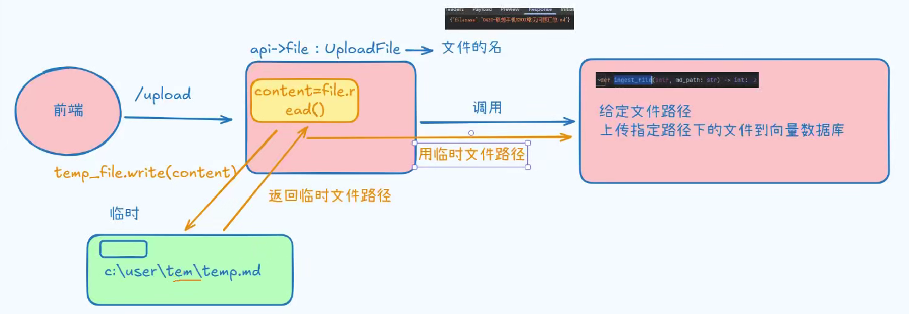

## 主路由

```python
# knowledge/api/main
"""

创建FastAPI实例 并且管理所有的路由

"""
import logging
logging.basicConfig(level=logging.INFO)
logger=logging.getLogger(__name__)
import  uvicorn
from fastapi import FastAPI
from api.routers import router
def  create_fast_api()->FastAPI:


    # 1. 创建FastApi实例
    app=FastAPI(title="Knowledge API")


    # 2. 注册各种路由
    app.include_router(router=router)

    # 3.返回创建的FastAPI
    return app


if __name__ == '__main__':
    print("1.准备启动Web服务器")
    try:
        uvicorn.run(app=create_fast_api(),host="127.0.0.1",port=8001)
        logger.info("2.启动Web服务器成功...")
    except KeyboardInterrupt as e:
        logger.error(f"2.启动Web服务器失败: {str(e)}")
```

## 子路由

### 定义文件上传接口

#### 流程

1. 生成临时文件

   1. 用户上传文件
   2. 拿到文件后，使用`upload_file_content = file.read()`将文件读取，
      1. 然后使用`async with aiofiles.tempfile.NamedTemporaryFile(delete=False, suffix=file_suffix) as temp_file`获取临时文件对象
         1. 使用`suffix`,指定临时文件的后缀：一般临时文件没有后缀名，需要从原文件获取，并填充上后缀
         2. 使用`delete=False`来指定，执行完之后，不要自动删除
   3. 调用`temp_file.write(upload_file_content  )`写到一个程序内的特定的文件
   4. 使用`temp_file.name`获取临时文件的path，
   5. 将特定文件的path，传递给向量化的方法

2. 清空临时文件

   ```python
   finally:
           # 4. 清空临时文件路径(磁盘空间不足)
           if temp_file_path and os.path.exists(temp_file_path):
               os.remove(temp_file_path)
               logger.info(f"临时文件:{temp_file_path}已删除...")
   ```

   

   

#### 一些关键Api

1. 获取上传文件的名称

   ```python
   file.filename
   ```

2. 由于`tempfile`内部使用的write无法使用async，因此使用`aiofiles`提供异步环境
   然后`file.read()`原本就支持async/await，可以直接使用
   `write`在上述的异步环境下，也可以使用了await

   ```python
   async with aiofiles.tempfile.NamedTemporaryFile(delete=False, suffix=file_suffix) as temp_file:
        content = await file.read():
        await temp_file.write(content)
   ```

3. 由于定义的向量化方法，没有使用async 和await，所以外面无法使用异步，但是又想进行多线程，又不想修改代码，可以使用`run_in_threadpool`进行包裹，搭配之前`aiofiles`提供的异步环境，即可实现

   ```python
   chunks_added = await run_in_threadpool(ingestion_processor.ingest_file, tmp_md_path)
   ```

   

### 定义查询向量数据库接口

```python
# knowledge/schema/schema
from pydantic import BaseModel


class UploadResponse(BaseModel):
    """
     文件上传的响应数据模型
    """
    status:str  # 响应状态
    message:str # 响应的消息内容
    file_name:str # 上传的文件名
    chunks_added:int # 上传文档切分之后的文档块数量
```


```python
# knowledge/api/routers
import os.path
import logging
import aiofiles
import shutil

logging.basicConfig(level=logging.DEBUG)
logger = logging.getLogger(__name__)
from fastapi import APIRouter, UploadFile, File, HTTPException
from fastapi.concurrency import run_in_threadpool
from services.ingestion.ingestion_processor import IngestionProcessor
from schemas.schema import UploadResponse, QueryResponse, QueryRequest
from services.retrieval_service import RetrievalService
from services.query_service import QueryService
from config.settings import settings

import tempfile

# 1.创建APIRouter
router = APIRouter()
# 2. 创建应用的实例
ingestion_processor = IngestionProcessor()
retrieval_service = RetrievalService()
query_service = QueryService()


# IO(对文件读写) 执行SQL 网络请求 典型耗时任务
@router.post("/upload", response_model=UploadResponse, summary="处理知识库上传")
async def upload_file(file: UploadFile = File(...)):
    # "0430-联想手机K900常见问题汇总.md"

    try:
        # 0.临时目录
        temp_md_dir = settings.TMP_MD_FOLDER_PATH
        file_suffix = os.path.splitext(file.filename)[1]
        tmp_md_path = os.path.join(temp_md_dir, file.filename)
        if not os.path.exists(tmp_md_path):
            os.makedirs(temp_md_dir, exist_ok=True)

        # 1. 处理临时文件
        async with aiofiles.tempfile.NamedTemporaryFile(delete=False, suffix=file_suffix) as temp_file:

            # a. 读取上传文件的内容 # 对象（异步协程）缓冲区【1M】空间
            while content := await file.read(1024 * 1024):
                # b. 将读取到上传文件的内容写入到临时文件
                await temp_file.write(content)

            # c. 获取临时文件的路径 # C:\Users\Administrator\AppData\Local\Temp\tmpe1puxhk7.md
            temp_file_path = temp_file.name

        shutil.move(temp_file_path, tmp_md_path)

        # 2. 磁盘写入完成,入库操作  # TODO(去重)
        # chunks_added =ingestion_processor.ingest_file(tmp_md_path)
        chunks_added = await run_in_threadpool(ingestion_processor.ingest_file, tmp_md_path)
        print(f"临时文件路径:{temp_file_path}")

        # 3.构建文件上传的响应对象
        return UploadResponse(
            status="success",
            message="文档上传知识库成功",
            file_name=file.filename,
            chunks_added=chunks_added
        )

    except Exception as e:
        print(e)
        raise HTTPException(status_code=500, detail=f"文件上传到知识库失败:{str(e)}")

    finally:
        # 4. 清空临时文件路径(磁盘空间不足)
        if temp_file_path and os.path.exists(temp_file_path):
            os.remove(temp_file_path)
            logger.info(f"临时文件:{temp_file_path}已删除...")


@router.post("/query", response_model=QueryResponse, summary="查询知识库")
async def query(request: QueryRequest):
    """
    查询知识库
    Args:
        request: 用户的输入请求

    Returns:
        QueryResponse： 模型的结果以及原始问题

    """
    try:
        # 1. 判断用户问题
        user_question = request.question
        if not user_question:
            raise HTTPException(status_code=500, detail="查询问题不存在")

        # 2. 调用检索器的检索方法
        retrieval_context = retrieval_service.retrieval(user_question)

        # 3. 调用查询器的查询方法
        answer = query_service.generate_answer(user_question, retrieval_context)

        # 4. 封装到响应数据模型
        return QueryResponse(
            question=user_question,
            answer=answer
        )
    except Exception as e:
        logger.error(f"调用查询知识库服务失败:原因:{str(e)}")
        raise HTTPException(status_code=500,detail="服务内部出现异常")

```

