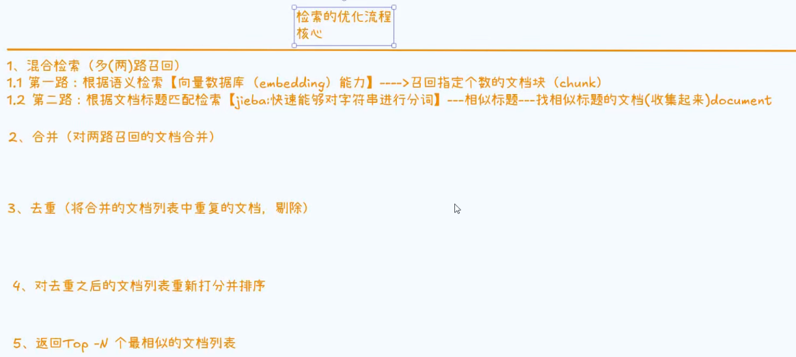
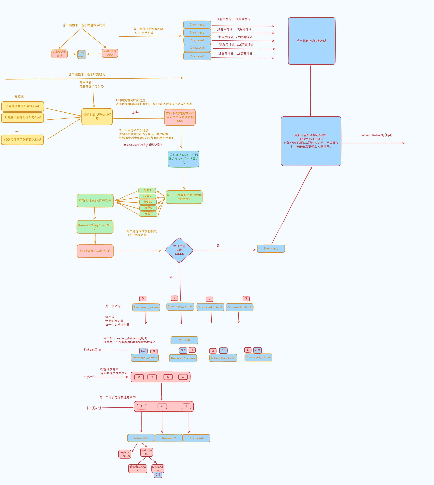

## 检索流程



## 知识库检索

### 说明

1. `L2`：如果`值越小`，`越相似`
   `余弦相似度`：`值越大，越相似`
   `L2的值 = 1 - 余弦相似度的值`
2. 

### 粗排序

1. 首先使用字符串分词(**将字符进行拆分，然后将用户输入的字符、标题的字符，一起进行匹配计算**)
   1. 使用jarcard算法，对用户输入的问题和所有的md文档标题，进行匹配计算
   2. 使用`jieba算法`，对用户输入的问题和所有的md文档标题，进行匹配计算
   3. 将两次的值，按照加权平均，得到粗排的分数
   4. 只获取前50个相似度高的结果

```python
def rough_ranking(self, user_query, mds_metadata: List[Dict[str, Any]]) -> List[Dict[str, Any]]:
        """
         对标题进行粗排
         基于jieba进行标题的分词匹配
        Args:
            user_query: 用户的问题
            mds_metadata: 所有md的元数据（标题【title】，路径【path】）

        Returns:
            List[Dict[str,Any]]:所有md的元数据 （标题【title】，路径【path】，标题粗排得分【rough_score】）
        """

        # 1. 用户输入问题是否存在
        if not user_query:
            return []
        ROUGHIN_WORD_WEIGHT = 0.7

        # 2.遍历mds_metadata(所有md的元数据)
        for md_metadata in mds_metadata:
            # 2.1 获取md标题
            md_metadata_title = md_metadata['title']

            # 2.2 判断标题是否存在
            if not md_metadata_title and not md_metadata_title.strip():
                continue
            # 2.3 进行分词&&算得分
            # 2.3.1 优先用字符切:set:交、并、差:jarcard算法=A N B/A U B
            user_query_char = set(user_query)
            md_metadata_title_char = set(md_metadata_title)
            unique_char = user_query_char | md_metadata_title_char
            char_score = len(user_query_char & md_metadata_title_char) / len(unique_char) if len(unique_char) > 0 else 0

            # 2.3.2 在用jieba词项切(影响因素大一些)
            user_query_word = set(jieba.lcut(user_query))
            md_metadata_title_word = set(jieba.lcut(md_metadata_title))
            unique_word = user_query_word | md_metadata_title_word
            word_score = len(user_query_word & md_metadata_title_word) / len(unique_word) if len(unique_word) > 0 else 0

            # 2.3.3 计算粗排分数：字符级+词性项级(侧重)
            roughing_score = word_score * ROUGHIN_WORD_WEIGHT + char_score * (1 - ROUGHIN_WORD_WEIGHT)

            md_metadata['roughing_score'] = float(roughing_score)

        # 3.根据标题的元数据（roughing_score）排序并且留下前50个
        return sorted(mds_metadata, key=lambda x: x['roughing_score'], reverse=True)[:50]
```

### 细排序

1. 对用户问题向量化
2. 对上述粗排得到的50个结果，进行列表化，得到只有标题的列表
3. 对标题进行向量化
4. 使用`cosine_similarity`，将用户问题和标题进行相似度匹配
5. 对`粗排的分数`，以及`用户问题向量化+标题向量化，获取的分数`，进行`加权平均`，`获取到精排分数`

```python
def fine_ranking(self, user_query: str, rough_mds_metadata: List[Dict[str, Any]]) -> List[Dict[str, Any]]:
        """
         对标题进行精排
         基于嵌入模型相似性以及cosine_similarity()
        Args:
            user_query: 用户当前问题
            rough_mds_metadata: 粗排后的md元数据

        Returns:
            List[Dict[str, Any]]: 带精排分数的元数据
        """

        # 1. 判粗排元数据
        if not rough_mds_metadata:
            return []

        # 两个二维矩阵（X[样本数] Y[样本质量]） K(X, Y) = <X, Y> / (||X||*||Y||)

        # 2. 对问题向量化
        query_embedding = self.chroma_vector.embedd_document(user_query)

        # 3. 获取粗排后的标题
        roughing_title = [md_metadata['title'] for md_metadata in rough_mds_metadata]

        # 4. 标题的向量值
        roughing_title_embeddings = self.chroma_vector.embedd_documents(roughing_title)

        # 5. 计算问题和粗排标题的相似度（余弦相似分数）分数值越大 代表问题和标题越相似
        # flatten()--->一维数组[0.1,0.4,0.01,0.6...]
        # X:1  Y:[1,2,3,4,5]   similarity=[0.1,0.4,0.01,0.6,0.3]【-1,0】
        similarity = cosine_similarity([query_embedding], roughing_title_embeddings).flatten()

        # 6. 遍历粗排元数据
        ROUGH_HEIGHT = 0.3
        SIM_HEIGHT = 0.7
        for index, md_metadata in enumerate(rough_mds_metadata):

            # a. 获取精排分数(归一)
            sim = similarity[index]
            if sim < 0:
                sim = 0
            # b. 获取粗排
            roughing_score = md_metadata['roughing_score']

            # c. 加权求最终精排分数
            final_score = roughing_score * ROUGH_HEIGHT + sim * SIM_HEIGHT

            # d. 存放到md_metadata 元数据中
            md_metadata['sim_score'] = sim
            md_metadata['final_score'] = final_score

        # 7. 排序
        sim_mds_metadata = sorted(rough_mds_metadata, key=lambda x: x['final_score'], reverse=True)[:5]

        # 8. 返回
        return sim_mds_metadata
```

### 多路检索

```python
def retrieval(self, user_question: str) -> List[Document]:
        """
         核心检索方法（检索器的入口）
        Args:
            user_question: 用户输入的问题

        Returns:
           List[Document]: 返回指定Top-N个相似性文档列表
        """

        # 1. 第一路检索(基于嵌入模型的向量检索)---主要两方面（bge模型对中文比较好，langchain整合不太好[真的!]）第二方面（向量时候语义被稀释）小块嵌入【保证嵌入能力不被稀释】--->大块做管理（保证模型看到完整的信息）精度和准确性
        based_vector_candidates = self._search_based_vector(user_question)

        # 2. 第二路检索(基于jieba的分词匹配的检索)
        based_title_candidates = self._search_based_title(user_question)

        # 3. 合并两路检索的文档列表
        total_candidates = based_vector_candidates + based_title_candidates

        # 4. 对合并后的文档列表去重
        unique_candidates = self._deduplicate(total_candidates)

        # 5. 重新打分排序
        top_documents = self._reranking(unique_candidates, user_question)

        # 6.返回指定Top-N个文档列表
        return top_documents
```

### 用户输入 - 对比 -向量数据库，相似度检索

1. 使用由`self.vector_database.similarity_search_with_score(user_question,top_k)`封装的`search_similarity_with_score`,得出向量数据库中，与用户输入匹配的前Top-N个向量数据

```python
def _search_based_vector(self, user_question: str) -> List[Document]:
        """
        第一路检索
        基于语义相似度检索

        Args:
            user_question: 用户输入的问题

        Returns:
            List[Document]： Top-N个相似的文档列表

        """
        # 1.返回带分数的文档列表
        documents_with_score = self.chroma_vector.search_similarity_with_score(user_question)

        # 2.TODO(不用距离得分)
        based_vector_candidates = []
        for document, _ in documents_with_score:
            based_vector_candidates.append(document)
        return based_vector_candidates
```

### 基于标题检索

1. 基于`用户输入 + 所有的文档标题`，进行`粗排`
2. 基于`用户输入 + 粗排的结果`，进行`细排序`
3. 压栈相关文档
   1. 对于文档小于3000，增加文档内容content，以及metadata属性(包含path 和标题)
   2. 对于大于3000的，进行详细切分，具体见`_deal_long_title_content`方法
4. 最后`将3.1和3.2得到的相关的文档`，`存入一个变量`

```python
 def _search_based_title(self, user_query: str) -> List[Document]:
        """
         第二路检索
         基于标题的关键词匹配检索
        Args:
            user_query: 用户输入的问题

        Returns:
            List[Document]: Top-N个相似的文档列表

        """

        # 1. 获取指定目录下的文件的标题
        mds_metadata = MarkDownUtils.collect_md_metadata(settings.CRAWL_OUTPUT_DIR)

        # 2. 进行标题匹配
        # 2.1 关键词匹配（jieba）--->（比较对象：用户输入的问题 vs crawl目录下的文件标题）
        # 2.2 标题的语义匹配（比较对象：用户的输入问题  vs md目录下的 ）
        rough_mds_metadata = self.rough_ranking(user_query, mds_metadata)
        fine_mds_metadata = self.fine_ranking(user_query, rough_mds_metadata)

        # 3. 处理文档（根据标题读取标题对于的文档内容---Document(page_content,metadata={})）

        based_title_candidates = []
        for fine_md_metadata in fine_mds_metadata:
            try:
                # 3.1 打开文件
                with open(fine_md_metadata['path'], "r", encoding="utf-8") as f:
                    content = f.read().strip()
                # 3.2 判断content内容长度
                # a.短md知识
                if len(content) < 3000:
                    # 不切分
                    doc = Document(page_content=content, metadata={
                        "path": fine_md_metadata['path'],
                        "title": fine_md_metadata['title'],
                    })
                    based_title_candidates.append(doc)
                # b. 长md知识 切分
                else:
                    doc_chunks = self._deal_long_title_content(content, fine_md_metadata, user_query)
                    based_title_candidates.extend(doc_chunks)  # doc_chunks 列表中元素打散了
            except Exception as e:

                logger.error(f"打开文件失败:{e}")
                return []
        # 4. 返回指定文档列表

        return based_title_candidates
```

### 文档去重

1. 根据文档的标题、前100个字符，双重标准，来进行去重

```python
    def _deduplicate(self, total_candidates: List[Document]) -> List[Document]:
        """
         对合并后的文档列表去重
         用set()集合去重（(title,内容的前【100】个字符)）-->key
        Args:
            total_candidates: 合并的文档列表

        Returns:
            List[Document]：唯一的文档列表
        """

        if not total_candidates:
            return []

        # 2. 定义set集合
        seen = set()
        unique_candidates = []

        # 3. 遍历合并后的每一个文档列表
        for document in total_candidates:
            # 去重（）
            clean_content = re.sub(r'^文档来源:.*?(?=(\n|#))', '', document.page_content, flags=re.DOTALL).strip()#【加上】
            key = (document.metadata['title'], clean_content[:100])
            if key not in seen:
                seen.add(key)
                unique_candidates.append(document)

        # 4. 返回唯一的
        return unique_candidates
```

### 重排序

1. 由于只有长文档，进行了余弦相似度打分，不需要二次计算，所以这里要排除
   1. 长文档计算后的属性中，包含`chunk_index`和`similarity`两个属性，由此可以进行区分
   2. 遇到长文档，直接压栈
2. 第一路和第二路文档，将文档压栈`need_embedding_docs`,索引压栈到`need_embedding_candidates_indices`
3. 文档向量化
   1. 对用户输入问题，进行向量化
   2. 对`need_embedding_docs`里的文档，进行循环，将内容拼接上标题，然后进行向量化
   3. 将用户输入的向量和文档列表的向量，进行余弦相似度匹配
   4. 将文件内容和相似度分数，压栈到`score_doc`
   5. 最后将`score_doc`根据相似度分数排序，然后返回Top-N的数据

```python
    def _reranking(self, unique_candidates: List[Document], user_question: str) -> List[Document]:
        """
         重新计算打分&&排序
         第二路长文档已经进行了cosine_similarity()的计算（无需在次打分）
         对第一路的文档和第二路的短文档进行重新计算

        Args:
            unique_candidates: 唯一的候选文档列表
            user_question: 用户输入的问题

        Returns:
            List[Document]: 最终指定Top-N的文档列表

        """

        # 1. 判断去重合并之后文档列表是否有文档对象
        if not unique_candidates:
            return []

        need_embedding_docs = []
        need_embedding_candidates_indices = []
        score_doc = []

        # 2. 遍历去重并合并之后的文档列表(Document,score)
        for candidate_index, unique_candidate in enumerate(unique_candidates):
            # 如何去判断 第二路长文档 or  第一路的文档和第二路?
            # 2.1 第二路的长文档
            if "chunk_index" in unique_candidate.metadata and "similarity" in unique_candidate.metadata:
                score_doc.append((unique_candidate, unique_candidate.metadata['similarity']))
            # 2.2 第一路和第二路的短文档
            else:
                need_embedding_docs.append(unique_candidate)
                need_embedding_candidates_indices.append(candidate_index)

        # 3.处理需要重新计算分数的文档
        if need_embedding_docs:
            # 3.1 计算用户问题的向量
            query_embedding = self.chroma_vector.embedd_document(user_question)

            # 3.2 获取到需要向量的文档内容
            embedding_docs_content = ["文档来源:" + doc.metadata['title'] + doc.page_content for doc in
                                      need_embedding_docs]
            # 3.3 计算需要向量的文档内容
            doc_embeddings = self.chroma_vector.embedd_documents(embedding_docs_content)

            # 3.4 计算相似得分
            similarity = cosine_similarity([query_embedding], doc_embeddings).flatten()

            # 3.5 封装到带得分的文档列表
            for idx, candidate_index in enumerate(need_embedding_candidates_indices):
                score_doc.append((unique_candidates[candidate_index], similarity[idx]))

        # 4. 排序
        sorted_docs = sorted(score_doc, key=lambda x: x[1], reverse=True)

        # 5. 返回Top-N
        return [doc for doc, _ in sorted_docs[:2]]
```

### 长文档处理

1. 将文档切分
2. 获取文档标题
3. 将每个文档块，赋值文档标题进去
4. 对用户问题进项向量化
5. 对切分后的文档块进行向量化
6. 将用户输入和切分的块，进行相似度匹配
7. 对匹配后的数据，通过`argsort`进行排序，并获取前N个数据
8. 将N个数据，封装成Document对象，设置文档内容，metadata(设置`path、title、chunk_index、similarity`四个属性)

````python
    def _deal_long_title_content(self, content: str, fine_md_metadata: Dict[str, Any], user_query: str) -> List[
        Document]:
        """
         处理标题对应的长文本
         切分-->文档块--->算文档块和问题的相似度
        Args:
            content: 长文本
            fine_md_metadata: 长文本对应的元数据
            user_query: 用户的问题

        Returns:
            List[Document]: 和问题相似的文档块（chunk）
        """

        # 1. 对长文本切分(换成适合)
        chunks = self.spliter.document_spliter.split_text(content)

        # 2. 获取对应的标题
        doc_chunks_title = fine_md_metadata['title']

        # 3. 标题注入到文档块中（第二次结构和第一次的拼接一定要一样）TODO
        doc_chunks_inject_title = [f"文档来源:{doc_chunks_title}" + doc_chunk for doc_chunk in chunks]

        # 4. 对问题向量
        query_embedding = self.chroma_vector.embedd_document(user_query)

        # 5. 对切分后的文档块向量化
        doc_chunk_embeddings = self.chroma_vector.embedd_documents(doc_chunks_inject_title)

        # 6. 计算相似性:doc_chunks_similarity[0.8,0.6,0.7,0.1,0.9]
        doc_chunks_similarity = cosine_similarity([query_embedding], doc_chunk_embeddings).flatten()

        # 7. 获取3个相似性分数值高的三个索引 argsort->[3,1,2,0,4]->[2,0,4]--->[4,0,2]
        top_doc_chunks_indices = doc_chunks_similarity.argsort()[-3:][::-1]

        # 8. 构建最终文档对象列表(为每一个切分后的块)
        docs = []
        for i, chunk_idx in enumerate(top_doc_chunks_indices):
            doc = Document(
                page_content=doc_chunks_inject_title[chunk_idx],  # 带上
                metadata={
                    "path": fine_md_metadata['path'],
                    "title": fine_md_metadata['title'],
                    "chunk_index:": int(chunk_idx),
                    "similarity": float(doc_chunks_similarity[chunk_idx])
                }
            )
            docs.append(doc)

        return   docs
````

### 完整代码

#### md文档扫码

```python
import  os
import re
from typing import List,Dict,Any


class MarkDownUtils:
    """
     MarkDown文档处理工具
    """

    @staticmethod
    def collect_md_metadata(folder_path: str) -> List[Dict[str, Any]]:
        """
        收集Markdown文件元数据

        遍历指定目录，提取所有Markdown文件的路径和标题信息。

        Args:
            folder_path: Markdown文件所在目录

        Returns:
            List[Dict[str, Any]]: 包含路径和标题的元数据列表
        """
        md_metadata = []
        if not os.path.exists(folder_path):
            return md_metadata

        # 正则匹配文件名格式：编号-标题.md
        filename_pattern = re.compile(r'^(.+?)-(.*?)\.md$')

        for filename in os.listdir(folder_path):
            if filename.endswith('.md'):
                match = filename_pattern.match(filename)
                if match:
                    title = match.group(2).strip()
                else:
                    title = os.path.splitext(filename)[0].strip()

                md_metadata.append({
                    "path": os.path.join(folder_path, filename),
                    "title": title
                })
        return md_metadata

    @staticmethod
    def extract_title(file_path: str) -> str:
        """
        辅助方法：从文件名中提取标题
        逻辑与 MarkDownUtils 保持一致
        """
        filename = os.path.basename(file_path)
        filename_pattern = re.compile(r'^(.+?)-(.*?)\.md$')
        match = filename_pattern.match(filename)
        if match:
            # 提取正则分组的第2部分作为标题
            return match.group(2).strip()
        else:
            # 匹配失败则使用文件名（去后缀）
            return os.path.splitext(filename)[0].strip()

    def clean_markdown_images(text: str) -> str:
        """将  替换为纯 url，每张图单独一行"""
        # 匹配 Markdown 图片语法: 
        pattern = r'!\$$[^$$]*\]\((https?://[^\s\)]+)\)'

        def replace_func(match):
            url = match.group(1)
            return f"\n{url}\n"  # 每个链接前后加换行，保证独立一行

        cleaned = re.sub(pattern, replace_func, text)

        # 清理多余空行
        cleaned = re.sub(r'\n{3,}', '\n\n', cleaned)

        return cleaned.strip()

```

#### 检索完整代码

```python
#knowledge/services/retrieval_service.py
import logging
import jieba
import re

logging.basicConfig(level=logging.INFO)
logger = logging.getLogger(__name__)

from typing import List, Dict, Any
from langchain_core.documents import Document
from repositories.vector_store_repository import VectorStoreRepository
from services.ingestion.ingestion_processor import IngestionProcessor
from utils.markdown_utils import MarkDownUtils
from config.settings import settings
from sklearn.metrics.pairwise import cosine_similarity


class RetrievalService:
    """
    负责检索的类（检索器）
    RAG:（小块：越小越好【小（无线小）】）文本嵌入模型  （完整信息：越大越大【不能无限大】）文本语言模型====准 原文档（大）--->1.小块（子） 2.稍微大一点的块（整个文档）【父】---留一个保留关系：穿针引线思想（父文档召回）
    """

    def __init__(self):
        self.chroma_vector = VectorStoreRepository()
        self.spliter = IngestionProcessor()

    def rough_ranking(self, user_query, mds_metadata: List[Dict[str, Any]]) -> List[Dict[str, Any]]:
        """
         对标题进行粗排
         基于jieba进行标题的分词匹配
        Args:
            user_query: 用户的问题
            mds_metadata: 所有md的元数据（标题【title】，路径【path】）

        Returns:
            List[Dict[str,Any]]:所有md的元数据 （标题【title】，路径【path】，标题粗排得分【rough_score】）
        """

        # 1. 用户输入问题是否存在
        if not user_query:
            return []
        ROUGHIN_WORD_WEIGHT = 0.7

        # 2.遍历mds_metadata(所有md的元数据)
        for md_metadata in mds_metadata:
            # 2.1 获取md标题
            md_metadata_title = md_metadata['title']

            # 2.2 判断标题是否存在
            if not md_metadata_title and not md_metadata_title.strip():
                continue
            # 2.3 进行分词&&算得分
            # 2.3.1 优先用字符切:set:交、并、差:jarcard算法=A N B/A U B
            user_query_char = set(user_query)
            md_metadata_title_char = set(md_metadata_title)
            unique_char = user_query_char | md_metadata_title_char
            char_score = len(user_query_char & md_metadata_title_char) / len(unique_char) if len(unique_char) > 0 else 0

            # 2.3.2 在用jieba词项切(影响因素大一些)
            user_query_word = set(jieba.lcut(user_query))
            md_metadata_title_word = set(jieba.lcut(md_metadata_title))
            unique_word = user_query_word | md_metadata_title_word
            word_score = len(user_query_word & md_metadata_title_word) / len(unique_word) if len(unique_word) > 0 else 0

            # 2.3.3 计算粗排分数：字符级+词性项级(侧重)
            roughing_score = word_score * ROUGHIN_WORD_WEIGHT + char_score * (1 - ROUGHIN_WORD_WEIGHT)

            md_metadata['roughing_score'] = float(roughing_score)

        # 3.根据标题的元数据（roughing_score）排序并且留下前50个
        return sorted(mds_metadata, key=lambda x: x['roughing_score'], reverse=True)[:50]

    def fine_ranking(self, user_query: str, rough_mds_metadata: List[Dict[str, Any]]) -> List[Dict[str, Any]]:
        """
         对标题进行精排
         基于嵌入模型相似性以及cosine_similarity()
        Args:
            user_query: 用户当前问题
            rough_mds_metadata: 粗排后的md元数据

        Returns:
            List[Dict[str, Any]]: 带精排分数的元数据
        """

        # 1. 判粗排元数据
        if not rough_mds_metadata:
            return []

        # 两个二维矩阵（X[样本数] Y[样本质量]） K(X, Y) = <X, Y> / (||X||*||Y||)

        # 2. 对问题向量化
        query_embedding = self.chroma_vector.embedd_document(user_query)

        # 3. 获取粗排后的标题
        roughing_title = [md_metadata['title'] for md_metadata in rough_mds_metadata]

        # 4. 标题的向量值
        roughing_title_embeddings = self.chroma_vector.embedd_documents(roughing_title)

        # 5. 计算问题和粗排标题的相似度（余弦相似分数）分数值越大 代表问题和标题越相似
        # flatten()--->一维数组[0.1,0.4,0.01,0.6...]
        # X:1  Y:[1,2,3,4,5]   similarity=[0.1,0.4,0.01,0.6,0.3]【-1,0】
        similarity = cosine_similarity([query_embedding], roughing_title_embeddings).flatten()

        # 6. 遍历粗排元数据
        ROUGH_HEIGHT = 0.3
        SIM_HEIGHT = 0.7
        for index, md_metadata in enumerate(rough_mds_metadata):

            # a. 获取精排分数(归一)
            sim = similarity[index]
            if sim < 0:
                sim = 0
            # b. 获取粗排
            roughing_score = md_metadata['roughing_score']

            # c. 加权求最终精排分数
            final_score = roughing_score * ROUGH_HEIGHT + sim * SIM_HEIGHT

            # d. 存放到md_metadata 元数据中
            md_metadata['sim_score'] = sim
            md_metadata['final_score'] = final_score

        # 7. 排序
        sim_mds_metadata = sorted(rough_mds_metadata, key=lambda x: x['final_score'], reverse=True)[:5]

        # 8. 返回
        return sim_mds_metadata

    def retrieval(self, user_question: str) -> List[Document]:
        """
         核心检索方法（检索器的入口）
        Args:
            user_question: 用户输入的问题

        Returns:
           List[Document]: 返回指定Top-N个相似性文档列表
        """

        # 1. 第一路检索(基于嵌入模型的向量检索)---主要两方面（bge模型对中文比较好，langchain整合不太好[真的!]）第二方面（向量时候语义被稀释）小块嵌入【保证嵌入能力不被稀释】--->大块做管理（保证模型看到完整的信息）精度和准确性
        based_vector_candidates = self._search_based_vector(user_question)

        # 2. 第二路检索(基于jieba的分词匹配的检索)
        based_title_candidates = self._search_based_title(user_question)

        # 3. 合并两路检索的文档列表
        total_candidates = based_vector_candidates + based_title_candidates

        # 4. 对合并后的文档列表去重
        unique_candidates = self._deduplicate(total_candidates)

        # 5. 重新打分排序
        top_documents = self._reranking(unique_candidates, user_question)

        # 6.返回指定Top-N个文档列表
        return top_documents

    def _search_based_vector(self, user_question: str) -> List[Document]:
        """
        第一路检索
        基于语义相似度检索

        Args:
            user_question: 用户输入的问题

        Returns:
            List[Document]： Top-N个相似的文档列表

        """
        # 1.返回带分数的文档列表
        documents_with_score = self.chroma_vector.search_similarity_with_score(user_question)

        # 2.TODO(不用距离得分)
        based_vector_candidates = []
        for document, _ in documents_with_score:
            based_vector_candidates.append(document)
        return based_vector_candidates

    def _search_based_title(self, user_query: str) -> List[Document]:
        """
         第二路检索
         基于标题的关键词匹配检索
        Args:
            user_query: 用户输入的问题

        Returns:
            List[Document]: Top-N个相似的文档列表

        """

        # 1. 获取指定目录下的文件的标题
        mds_metadata = MarkDownUtils.collect_md_metadata(settings.CRAWL_OUTPUT_DIR)

        # 2. 进行标题匹配
        # 2.1 关键词匹配（jieba）--->（比较对象：用户输入的问题 vs crawl目录下的文件标题）
        # 2.2 标题的语义匹配（比较对象：用户的输入问题  vs md目录下的 ）
        rough_mds_metadata = self.rough_ranking(user_query, mds_metadata)
        fine_mds_metadata = self.fine_ranking(user_query, rough_mds_metadata)

        # 3. 处理文档（根据标题读取标题对于的文档内容---Document(page_content,metadata={})）

        based_title_candidates = []
        for fine_md_metadata in fine_mds_metadata:
            try:
                # 3.1 打开文件
                with open(fine_md_metadata['path'], "r", encoding="utf-8") as f:
                    content = f.read().strip()
                # 3.2 判断content内容长度
                # a.短md知识
                if len(content) < 3000:
                    # 不切分
                    doc = Document(page_content=content, metadata={
                        "path": fine_md_metadata['path'],
                        "title": fine_md_metadata['title'],
                    })
                    based_title_candidates.append(doc)
                # b. 长md知识 切分
                else:
                    doc_chunks = self._deal_long_title_content(content, fine_md_metadata, user_query)
                    based_title_candidates.extend(doc_chunks)  # doc_chunks 列表中元素打散了
            except Exception as e:

                logger.error(f"打开文件失败:{e}")
                return []
        # 4. 返回指定文档列表

        return based_title_candidates

    def _deduplicate(self, total_candidates: List[Document]) -> List[Document]:
        """
         对合并后的文档列表去重
         用set()集合去重（(title,内容的前【100】个字符)）-->key
        Args:
            total_candidates: 合并的文档列表

        Returns:
            List[Document]：唯一的文档列表
        """

        if not total_candidates:
            return []

        # 2. 定义set集合
        seen = set()
        unique_candidates = []

        # 3. 遍历合并后的每一个文档列表
        for document in total_candidates:
            # 去重（）
            clean_content = re.sub(r'^文档来源:.*?(?=(\n|#))', '', document.page_content, flags=re.DOTALL).strip()#【加上】
            key = (document.metadata['title'], clean_content[:100])
            if key not in seen:
                seen.add(key)
                unique_candidates.append(document)

        # 4. 返回唯一的
        return unique_candidates

    def _reranking(self, unique_candidates: List[Document], user_question: str) -> List[Document]:
        """
         重新计算打分&&排序
         第二路长文档已经进行了cosine_similarity()的计算（无需在次打分）
         对第一路的文档和第二路的短文档进行重新计算

        Args:
            unique_candidates: 唯一的候选文档列表
            user_question: 用户输入的问题

        Returns:
            List[Document]: 最终指定Top-N的文档列表

        """

        # 1. 判断去重合并之后文档列表是否有文档对象
        if not unique_candidates:
            return []

        need_embedding_docs = []
        need_embedding_candidates_indices = []
        score_doc = []

        # 2. 遍历去重并合并之后的文档列表(Document,score)
        for candidate_index, unique_candidate in enumerate(unique_candidates):
            # 如何去判断 第二路长文档 or  第一路的文档和第二路?
            # 2.1 第二路的长文档
            if "chunk_index" in unique_candidate.metadata and "similarity" in unique_candidate.metadata:
                score_doc.append((unique_candidate, unique_candidate.metadata['similarity']))
            # 2.2 第一路和第二路的短文档
            else:
                need_embedding_docs.append(unique_candidate)
                need_embedding_candidates_indices.append(candidate_index)

        # 3.处理需要重新计算分数的文档
        if need_embedding_docs:
            # 3.1 计算用户问题的向量
            query_embedding = self.chroma_vector.embedd_document(user_question)

            # 3.2 获取到需要向量的文档内容
            embedding_docs_content = ["文档来源:" + doc.metadata['title'] + doc.page_content for doc in
                                      need_embedding_docs]
            # 3.3 计算需要向量的文档内容
            doc_embeddings = self.chroma_vector.embedd_documents(embedding_docs_content)

            # 3.4 计算相似得分
            similarity = cosine_similarity([query_embedding], doc_embeddings).flatten()

            # 3.5 封装到带得分的文档列表
            for idx, candidate_index in enumerate(need_embedding_candidates_indices):
                score_doc.append((unique_candidates[candidate_index], similarity[idx]))

        # 4. 排序
        sorted_docs = sorted(score_doc, key=lambda x: x[1], reverse=True)

        # 5. 返回Top-N
        return [doc for doc, _ in sorted_docs[:2]]

    def _deal_long_title_content(self, content: str, fine_md_metadata: Dict[str, Any], user_query: str) -> List[
        Document]:
        """
         处理标题对应的长文本
         切分-->文档块--->算文档块和问题的相似度
        Args:
            content: 长文本
            fine_md_metadata: 长文本对应的元数据
            user_query: 用户的问题

        Returns:
            List[Document]: 和问题相似的文档块（chunk）
        """

        # 1. 对长文本切分(换成适合)
        chunks = self.spliter.document_spliter.split_text(content)

        # 2. 获取对应的标题
        doc_chunks_title = fine_md_metadata['title']

        # 3. 标题注入到文档块中（第二次结构和第一次的拼接一定要一样）TODO
        doc_chunks_inject_title = [f"文档来源:{doc_chunks_title}" + doc_chunk for doc_chunk in chunks]

        # 4. 对问题向量
        query_embedding = self.chroma_vector.embedd_document(user_query)

        # 5. 对切分后的文档块向量化
        doc_chunk_embeddings = self.chroma_vector.embedd_documents(doc_chunks_inject_title)

        # 6. 计算相似性:doc_chunks_similarity[0.8,0.6,0.7,0.1,0.9]
        doc_chunks_similarity = cosine_similarity([query_embedding], doc_chunk_embeddings).flatten()

        # 7. 获取3个相似性分数值高的三个索引 argsort->[3,1,2,0,4]->[2,0,4]--->[4,0,2]
        top_doc_chunks_indices = doc_chunks_similarity.argsort()[-3:][::-1]

        # 8. 构建最终文档对象列表(为每一个切分后的块)
        docs = []
        for i, chunk_idx in enumerate(top_doc_chunks_indices):
            doc = Document(
                page_content=doc_chunks_inject_title[chunk_idx],  # 带上
                metadata={
                    "path": fine_md_metadata['path'],
                    "title": fine_md_metadata['title'],
                    "chunk_index:": int(chunk_idx),
                    "similarity": float(doc_chunks_similarity[chunk_idx])
                }
            )
            docs.append(doc)

        return   docs


if __name__ == '__main__':
    retrival_service = RetrievalService()

    # rough_ranking_result = retrival_service.rough_ranking("我的电脑开机之后没有任何的反应"）
    # for roughing_result in rough_ranking_result[:10]:
    #     print(f"粗排---{roughing_result}")
    #
    # sim_ranking_result = retrival_service.fine_ranking("我的电脑开机之后没有任何的反应", rough_ranking_result[:10])
    #
    # for sim_result in sim_ranking_result:
    #     print(f"精排---{sim_result}")

    # result = retrival_service.retrieval("我的电脑开机之后没有任何的反应")
    # result = retrival_service.retrieval("如何安装联想的一件影音")
    # result = retrival_service.retrieval("联想手机K900常见问题汇总有哪些")
    # result = retrival_service.retrieval("如何使用U盘安装Windows 7操作系统.")
    # result = retrival_service.retrieval("开机屏幕黑屏或蓝屏报错,无法正常进入系统怎么办")
    # result = retrival_service.retrieval("我的电脑经常死机该如何解决")
    result = retrival_service.retrieval("手机、平板上的画面能无线传输到电视上播放吗") # 80-90%

    for r in result:
        print(r)
```

